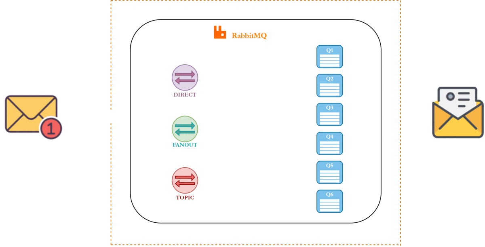

# Брокеры сообщений: Redis, RabbitMQ, Kafka
## Python + FastAPI

---

## Слайд 1: Введение

### Что такое брокер сообщений?

**Брокер сообщений** — промежуточное ПО для асинхронного обмена сообщениями между сервисами

**Зачем нужны:**
- Асинхронная обработка задач
- Масштабирование системы
- Отказоустойчивость
- Разделение ответственности

## Слайд 2: Многообразие брокеров


---

## Слайд 3: Сферы применения брокеров

| Сфера | Задачи | Примеры (РФ) |
|-------|--------|--------|
| **E-commerce** | Обработка заказов<br>Уведомления о доставке<br>Обновление остатков | Ozon, Wildberries, Яндекс.Маркет |
| **Финтех** | Обработка платежей<br>Fraud detection<br>Транзакционные уведомления | Сбербанк, Тинькофф, Альфа-Банк |
| **Социальные сети** | Лента новостей<br>Push-уведомления<br>Обработка медиа | VK, Одноклассники, Telegram |
| **IoT** | Сбор данных с датчиков<br>Мониторинг устройств<br>Аналитика в реальном времени | Яндекс.Дом, Ростелеком IoT |
| **Микросервисы** | Межсервисная коммуникация<br>Event-driven архитектура<br>Распределенные транзакции | Яндекс, Avito, Mail.ru |

---

## Слайд 4: Пропускная способность хранилищ

### Сравнение записи в дисковые хранилища

| Хранилище | Записей/сек | Задержка | Особенности |
|-----------|-------------|----------|-------------|
| **PostgreSQL** | 5,000-15,000 | 10-50ms | ACID, индексы, блокировки |
| **MySQL** | 10,000-20,000 | 5-30ms | Быстрее на простых запросах |
| **MS SQL** | 8,000-18,000 | 8-40ms | Оптимизирован под Windows |
| **MongoDB** | 20,000-50,000 | 2-10ms | NoSQL, без схемы |
| **JSON файлы** | 50,000-100,000 | 1-5ms | Без гарантий, риск потери |

**Проблема:** Все хранилища ограничены скоростью диска

**Решение:** Брокеры сообщений (in-memory) - **100,000-1,000,000+ записей/сек**

---
## слайд 5


## Слайд 6: Проблемы без брокеров

```python
# Синхронная обработка - плохо
@app.post("/order")
def create_order(order: Order):
    save_to_db(order)           # 100ms
    send_email(order)           # 2000ms
    update_inventory(order)     # 500ms
    notify_warehouse(order)     # 300ms
    return {"status": "ok"}     # Клиент ждет 2900ms!
```

**Проблемы:**
- Долгий ответ клиенту
- Блокировка потока
- Сложно масштабировать

---

## Слайд 7: Решение с брокером

```python
# Асинхронная обработка - хорошо
@app.post("/order")
async def create_order(order: Order):
    save_to_db(order)                    # 100ms
    await queue.send("email", order)     # 5ms
    await queue.send("inventory", order) # 5ms
    await queue.send("warehouse", order) # 5ms
    return {"status": "ok"}              # Клиент ждет 115ms!
```

**Преимущества:**
- Быстрый ответ
- Независимая обработка
- Легко масштабировать

---

## Слайд 8: Основные брокеры

| Брокер | Тип | Скорость | Сложность | Use Case |
|--------|-----|----------|-----------|----------|
| **Redis** | In-memory | Очень высокая | Низкая | Кэш, очереди, pub/sub |
| **RabbitMQ** | Message Queue | Средняя | Средняя | Задачи, маршрутизация |
| **Kafka** | Event Stream | Высокая | Высокая | Логи, аналитика, события |

---

## Слайд 9: Redis - Обзор

**Redis** (Remote Dictionary Server) - in-memory хранилище данных

**Особенности:**
- Хранение в оперативной памяти
- Поддержка структур данных (строки, списки, множества, хэши)
- Pub/Sub модель
- Простые очереди

**Когда использовать:**
- Кэширование
- Счетчики, рейтинги
- Простые очереди задач
- Real-time приложения

---

## Слайд 10: Redis - Установка

```bash
# Docker
docker run -d -p 6379:6379 redis:latest

# Python библиотека
pip install redis
```

```python
import redis

# Подключение
r = redis.Redis(host='localhost', port=6379, decode_responses=True)

# Проверка
r.ping()  # True
```

---

## Слайд 11: Redis - Базовые операции

```python
import redis

r = redis.Redis(decode_responses=True)

# Строки
r.set('user:1:name', 'Alice')
r.get('user:1:name')  # 'Alice'

# Счетчики
r.incr('page:views')  # 1
r.incr('page:views')  # 2

# Списки (очереди)
r.lpush('tasks', 'task1')
r.lpush('tasks', 'task2')
r.rpop('tasks')  # 'task1'

# Хэши
r.hset('user:1', mapping={'name': 'Alice', 'age': 30})
r.hgetall('user:1')  # {'name': 'Alice', 'age': '30'}
```

---

## Слайд 12: Redis Pub/Sub

```python
import redis

r = redis.Redis()

# Publisher
def publish_message():
    r.publish('notifications', 'New order received!')

# Subscriber
def subscribe_messages():
    pubsub = r.pubsub()
    pubsub.subscribe('notifications')
    
    for message in pubsub.listen():
        if message['type'] == 'message':
            print(f"Received: {message['data']}")
```

**Особенность:** Сообщения не сохраняются, если нет подписчиков

---

## Слайд 13: Redis + FastAPI - Кэширование

```python
from fastapi import FastAPI
import redis
import json

app = FastAPI()
r = redis.Redis(decode_responses=True)

@app.get("/products/{product_id}")
async def get_product(product_id: int):
    # Проверяем кэш
    cached = r.get(f"product:{product_id}")
    if cached:
        return json.loads(cached)
    
    # Запрос к БД
    product = db.get_product(product_id)
    
    # Сохраняем в кэш на 1 час
    r.setex(f"product:{product_id}", 3600, json.dumps(product))
    
    return product
```

---

## Слайд 14: Redis + FastAPI - Очередь задач

```python
from fastapi import FastAPI, BackgroundTasks
import redis

app = FastAPI()
r = redis.Redis()

@app.post("/send-email")
async def send_email(email: str, message: str):
    # Добавляем задачу в очередь
    task = {"email": email, "message": message}
    r.lpush("email_queue", json.dumps(task))
    return {"status": "queued"}

# Worker
def process_emails():
    while True:
        task = r.brpop("email_queue", timeout=5)
        if task:
            data = json.loads(task[1])
            send_email_smtp(data['email'], data['message'])
```

---

## Слайд 15: RabbitMQ - Обзор

**RabbitMQ** - брокер сообщений на основе протокола AMQP


## Слайд 16: RabbitMQ 
**Особенности:**
- Гарантия доставки сообщений
- Гибкая маршрутизация (exchanges, queues, bindings)
- Подтверждение обработки (acknowledgments)
- Приоритеты сообщений

**Когда использовать:**
- Критичные задачи
- Сложная маршрутизация
- Нужна гарантия доставки

---

## Слайд 17: RabbitMQ - Архитектура

Direct
Fanout 
Topic
```
Producer → Exchange → Queue → Consumer
              ↓
           Binding
```

## Слайд 18: 


**Типы Exchange:**
- **Direct** - точное совпадение routing key
- **Fanout** - всем очередям
- **Topic** - по шаблону (*.error, logs.*)
- **Headers** - по заголовкам

---

## слайд 17




## Слайд 22: RabbitMQ - Установка

```bash
# Docker
docker run -d -p 5672:5672 -p 15672:15672 rabbitmq:management

# Python библиотека
pip install pika
```

```python
import pika

# Подключение
connection = pika.BlockingConnection(
    pika.ConnectionParameters('localhost')
)
channel = connection.channel()

# Создание очереди
channel.queue_declare(queue='tasks', durable=True)
```

---

## Слайд 23: RabbitMQ - Producer

```python
import pika
import json

connection = pika.BlockingConnection(
    pika.ConnectionParameters('localhost')
)
channel = connection.channel()

# Объявляем очередь
channel.queue_declare(queue='tasks', durable=True)

# Отправляем сообщение
message = {"task": "send_email", "to": "user@example.com"}
channel.basic_publish(
    exchange='',
    routing_key='tasks',
    body=json.dumps(message),
    properties=pika.BasicProperties(
        delivery_mode=2,  # Сохранять на диск
    )
)

connection.close()
```

---

## Слайд 24: RabbitMQ - Consumer

```python
import pika
import json

connection = pika.BlockingConnection(
    pika.ConnectionParameters('localhost')
)
channel = connection.channel()
channel.queue_declare(queue='tasks', durable=True)

def callback(ch, method, properties, body):
    message = json.loads(body)
    print(f"Processing: {message}")
    
    # Обработка задачи
    process_task(message)
    
    # Подтверждение обработки
    ch.basic_ack(delivery_tag=method.delivery_tag)

channel.basic_qos(prefetch_count=1)
channel.basic_consume(queue='tasks', on_message_callback=callback)

print('Waiting for messages...')
channel.start_consuming()
```

---

## Слайд 25: RabbitMQ + FastAPI

```python
from fastapi import FastAPI
import pika
import json

app = FastAPI()

def get_channel():
    connection = pika.BlockingConnection(
        pika.ConnectionParameters('localhost')
    )
    return connection.channel()

@app.post("/tasks")
async def create_task(task_type: str, data: dict):
    channel = get_channel()
    channel.queue_declare(queue='tasks', durable=True)
    
    message = {"type": task_type, "data": data}
    channel.basic_publish(
        exchange='',
        routing_key='tasks',
        body=json.dumps(message),
        properties=pika.BasicProperties(delivery_mode=2)
    )
    
    return {"status": "queued", "task": message}
```

---

## Слайд 26: RabbitMQ - Topic Exchange

```python
# Producer
channel.exchange_declare(exchange='logs', exchange_type='topic')

# Отправка с routing key
channel.basic_publish(
    exchange='logs',
    routing_key='error.payment',
    body='Payment failed'
)

# Consumer 1 - все ошибки
channel.queue_bind(exchange='logs', queue='errors', routing_key='error.*')

# Consumer 2 - все логи платежей
channel.queue_bind(exchange='logs', queue='payments', routing_key='*.payment')
```

---

## Слайд 23: Kafka - Обзор

**Apache Kafka** - распределенная платформа потоковой обработки событий

**Особенности:**
- Высокая пропускная способность (миллионы сообщений/сек)
- Хранение событий (retention)
- Партиционирование
- Репликация

**Когда использовать:**
- Логирование событий
- Аналитика в реальном времени
- Event Sourcing
- Большие объемы данных

---

## Слайд 24: Kafka - Применение


## Слайд 25: Kafka - Архитектура


```
Producer → Topic (Partition 0, 1, 2) → Consumer Group
                                          ↓
                                    Consumer 1, 2, 3
```

**Основные понятия:**
- **Topic** - категория сообщений
- **Partition** - упорядоченная последовательность
- **Offset** - позиция в партиции
- **Consumer Group** - группа потребителей

---

## Слайд 30: Kafka - Установка

```bash
# Docker Compose
version: '3'
services:
  zookeeper:
    image: confluentinc/cp-zookeeper:latest
    environment:
      ZOOKEEPER_CLIENT_PORT: 2181
  
  kafka:
    image: confluentinc/cp-kafka:latest
    ports:
      - "9092:9092"
    environment:
      KAFKA_ZOOKEEPER_CONNECT: zookeeper:2181
      KAFKA_ADVERTISED_LISTENERS: PLAINTEXT://localhost:9092

# Python
pip install kafka-python
```

---

## Слайд 31: Kafka - Producer

```python
from kafka import KafkaProducer
import json

producer = KafkaProducer(
    bootstrap_servers=['localhost:9092'],
    value_serializer=lambda v: json.dumps(v).encode('utf-8')
)

# Отправка сообщения
event = {
    "user_id": 123,
    "action": "purchase",
    "amount": 99.99
}

future = producer.send('user-events', value=event)
result = future.get(timeout=10)

print(f"Sent to partition {result.partition}, offset {result.offset}")

producer.close()
```

---

## Слайд 32: Kafka - Consumer

```python
from kafka import KafkaConsumer
import json

consumer = KafkaConsumer(
    'user-events',
    bootstrap_servers=['localhost:9092'],
    auto_offset_reset='earliest',
    group_id='analytics-group',
    value_deserializer=lambda m: json.loads(m.decode('utf-8'))
)

for message in consumer:
    event = message.value
    print(f"Partition: {message.partition}, Offset: {message.offset}")
    print(f"Event: {event}")
    
    # Обработка события
    process_event(event)
```

---

## Слайд 33: Kafka + FastAPI - Producer

```python
from fastapi import FastAPI
from kafka import KafkaProducer
import json

app = FastAPI()

producer = KafkaProducer(
    bootstrap_servers=['localhost:9092'],
    value_serializer=lambda v: json.dumps(v).encode('utf-8')
)

@app.post("/events")
async def send_event(event_type: str, data: dict):
    event = {
        "type": event_type,
        "data": data,
        "timestamp": datetime.now().isoformat()
    }
    
    future = producer.send('events', value=event)
    result = future.get(timeout=10)
    
    return {
        "status": "sent",
        "partition": result.partition,
        "offset": result.offset
    }
```

---

## Слайд 34: Kafka + FastAPI - Consumer

```python
from kafka import KafkaConsumer
import json
import asyncio

consumer = KafkaConsumer(
    'events',
    bootstrap_servers=['localhost:9092'],
    group_id='processor-group',
    value_deserializer=lambda m: json.loads(m.decode('utf-8'))
)

async def process_events():
    for message in consumer:
        event = message.value
        
        if event['type'] == 'order':
            await process_order(event['data'])
        elif event['type'] == 'payment':
            await process_payment(event['data'])

# Запуск в фоне
asyncio.create_task(process_events())
```

---

## Слайд 31: Сравнение брокеров

| Критерий | Redis | RabbitMQ | Kafka |
|----------|-------|----------|-------|
| **Скорость** | 100k+ msg/s | 20k msg/s | 1M+ msg/s |
| **Персистентность** | Опционально | Да | Да |
| **Гарантии** | At most once | At least once | Exactly once |
| **Сложность** | Низкая | Средняя | Высокая |
| **Хранение** | RAM | Disk | Disk |
| **Порядок** | Нет | Да | Да (в партиции) |

---

## Слайд 32: Выбор брокера

**Redis:**
- Простые задачи
- Кэширование
- Pub/Sub в реальном времени
- Не критичная потеря данных

**RabbitMQ:**
- Задачи с гарантией доставки
- Сложная маршрутизация
- Приоритеты задач
- Средние нагрузки

**Kafka:**
- Большие объемы данных
- Event Sourcing
- Аналитика
- Логирование

---

## Слайд 33: Celery и брокеры сообщений
### Зачем кролику и редиске нужен сельдерей? 🥕🐰

**Celery** - распределенная система очередей задач для Python

```python
# Без Celery - ручная работа с брокером
import pika

connection = pika.BlockingConnection(...)
channel = connection.channel()
channel.queue_declare(queue='tasks')
channel.basic_publish(exchange='', routing_key='tasks', body='task_data')
# Нужно самому: сериализация, retry, мониторинг, worker'ы
```

```python
# С Celery - всё из коробки
from celery import Celery

app = Celery('tasks', broker='redis://localhost:6379/0')

@app.task(retry_backoff=True, max_retries=3)
def send_email(to, subject, body):
    # Просто пишем бизнес-логику
    smtp.send(to, subject, body)

# Вызов
send_email.delay('user@example.com', 'Hello', 'World')
```

---

## Слайд 34: Возможности Celery

**Что даёт Celery из коробки:**
- ✅ Автоматическая сериализация/десериализация
- ✅ Retry с экспоненциальной задержкой
- ✅ Мониторинг и статистика (Flower)
- ✅ Периодические задачи (Celery Beat)
- ✅ Приоритеты задач
- ✅ Routing и цепочки задач

**Celery + Redis = 🚀**
- Redis как брокер (быстро)
- Redis как backend результатов
- Простая настройка
- Подходит для большинства задач

**Celery + RabbitMQ = 🛡️**
- Гарантия доставки
- Сложная маршрутизация
- Enterprise-ready
- Критичные задачи


## Слайд 34: Celery + Redis/RabbitMQ

```python
# celery_app.py
from celery import Celery

# Redis как брокер
app = Celery('tasks', broker='redis://localhost:6379/0')

# Или RabbitMQ
# app = Celery('tasks', broker='amqp://localhost')

@app.task
def send_email(to: str, subject: str, body: str):
    # Отправка email
    smtp.send(to, subject, body)
    return f"Email sent to {to}"

# FastAPI
from fastapi import FastAPI
from celery_app import send_email

app = FastAPI()

@app.post("/send-email")
async def queue_email(to: str, subject: str, body: str):
    task = send_email.delay(to, subject, body)
    return {"task_id": task.id, "status": "queued"}
```

---

## Слайд 35: Паттерны использования

**1. Task Queue (Очередь задач)**
```python
# Отложенная обработка
queue.send("process_video", video_id)
```

**2. Pub/Sub (Издатель-подписчик)**
```python
# Уведомления
pubsub.publish("user.registered", user_data)
```

**3. Event Sourcing**
```python
# История событий
kafka.send("events", {"type": "order.created", "data": order})
```

**4. Request-Reply**
```python
# RPC через очереди
response = queue.call("calculate", data)
```

---

## Слайд 36: Best Practices

**1. Идемпотентность**
```python
# Обработка может быть повторной
def process_order(order_id):
    if already_processed(order_id):
        return
    # Обработка
```

**2. Обработка ошибок**
```python
@app.task(bind=True, max_retries=3)
def task(self, data):
    try:
        process(data)
    except Exception as exc:
        raise self.retry(exc=exc, countdown=60)
```

**3. Мониторинг**
```python
# Логирование, метрики
logger.info(f"Processing message {msg_id}")
metrics.increment("messages.processed")
```

---

## Слайд 37 Заключение

**Что изучили:**
- Redis - быстрый in-memory брокер
- RabbitMQ - надежная очередь сообщений
- Kafka - платформа потоковой обработки
- Интеграция с FastAPI

**Ключевые моменты:**
- Выбор брокера зависит от задачи
- Асинхронность улучшает производительность
- Важна обработка ошибок и идемпотентность

**Дополнительно:**
- Celery для распределенных задач
- Мониторинг и логирование
- Масштабирование

---

---

## Ресурсы

- Redis: https://redis.io/docs/
- RabbitMQ: https://www.rabbitmq.com/tutorials/
- Kafka: https://kafka.apache.org/documentation/
- Celery: https://docs.celeryq.dev/
- FastAPI: https://fastapi.tiangolo.com/

**GitHub примеры:**
- https://github.com/celery/celery
- https://github.com/dpkp/kafka-python
- https://github.com/pika/pika
