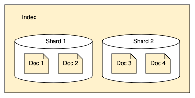

# OpenSearch: Поиск и аналитика для хайлоадов 🚀

## Что такое OpenSearch?

OpenSearch — это **распределенная поисковая машина** (думай про неё как про Google для твоих данных). Можно запустить на одной тачке или раскидать по сотням серверов в дата-центре.

**Зачем нужен?**
- Поисковая строка на сайте (как на Amazon)
- Анализ логов и безопасности (ловим хакеров)
- Аналитика больших данных (BigData, детка!)

---

## Основные концепции (база, которую надо знать)

### 📄 Документ (Document)

**Что это?** Единица хранения данных в JSON-формате. Как строка в SQL-таблице, только круче.

**Пример:** Студент в базе данных

| ID | Имя | Средний балл | Год выпуска |
|----|-----|--------------|-------------|
| 1 | Джон Доу | 3.89 | 2022 |

В JSON выглядит так:

```json
{
  "name": "John Doe",
  "gpa": 3.89,
  "grad_year": 2022
}
```

**Ассоциация:** Документ = карточка студента в деканате.

---

### 📚 Индекс (Index)

**Что это?** Коллекция документов. Как таблица в SQL, но без жесткой схемы.

**Пример:** Все студенты школы

| ID | Имя | Средний балл | Год выпуска |
|----|-----|--------------|-------------|
| 1 | Джон Доу | 3.89 | 2022 |
| 2 | Джонатан Пауэрс | 3.85 | 2025 |
| 3 | Джейн Доу | 3.52 | 2024 |

**Ассоциация:** Индекс = папка с карточками всех студентов.

---

### 🖥️ Кластеры и узлы (Clusters & Nodes)

**Кластер** = группа серверов, работающих вместе  
**Узел** = один сервер в кластере

**Аналогия:** Кластер — это команда разработчиков, узел — один девелопер.

**Типы узлов:**
- **Master-node** (менеджер) — координирует работу кластера
- **Data-node** (воркер) — хранит данные и выполняет поиск
- **Ingest-node** (препроцессор) — обрабатывает данные перед индексацией

**Масштабирование:**
- Один ноут = одноузловой кластер (для разработки)
- Продакшн = сотни мощных серверов

---

### 🍕 Шарды (Shards) — делим пиццу на куски

**Проблема:** Индекс на 400 ГБ не влезет на один сервер.  
**Решение:** Режем индекс на **шарды** (куски по 40 ГБ) и раскидываем по узлам.



**Пример:**
- Индекс 1: 2 шарда
- Индекс 2: 4 шарда
- Распределены между узлами 1 и 2


**Важно!** Каждый шард = отдельный процесс Lucene (жрёт CPU и RAM). Не делай 1000 шардов на 400 ГБ — убьёшь кластер.

**Золотое правило:** Размер шарда = 10-50 ГБ.

---

### 🔄 Primary и Replica шарды

**Primary shard** (основной) — оригинал данных  
**Replica shard** (реплика) — копия для отказоустойчивости

**По умолчанию:** 1 реплика на каждый primary шард.


**Зачем реплики?**
1. **Отказоустойчивость** — если узел упал, данные не потеряны
2. **Скорость поиска** — запросы распределяются между репликами

**Сленг:** "Шардим базу" = делим индекс на части.

---

### 🔍 Инвертированный индекс (Inverted Index)

**Что это?** Структура данных, которая сопоставляет слова с документами.

**Пример:**

**Документы:**
- Документ 1: "Красота в глазах смотрящего"
- Документ 2: "Красавица и чудовище"

**Инвертированный индекс:**

| Слово | Документы |
|-------|-----------|
| красота | 1, 2 |
| является | 1 |
| в | 1 |
| глаз | 1 |
| и | 2 |
| зверь | 2 |

**Аналогия:** Как индекс в конце учебника — слово → страницы.

**Бонус:** OpenSearch хранит **позицию слова** в документе для фразовых запросов.

---

### ⭐ Релевантность (Relevance Score)

**Что это?** Оценка того, насколько документ соответствует запросу.

**Алгоритм:** BM25 (Okapi BM25)

**Факторы:**
1. **TF (Term Frequency)** — чем чаще слово в документе, тем выше балл
2. **IDF (Inverse Document Frequency)** — чем реже слово в коллекции, тем выше балл
3. **Длина документа** — короткие документы ранжируются выше

**Пример:**
- Запрос: "blue axolotl"
- Документ с "axolotl" (редкое слово) получит выше балл, чем с "blue"

**Сленг:** "Скор упал" = релевантность результатов поиска ухудшилась.

---

## Взаимодействие с OpenSearch

### 🛠️ REST API

**Способы отправки запросов:**
1. **cURL** (терминал)
2. **Dev Tools** (OpenSearch Dashboards)
3. **HTTP-клиенты** (Postman, Insomnia)

### Примеры запросов

**Без безопасности:**
```bash
curl -X GET "http://localhost:9200/_cluster/health"
```

**С безопасностью:**
```bash
curl -X GET "https://localhost:9200/_cluster/health" -ku admin:PASSWORD
```

**Красивый JSON (pretty print):**
```bash
curl -X GET "https://localhost:9200/_cluster/health?pretty"
```

**Запрос с телом:**
```bash
curl -X GET "https://localhost:9200/students/_search?pretty" \
  -H 'Content-Type: application/json' \
  -d '{
    "query": {
      "match_all": {}
    }
  }'
```

### Dev Tools (упрощённый синтаксис)

```http
GET _cluster/health
```

**Запуск:** `Ctrl+Enter` или клик по ▶

---

## CRUD операции (Create, Read, Update, Delete)

### 📝 Индексация документа (Create)

**Синтаксис:**
```http
PUT /<index>/_doc/<id>
```

**Пример:**
```http
PUT /students/_doc/1
{
  "name": "Иван Иванов",
  "gpa": 4.5,
  "grad_year": 2023
}
```

**Что происходит:**
1. Создаётся индекс `students` (если не существует)
2. Документ сохраняется с ID = 1
3. Если ID не указан → генерируется автоматически

---

### 🔎 Динамическое маппинг (Dynamic Mapping)

OpenSearch **автоматически определяет типы полей** из JSON.

**Проверка схемы:**
```http
GET /students/_mapping
```

**Ответ:**
```json
{
  "students": {
    "mappings": {
      "properties": {
        "gpa": {"type": "float"},
        "grad_year": {"type": "long"},
        "name": {
          "type": "text",
          "fields": {
            "keyword": {
              "type": "keyword",
              "ignore_above": 256
            }
          }
        }
      }
    }
  }
}
```

**Типы полей:**
- `text` — для полнотекстового поиска (анализируется)
- `keyword` — для точного поиска (не анализируется)
- `float`, `long` — числа
- `date` — даты

**Важно!** Изменить тип поля после создания индекса **нельзя** — нужно пересоздавать индекс.

---

### 🔍 Поиск документов (Read)

**Все документы:**
```http
GET /students/_search
{
  "query": {
    "match_all": {}
  }
}
```

**Ответ:**
```json
{
  "took": 12,
  "hits": {
    "total": {"value": 1, "relation": "eq"},
    "max_score": 1,
    "hits": [
      {
        "_index": "students",
        "_id": "1",
        "_score": 1,
        "_source": {
          "name": "Иван Иванов",
          "gpa": 4.5,
          "grad_year": 2023
        }
      }
    ]
  }
}
```

**Ключевые поля:**
- `took` — время выполнения (мс)
- `hits.total` — количество найденных документов
- `_score` — релевантность
- `_source` — исходный документ

---

### ✏️ Обновление документов (Update)

**Полное обновление (переиндексация):**
```http
PUT /students/_doc/1
{
  "name": "Иван Иванов",
  "gpa": 4.7,
  "grad_year": 2023,
  "address": "ул. Ленина, 123"
}
```

**Частичное обновление:**
```http
POST /students/_update/1
{
  "doc": {
    "gpa": 4.7,
    "address": "ул. Ленина, 123"
  }
}
```

**Сленг:** "Апдейтим докумен" = обновляем документ.

---

### 🗑️ Удаление (Delete)

**Удалить документ:**
```http
DELETE /students/_doc/1
```

**Удалить индекс:**
```http
DELETE /students
```

**Осторожно!** Удаление индекса = удаление всех данных.

---

## Настройка индексов

### Явное создание индекса с маппингом

```http
PUT /students
{
  "settings": {
    "index.number_of_shards": 1
  },
  "mappings": {
    "properties": {
      "name": {"type": "text"},
      "grad_year": {"type": "date"}
    }
  }
}
```

**Параметры:**
- `settings` — настройки индекса (количество шардов)
- `mappings` — схема полей

---

## Поиск данных (Search)

### Подготовка тестовых данных

```http
POST _bulk
{ "create": { "_index": "students", "_id": "1" } }
{ "name": "Иван Петров", "gpa": 4.5, "grad_year": 2023}
{ "create": { "_index": "students", "_id": "2" } }
{ "name": "Алексей Смирнов", "gpa": 4.2, "grad_year": 2025 }
{ "create": { "_index": "students", "_id": "3" } }
{ "name": "Мария Иванова", "gpa": 4.8, "grad_year": 2024 }
```

**Сленг:** "Залили данные через bulk" = массовая загрузка.

---

### Query String поиск (простой)

```http
GET /students/_search?q=name:иван
```

**Минусы:**
- Ограниченные возможности
- Сложно читать

---

### Query DSL (мощный)

**Полнотекстовый поиск:**
```http
GET /students/_search
{
  "query": {
    "match": {
      "name": "иван"
    }
  }
}
```

**Найдёт:** "Иван Петров" и "Мария Иванова"

---

### Поиск по keyword (точное совпадение)

```http
GET /students/_search
{
  "query": {
    "match": {
      "name.keyword": "Иван Петров"
    }
  }
}
```

**Найдёт:** только "Иван Петров" (полное совпадение)

---

### Фильтры (без расчёта релевантности)

**Точное значение:**
```http
GET students/_search
{
  "query": { 
    "bool": { 
      "filter": [ 
        { "term": { "grad_year": 2023 }}
      ]
    }
  }
}
```

**Диапазон:**
```http
GET students/_search
{
  "query": { 
    "bool": { 
      "filter": [ 
        { "range": { "gpa": { "gt": 4.0 }}}
      ]
    }
  }
}
```

**Операторы:**
- `gt` — больше (>)
- `gte` — больше или равно (≥)
- `lt` — меньше (<)
- `lte` — меньше или равно (≤)

---

### Составные запросы (bool query)

```http
GET students/_search
{
  "query": {
    "bool": {
      "must": [
        { "match": { "name": "иван" } },
        { "range": { "gpa": { "gte": 4.0 } } },
        { "term": { "grad_year": 2023 }}
      ]
    }
  }
}
```

**Логика:**
- `must` — И (AND)
- `should` — ИЛИ (OR)
- `must_not` — НЕ (NOT)
- `filter` — фильтр без скора

**Сленг:** "Булевый запрос" = комбинация условий.

---

## Query DSL — язык запросов

### Типы запросов

#### 1️⃣ Листовые запросы (Leaf queries)

**Особенности:**
- Поиск по конкретным полям
- Используются самостоятельно
- Не содержат других запросов

**Типы:**

**1.1 Полнотекстовые (Full-text):**
- `match` — поиск с анализом текста
- `match_phrase` — поиск фразы
- `multi_match` — поиск по нескольким полям

**1.2 Термино-уровневые (Term-level):**
- `term` — точное совпадение
- `terms` — совпадение с одним из значений
- `range` — диапазон
- `exists` — проверка наличия поля

**1.3 Геопространственные (Geo):**
- `geo_distance` — поиск в радиусе
- `geo_bounding_box` — поиск в прямоугольнике

**1.4 Специализированные:**
- `more_like_this` — похожие документы
- `script` — запросы со скриптами

---

#### 2️⃣ Составные запросы (Compound queries)

**Особенности:**
- Объединяют несколько запросов
- Управляют логикой выполнения

**Типы:**
- `bool` — булева логика (AND, OR, NOT)
- `dis_max` — поиск по нескольким полям (берёт максимальный скор)
- `constant_score` — фиксированная релевантность
- `function_score` — кастомные алгоритмы скоринга

---

### Ресурсоёмкие запросы (дорогие)

**Типы:**
- `fuzzy` — нечёткий поиск
- `prefix` — поиск по префиксу
- `regexp` — регулярные выражения
- `wildcard` — поиск с подстановочными символами

**Защита от дорогих запросов:**
```http
PUT _cluster/settings
{
  "persistent": {
    "search.allow_expensive_queries": false
  }
}
```

**Сленг:** "Дорогой запрос" = запрос, жрущий много ресурсов.

---

## Контекст запроса и фильтра

### Контекст фильтра (Filter context)

**Особенности:**
- Бинарный результат (Да/Нет)
- Не вычисляет релевантность
- Результаты кэшируются
- Быстрее, чем query context

**Пример:**
```http
GET students/_search
{
  "query": {
    "bool": {
      "filter": [
        { "term": { "honors": true }},
        { "range": { "graduation_year": { "gte": 2020, "lte": 2022 }}}
      ]
    }
  }
}
```

**Аналогия:** Фильтр = сито (пропускает или нет).

---

### Контекст запроса (Query context)

**Особенности:**
- Вычисляет релевантность (_score)
- Сортирует по релевантности
- Медленнее фильтра

**Пример:**
```http
GET shakespeare/_search
{
  "query": {
    "match": {
      "text_entry": "long live king"
    }
  }
}
```

**Аналогия:** Запрос = экзамен (оценивает качество ответа).

---

## Сравнение термовых и полнотекстовых запросов

| Характеристика | Термовые (term-level) | Полнотекстовые (full-text) |
|----------------|----------------------|---------------------------|
| **Анализатор** | Не используется | Используется |
| **Релевантность** | Не сортирует | Сортирует по _score |
| **Использование** | Точные значения (ID, даты) | Текстовые поля |
| **Пример** | `term`, `range` | `match`, `match_phrase` |

---

### Пример 1: Поиск фразы

**Термовый запрос (не найдёт):**
```http
GET shakespeare/_search
{
  "query": {
    "term": {
      "text_entry": "To be, or not to be"
    }
  }
}
```

**Результат:** 0 документов (ищет точную фразу без анализа).

**Полнотекстовый запрос (найдёт):**
```http
GET shakespeare/_search
{
  "query": {
    "match": {
      "text_entry": "To be, or not to be"
    }
  }
}
```

**Результат:** 10000+ документов (анализирует фразу).

---

### Пример 2: Поиск точного термина

```http
GET shakespeare/_search
{
  "query": {
    "term": {
      "speaker": "HAMLET"
    }
  }
}
```

**Результат:** 1582 документа.

**Важно!** Поиск по "Hamlet" не даст результатов (поле `speaker` — keyword, регистр важен).

---

## Термино-уровневые запросы (Term-level queries)

### Типы запросов

| Тип | Описание |
|-----|----------|
| `term` | Точное совпадение |
| `terms` | Совпадение с одним из значений |
| `terms_set` | Минимальное количество совпадений |
| `ids` | Поиск по ID |
| `range` | Диапазон значений |
| `prefix` | Поиск по префиксу |
| `exists` | Проверка наличия поля |
| `fuzzy` | Нечёткий поиск (опечатки) |
| `wildcard` | Поиск с подстановочными символами |
| `regexp` | Регулярные выражения |

---

### Примеры

**Точное совпадение:**
```http
GET products/_search
{
  "query": {
    "term": {
      "product_code": "ABC-123"
    }
  }
}
```

**Диапазон:**
```http
GET logs/_search
{
  "query": {
    "range": {
      "timestamp": {
        "gte": "2023-01-01",
        "lte": "2023-12-31"
      }
    }
  }
}
```

**Нечёткий поиск (опечатки):**
```http
GET contacts/_search
{
  "query": {
    "fuzzy": {
      "last_name": {
        "value": "Smith",
        "fuzziness": 2
      }
    }
  }
}
```

**Сленг:** "Фаззи поиск" = поиск с опечатками.

---

## Рекомендации (Best Practices)

### ✅ Что делать

1. **Для точных значений** → используй `keyword` и термовые запросы
2. **Для текста** → используй `text` и полнотекстовые запросы
3. **Для фильтрации** → используй filter context (кэшируется)
4. **Для поиска** → используй query context (релевантность)
5. **Размер шарда** → 10-50 ГБ
6. **Мониторинг** → включи slow logs для медленных запросов

### ❌ Чего не делать

1. **Не используй** термовые запросы для `text` полей
2. **Не создавай** слишком много шардов (убьёшь кластер)
3. **Не используй** дорогие запросы без необходимости
4. **Не забывай** про реплики (отказоустойчивость)

---

## Глоссарий (сленг разработчика)

- **Шардить** — делить индекс на части
- **Скор** — релевантность документа
- **Булевый запрос** — комбинация условий (AND, OR, NOT)
- **Фаззи поиск** — поиск с опечатками
- **Дорогой запрос** — ресурсоёмкий запрос
- **Залить данные** — загрузить данные в индекс
- **Апдейтить** — обновлять
- **Маппинг** — схема полей индекса
- **Кластер упал** — сервера недоступны
- **Реплика** — копия шарда

---

## Итоги

OpenSearch — это мощный инструмент для поиска и аналитики. Основные концепции:

1. **Документ** — единица данных (JSON)
2. **Индекс** — коллекция документов
3. **Шард** — часть индекса
4. **Реплика** — копия шарда
5. **Query DSL** — язык запросов
6. **Filter vs Query** — фильтр быстрее, запрос умнее

**Главное правило:** Используй правильный тип запроса для правильного типа поля!

🚀 **Удачи в освоении OpenSearch!**
