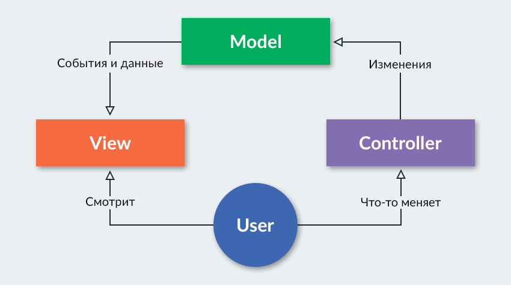
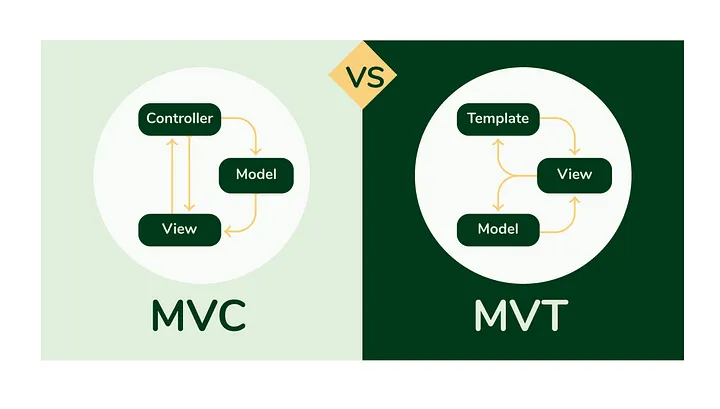
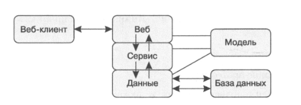

# Введение в FastAPI

## Слайд 1: REST(ful)

**Рой Филдинг**: определение передачи репрезентативного состояния (Representational State Transfer, REST) - архитектурного стиля для использования HTTP

### Характеристики RESTful

- использует HTTP и протокол клиент-сервер
- не имеет состояния (каждое соединение независимо)
- кэшируема
- основана на ресурсах

## Слайд 2: CRUD операции

- **POST** - создание (запись)
- **PUT** - полная модификация (замена)
- **PATCH** - частичная модификация (обновление)
- **GET** - получение (считывание, извлечение)
- **DELETE** - удаление

## Слайд 3: Конечные точки RESTful

Конечная точка RESTful с данными в одной из таких областей HTTP-сообщения:

- заголовки
- строка URL
- параметры запроса
- значения в теле сообщения

## Слайд 4: Коды состояния HTTP

Коды состояния, определяющие такие состояния, как:

- **группа кодов 100** - информация, продолжение выполнения
- **группа кодов 200** - успешное выполнение
- **группа кодов 300** - перенаправление
- **группа кодов 400** - ошибка на стороне клиента
- **группа кодов 500** - ошибка на стороне сервера

### Дополнительно:
- различные заголовки
- тело сообщения, которое может быть пустым, единым или разделенным на части (последовательные фрагменты)

**Пасхалка** - 418 (I'm a teapot)

## Слайд 5: Конкурентность

- **время ожидания** - предварительное время ожидания
- **пропускная способность** - количество байтов в секунду между сервисом и его абонентами

Термин «конкурентность» не означает полный параллелизм. Множественная обработка не происходит в одну и ту же наносекунду в одном процессоре. Конкурентность в основном позволяет избежать напряженного ожидания (простаивания центрального процессора (ЦП) до получения ответа)

## Слайд 6: Уровни (слои)

**«Модель-представление-контроллер»** (Model-View-Controller, MVC)

## Слайд 7: Архитектура уровней

### Описание уровней:

- **веб-уровень** - уровень ввода/вывода поверх HTTP. Он собирает клиентские запросы, вызывает сервисный уровень и возвращает ответы
- **сервис** - бизнес-логика, при необходимости выполняющая обращения к уровню данных
- **данные** - доступ к хранилищам данных и другим сервисам
- **модель** - определения данных, общие для всех уровней
- **веб-клиент** - веб-браузер или другое программное обеспечение на стороне клиента HTTP
- **база данных** - хранилище данных, часто SQL- или NoSQL-сервер

### Детальное описание:

**Веб-уровень** задействует клиентские приложения и API. Обычно мы говорим о RESTful-веб-интерфейсе с URL-адресами, запросами и закодированными в формате JSON ответами.

**Сервисный уровень** содержит фактические данные о том, что предоставляет этот веб-сайт. По сути, этот уровень похож на библиотеку. Он импортирует модули уровня данных для доступа к базам данных и внешним сервисам, но не должен получать от них детальную информацию.

**Уровень данных** предоставляет уровню сервисов доступ к данным через файлы или клиентские вызовы других сервисов.

**Блочная модель (model)** - это не настоящий уровень, а источник определений данных, общих для всех уровней. Он не требуется, если вы передаете между уровнями встроенные структуры данных Python (библиотека Pydantic)

## Слайд 8: Зачем разделять на уровни?

По многим причинам каждый уровень может быть:

- написан специалистами
- изолированно протестирован
- заменен или дополнен - вы можете добавить второй веб-уровень, использующий другой API, например GraphQL или gRPC, наряду с веб-уровнем

## Слайд 9: Преимущества FastAPI

Для FastAPI заявлены такие его преимущества:

- **высокая производительность** - в некоторых случаях он работает так же быстро, как Node.js и Go, что необычно для фреймворков Python
- **ускоренный процесс разработки** - никаких острых углов или странностей
- **повышение качества кода** - подсказки типов и модели помогают уменьшить количество ошибок
- **автоматически генерируемая документация и тестовые страницы** - это гораздо проще, чем вручную редактировать описания OpenAPI

## Слайд 10: Технологии FastAPI

В FastAPI используются:

- подсказки типов Python
- пакет Starlette для веб-машин, включая поддержку асинхронности
- пакет Pydantic для определения и проверки данных
- специальная интеграция, позволяющая использовать и расширять возможности других фреймворков
