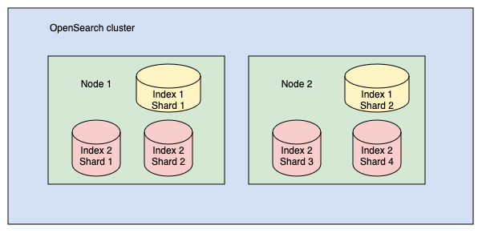

# OpenSearch: Поиск и аналитика для хайлоадов 🚀
**Слайд 1**

**Распределенная поисковая машина для больших данных**

---

## Что такое OpenSearch?
**Слайд 2**

**OpenSearch** — распределенная поисковая машина (Google для твоих данных)

**Применение:**
- 🔍 Поисковая строка на сайте (как на Amazon)
- 🛡️ Анализ логов и безопасности
- 📊 Аналитика больших данных (BigData)

**Масштабирование:** от одного ноутбука до сотен серверов

---

## SQL и DSL в OpenSearch 🔤
**Слайд 3**

**Два способа запросов:**

**1. SQL** — привычный синтаксис для аналитиков
```sql
SELECT name, gpa FROM students WHERE gpa > 4.0
```

**2. DSL (Domain Specific Language)** — мощный JSON-запрос
```json
{"query": {"range": {"gpa": {"gt": 4.0}}}}
```

**Когда использовать:**
- SQL → простые запросы, аналитика, BI-инструменты
- DSL → сложные запросы, полнотекстовый поиск, максимальная гибкость

---

## Сравнение SQL и DSL: Примеры 🔄
**Слайд 4**

**Пример 1: Поиск по имени**

```sql
SELECT * FROM students WHERE name LIKE '%Иван%'
```

```json
{
  "query": {
    "match": {
      "name": "Иван"
    }
  }
}
```

---

## Сравнение SQL и DSL: Сложный запрос 🎯
**Слайд 5**

**Пример 2: Комбинированные условия**

```sql
SELECT name, gpa FROM students 
WHERE gpa >= 4.0 AND grad_year = 2023
```

```json
{
  "query": {
    "bool": {
      "must": [
        {"range": {"gpa": {"gte": 4.0}}},
        {"term": {"grad_year": 2023}}
      ]
    }
  }
}
```

---

## Сравнение SQL vs DSL ⚖️
**Слайд 6**

| Критерий | SQL | DSL |
|----------|-----|-----|
| Синтаксис | SQL-подобный | JSON |
| Простота | Высокая | Средняя |
| Гибкость | Ограниченная | Полная |
| Производительность | Хорошая | Оптимальная |
| Все функции OpenSearch | Не все | Все |
| Full-text search | Ограничено | Полноценно |

---

## Документ (Document) 📄
**Слайд 7**

**Единица хранения данных в JSON-формате**

```json
{
  "name": "John Doe",
  "gpa": 3.89,
  "grad_year": 2022
}
```

**Ассоциация:** Документ = карточка студента в деканате

---

## Индекс (Index) 📚
**Слайд 4**

**Коллекция документов** (как таблица в SQL, но без жесткой схемы)

```json
[
  {"name": "Джон Доу", "gpa": 3.89, "grad_year": 2022},
  {"name": "Джонатан Пауэрс", "gpa": 3.85, "grad_year": 2025},
  {"name": "Джейн Доу", "gpa": 3.52, "grad_year": 2024}
]
```

**Ассоциация:** Индекс = папка с карточками всех студентов

---

## Кластеры и узлы 🖥️
**Слайд 5**

**Кластер** = группа серверов, работающих вместе
**Узел** = один сервер в кластере

**Типы узлов:**
- **Master-node** — координирует работу кластера
- **Data-node** — хранит данные и выполняет поиск
- **Ingest-node** — обрабатывает данные перед индексацией

**Аналогия:** Кластер = команда разработчиков, узел = один девелопер

---

## Шарды (Shards) 🍕
**Слайд 6**

**Проблема:** Индекс на 400 ГБ не влезет на один сервер

**Решение:** Режем индекс на шарды (куски по 40 ГБ)


**Золотое правило:** Размер шарда = 10-50 ГБ

**Важно!** Каждый шард = отдельный процесс Lucene (жрёт CPU и RAM)

---

## Распределение шардов
**Слайд 7**



**Пример:**
- Индекс 1: 2 шарда
- Индекс 2: 4 шарда
- Распределены между узлами 1 и 2

---

## Primary и Replica шарды 🔄
**Слайд 8**

**Primary shard** — оригинал данных
**Replica shard** — копия для отказоустойчивости


**По умолчанию:** 1 реплика на каждый primary шард

**Зачем реплики?**
1. Отказоустойчивость — если узел упал, данные не потеряны
2. Скорость поиска — запросы распределяются между репликами

---

## Инвертированный индекс 🔍
**Слайд 9**

**Структура данных:** слова → документы

| Слово | Документы |
|-------|-----------|
| красота | 1, 2 |
| глаз | 1 |
| зверь | 2 |

**Аналогия:** Индекс в конце учебника — слово → страницы

**Бонус:** OpenSearch хранит позицию слова для фразовых запросов

---

## Релевантность (Relevance Score) ⭐
**Слайд 10**

**Оценка соответствия документа запросу**

**Алгоритм:** BM25 (Okapi BM25)

**Факторы:**
1. **TF** — чем чаще слово в документе, тем выше балл
2. **IDF** — чем реже слово в коллекции, тем выше балл
3. **Длина документа** — короткие документы ранжируются выше

---

## REST API 🛠️

**Способы отправки запросов:**
1. cURL (терминал)
2. Dev Tools (OpenSearch Dashboards)
3. HTTP-клиенты (Postman, Insomnia)

**Пример:**
```bash
curl -X GET "http://localhost:9200/_cluster/health?pretty"
```

---

## Dev Tools (упрощённый синтаксис)

```http
GET _cluster/health
```

**Запуск:** `Ctrl+Enter` или клик по ▶

**Преимущества:**
- Автодополнение
- Подсветка синтаксиса
- История запросов

---

## Индексация документа (Create) 📝

```http
PUT /students/_doc/1
{
  "name": "Иван Иванов",
  "gpa": 4.5,
  "grad_year": 2023
}
```

**Что происходит:**
1. Создаётся индекс `students` (если не существует)
2. Документ сохраняется с ID = 1
3. Если ID не указан → генерируется автоматически

---

## Динамическое маппинг 🔎

**OpenSearch автоматически определяет типы полей**

```http
GET /students/_mapping
```

**Типы полей:**
- `text` — для полнотекстового поиска
- `keyword` — для точного поиска
- `float`, `long` — числа
- `date` — даты

**Важно!** Изменить тип поля после создания индекса нельзя

---

## Поиск документов (Read) 🔍

```http
GET /students/_search
{
  "query": {
    "match_all": {}
  }
}
```

**Ключевые поля ответа:**
- `took` — время выполнения (мс)
- `hits.total` — количество найденных документов
- `_score` — релевантность
- `_source` — исходный документ

---

## Обновление документов (Update) ✏️

**Полное обновление:**
```http
PUT /students/_doc/1
{
  "name": "Иван Иванов",
  "gpa": 4.7,
  "grad_year": 2023
}
```

**Частичное обновление:**
```http
POST /students/_update/1
{
  "doc": {
    "gpa": 4.7
  }
}
```

---

## Удаление (Delete) 🗑️

**Удалить документ:**
```http
DELETE /students/_doc/1
```

**Удалить индекс:**
```http
DELETE /students
```

**Осторожно!** Удаление индекса = удаление всех данных

---

## Явное создание индекса

```http
PUT /students
{
  "settings": {
    "index.number_of_shards": 1
  },
  "mappings": {
    "properties": {
      "name": {"type": "text"},
      "grad_year": {"type": "date"}
    }
  }
}
```

---

## Массовая загрузка данных (Bulk API)

```http
POST _bulk
{ "create": { "_index": "students", "_id": "1" } }
{ "name": "Иван Петров", "gpa": 4.5, "grad_year": 2023}
{ "create": { "_index": "students", "_id": "2" } }
{ "name": "Алексей Смирнов", "gpa": 4.2, "grad_year": 2025 }
{ "create": { "_index": "students", "_id": "3" } }
{ "name": "Мария Иванова", "gpa": 4.8, "grad_year": 2024 }
```

**Сленг:** "Залили данные через bulk"

---

## Query String поиск (простой)

```http
GET /students/_search?q=name:иван
```

**Минусы:**
- Ограниченные возможности
- Сложно читать

---

## Query DSL (мощный)

**Полнотекстовый поиск:**
```http
GET /students/_search
{
  "query": {
    "match": {
      "name": "иван"
    }
  }
}
```

**Найдёт:** "Иван Петров" и "Мария Иванова"

---

## Поиск по keyword (точное совпадение)

```http
GET /students/_search
{
  "query": {
    "match": {
      "name.keyword": "Иван Петров"
    }
  }
}
```

**Найдёт:** только "Иван Петров" (полное совпадение)

---

## Фильтры (без релевантности)

**Точное значение:**
```http
GET students/_search
{
  "query": { 
    "bool": { 
      "filter": [ 
        { "term": { "grad_year": 2023 }}
      ]
    }
  }
}
```

**Преимущества:** быстрее, результаты кэшируются

---

## Диапазон значений

```http
GET students/_search
{
  "query": { 
    "bool": { 
      "filter": [ 
        { "range": { "gpa": { "gt": 4.0 }}}
      ]
    }
  }
}
```

**Операторы:** `gt` (>), `gte` (≥), `lt` (<), `lte` (≤)

---

## Составные запросы (bool query)

```http
GET students/_search
{
  "query": {
    "bool": {
      "must": [
        { "match": { "name": "иван" } },
        { "range": { "gpa": { "gte": 4.0 } } }
      ]
    }
  }
}
```

**Логика:** `must` (AND), `should` (OR), `must_not` (NOT), `filter`

---

## Типы запросов Query DSL

**1. Листовые запросы (Leaf queries):**
- Полнотекстовые: `match`, `match_phrase`, `multi_match`
- Термино-уровневые: `term`, `terms`, `range`, `exists`
- Геопространственные: `geo_distance`, `geo_bounding_box`
- Специализированные: `more_like_this`, `script`

**2. Составные запросы (Compound queries):**
- `bool`, `dis_max`, `constant_score`, `function_score`

---

## Ресурсоёмкие запросы (дорогие)

**Типы:**
- `fuzzy` — нечёткий поиск
- `prefix` — поиск по префиксу
- `regexp` — регулярные выражения
- `wildcard` — поиск с подстановочными символами

**Защита:**
```http
PUT _cluster/settings
{
  "persistent": {
    "search.allow_expensive_queries": false
  }
}
```

---

## Контекст фильтра (Filter context)

**Особенности:**
- Бинарный результат (Да/Нет)
- Не вычисляет релевантность
- Результаты кэшируются
- Быстрее, чем query context

**Аналогия:** Фильтр = сито (пропускает или нет)

---

## Контекст запроса (Query context)

**Особенности:**
- Вычисляет релевантность (_score)
- Сортирует по релевантности
- Медленнее фильтра

**Аналогия:** Запрос = экзамен (оценивает качество ответа)

---

## Сравнение термовых и полнотекстовых запросов

| Характеристика | Термовые | Полнотекстовые |
|----------------|----------|----------------|
| Анализатор | Не используется | Используется |
| Релевантность | Не сортирует | Сортирует по _score |
| Использование | Точные значения | Текстовые поля |
| Пример | `term`, `range` | `match`, `match_phrase` |

---

## Пример: Поиск фразы

**Термовый запрос (не найдёт):**
```http
GET shakespeare/_search
{
  "query": {
    "term": {
      "text_entry": "To be, or not to be"
    }
  }
}
```

**Результат:** 0 документов (ищет точную фразу без анализа)

---

## Пример: Полнотекстовый поиск

**Полнотекстовый запрос (найдёт):**
```http
GET shakespeare/_search
{
  "query": {
    "match": {
      "text_entry": "To be, or not to be"
    }
  }
}
```

**Результат:** 10000+ документов (анализирует фразу)

---

## Рекомендации ✅

**Что делать:**
1. Для точных значений → `keyword` и термовые запросы
2. Для текста → `text` и полнотекстовые запросы
3. Для фильтрации → filter context (кэшируется)
4. Для поиска → query context (релевантность)
5. Размер шарда → 10-50 ГБ
6. Включи slow logs для медленных запросов

---

## Чего не делать ❌

1. Не используй термовые запросы для `text` полей
2. Не создавай слишком много шардов
3. Не используй дорогие запросы без необходимости
4. Не забывай про реплики (отказоустойчивость)

---

## Глоссарий (сленг разработчика)

- **Шардить** — делить индекс на части
- **Скор** — релевантность документа
- **Булевый запрос** — комбинация условий
- **Фаззи поиск** — поиск с опечатками
- **Дорогой запрос** — ресурсоёмкий запрос
- **Залить данные** — загрузить данные в индекс
- **Маппинг** — схема полей индекса

---

## Итоги

**Основные концепции:**
1. Документ — единица данных (JSON)
2. Индекс — коллекция документов
3. Шард — часть индекса
4. Реплика — копия шарда
5. Query DSL — язык запросов
6. Filter vs Query — фильтр быстрее, запрос умнее

**Главное правило:** Используй правильный тип запроса для правильного типа поля!

---

# 🚀 Удачи в освоении OpenSearch!

**Вопросы?**
