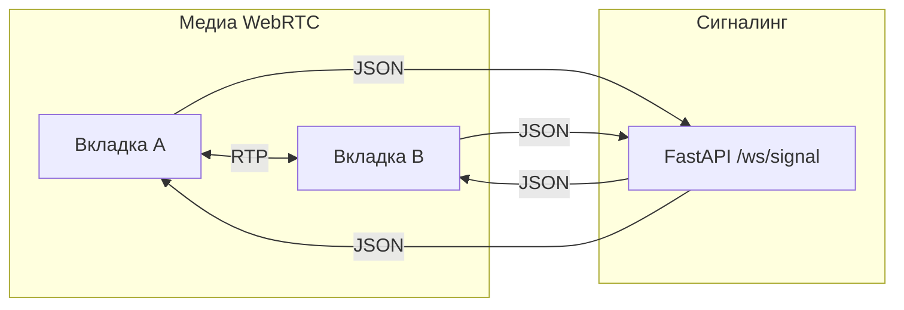

# Методичка: реакции через RabbitMQ и «прочитано» через HTTP.

---

## Содержание


| Раздел                                                       | Тема                                                    |
| ------------------------------------------------------------ | ------------------------------------------------------- |
| [Краткое ТЗ](#краткое-тз)                                    | цель, объём, отличия двух фич                           |
| [§0](#0-что-уже-должно-быть-в-проекте)                       | проверка базового проекта                               |
| [§1](#1-база-данных-appdbpy)                                 | `Reaction`, `ReadCursor`                                |
| [§2](#2-очереди-и-ключи-appmqpy)                             | константы и bindings                                    |
| [§3](#3-новый-файл-workersreactionspy)                       | обработчик реакций                                      |
| [§4](#4-точка-входа-воркера-workerpy)                        | второй консьюмер                                        |
| [§5](#5-веб-приложение-appmainpy)                            | `main.py`, в т.ч. эталон                                |
| [§6](#6-шаблон-комнаты-apptemplatesroomhtml)                 | `room.html`, JS                                         |
| [§7](#7-стили-appstaticstylescss)                            | галочки и пикер                                         |
| [§8](#8-переменные-окружения-по-желанию)                     | `.env`                                                  |
| [§9](#9-проверка)                                            | сценарии и curl                                         |
| [§10](#10-практикум-rabbitmq-и-ваш-репозиторий)              | код, UI, Publish, правка `mq.py`, `.env` *(по желанию)* |
| [§11](#11-webrtc-1-1-сигналинг-json-отдельный-ws)            | WebRTC 1:1, сигналинг JSON *(по желанию)*               |


## Краткое ТЗ

### Цель

На базе **предыдушей работы** добавить:

1. **Реакции** — эмодзи на сообщение, полный конвейер как у текста чата.
2. **Прочитано** — индикатор ✓ / ✓✓ у сообщения.

### Два потока данных (сравнение)


|                      | Реакции                                     | «Прочитано»                                |
| -------------------- | ------------------------------------------- | ------------------------------------------ |
| **Очереди RabbitMQ** | Да: `chat.reactions.incoming` / `persisted` | Нет                                        |
| **Кто пишет в БД**   | worker                                      | web (`POST /read`)                         |
| **Таблица**          | `reactions`                                 | `read_cursors`                             |
| **Обновление UI**    | WebSocket после `persisted`                 | WebSocket после `broadcast` из `mark_read` |


### Реакции — кратко по слоям


| Слой       | Что делаем                                                                              |
| ---------- | --------------------------------------------------------------------------------------- |
| PostgreSQL | Таблица `**reactions`**, уникальность (сообщение, ник, эмодзи)                          |
| RabbitMQ   | Те же `**chat.events`**, +2 очереди, ключи `chat.reaction.created` / `persisted`        |
| **web**    | `POST`/`DELETE` → publish; фоновая задача читает `reactions.persisted` → broadcast HTML |
| **worker** | Читает `reactions.incoming` → БД → publish счётчиков                                    |
| **Фронт**  | Пикер эмодзи, oob на `#reactions-{id}`                                                  |


### «Прочитано» — кратко


| Элемент                   | Описание                                                    |
| ------------------------- | ----------------------------------------------------------- |
| Таблица                   | `**read_cursors`** — одна строка на (ник, комната)          |
| HTTP                      | `**POST /rooms/{room_id}/read`** с `username`, `message_id` |
| UI                        | Класс `**read*`* на `#status-{id}` + CSS `::before` для ✓✓  |
| Очереди `**chat.read.***` | В этой методичке **не** используются                        |


### Файлы, которые меняем

`app/db.py` · `app/mq.py` · `app/main.py` · `**workers/reactions.py`** (новый) · `worker.py` · `app/templates/room.html` · `app/static/styles.css`

## 0. Что уже должно быть в проекте

Перед правками убедитесь, что проект **работает**: сообщение из формы проходит `web → очередь → worker → БД → persisted → broadcast` и видно у всех вкладок в той же комнате. 

Часть 2 **не заменяет** этот поток, а **добавляет** реакции по той же схеме и отдельно — хранение «до какого сообщения дочитал пользователь» с обновлением галочек в UI.

Контрольный список того, что уже есть в базовом архиве:

- `**app/db.py`** — класс `Message`, `init_models()`, `SessionLocal`.
- `**app/mq.py`** — `MQ_EXCHANGE`, очереди `MQ_QUEUE_INCOMING` / `MQ_QUEUE_PERSISTED`, ключи `MQ_ROUTING_KEY_CREATED` / `MQ_ROUTING_KEY_PERSISTED`, класс `MQ` с `connect`, `publish`, `close`; в `connect()` — объявление двух очередей и двух привязок к exchange.
- `**app/main.py`** — `lifespan`: `init_models`, `mq.connect`, одна фоновая задача `consume_persisted_events`, `POST /rooms/{room_id}/messages`, WebSocket `/ws/{room_id}` с публикацией `chat.message.created`.
- `**worker.py**` + `**workers/messages.py**` — функция `handle_message`: читает тело JSON, вставляет строку в `messages`, публикует `chat.message.persisted`. В `worker.py` — `consume()` и один вызов в `asyncio.gather` для сообщений.

Если в вашем архиве вся логика воркера в одном `**worker.py**` без пакета `workers/` — сначала вынесите обработчик сообщений в `**workers/messages.py**` по тому же принципу, что в образце Part 1; дальше методичка опирается на наличие `**workers/messages.py**` и правку `**worker.py**`.

---

## 1. База данных — `app/db.py`

> **Контекст**  
> Задаётся **схема PostgreSQL** под две новые возможности.  
> Таблица `**reactions`** — отдельные факты (одна строка = одна реакция). `**read_cursors`** — **состояние** «дочитал до id», одна строка на пару ник + комната. После правок перезапустите приложение: `init_models()` создаст таблицы.

#### Действие 1 — импорты

После класса `Message` (и до `engine = create_async_engine`) добавьте импорты, если их ещё нет:

```python
from sqlalchemy import DateTime, ForeignKey, Integer, String, Text, UniqueConstraint
```

(часть имён может уже быть в `from sqlalchemy import …` для `Message` — **дополните** строку, не дублируя её.)

#### Действие 2 — модели

Сразу после класса `Message` вставьте **два** класса целиком:

```python
class Reaction(Base):
    __tablename__ = "reactions"
    # Одна и та же пара (сообщение, ник, эмодзи) не может повториться.
    __table_args__ = (UniqueConstraint("message_id", "username", "emoji"),)

    id: Mapped[int] = mapped_column(Integer, primary_key=True, autoincrement=True)
    message_id: Mapped[int] = mapped_column(
        Integer,
        ForeignKey("messages.id", ondelete="CASCADE"),  # при удалении сообщения — строки реакций уходят
        index=True,
    )
    username: Mapped[str] = mapped_column(String(64))
    emoji: Mapped[str] = mapped_column(String(8))
    created_at: Mapped[datetime] = mapped_column(DateTime, default=datetime.utcnow)


class ReadCursor(Base):
    __tablename__ = "read_cursors"
    # Один курсор на пользователя в комнате — upsert будет по этой паре.
    __table_args__ = (UniqueConstraint("username", "room_id"),)

    id: Mapped[int] = mapped_column(Integer, primary_key=True, autoincrement=True)
    username: Mapped[str] = mapped_column(String(64), index=True)
    room_id: Mapped[str] = mapped_column(String(100), index=True)
    last_read_message_id: Mapped[int] = mapped_column(Integer)  # «дочитал до» этого id сообщения
    updated_at: Mapped[datetime] = mapped_column(DateTime, default=datetime.utcnow)
```

> **Итог**  
> `Reaction` — кто какой эмодзи на каком сообщении; `**ondelete="CASCADE"`** подчищает реакции при удалении сообщения. `ReadCursor` — курсор чтения по паре (ник, комната).

После перезапуска контейнеров таблицы создадутся через `**init_models()`**.

---

## 2. Очереди и ключи — `app/mq.py`

> **Контекст**  
> При старте **web** объявляет те же сущности, что и **worker**: exchange, очереди, bindings. Для реакций нужна **вторая пара** очередей и routing key в `**chat.events`**. Имена — в константах / `os.getenv`, чтобы оба процесса использовали **одинаковые строки**.

#### Действие 1 — константы

После строк с `MQ_ROUTING_KEY_PERSISTED` вставьте блок для реакций:

```python
# Очередь «заявка на реакцию» — читает только worker (как chat.messages.incoming).
MQ_QUEUE_REACTIONS_INCOMING = os.getenv("MQ_QUEUE_REACTIONS_INCOMING", "chat.reactions.incoming")
# Очередь «реакция сохранена, вот счётчики» — читает фоновая задача в web.
MQ_QUEUE_REACTIONS_PERSISTED = os.getenv("MQ_QUEUE_REACTIONS_PERSISTED", "chat.reactions.persisted")
MQ_ROUTING_KEY_REACTION_CREATED = os.getenv("MQ_ROUTING_KEY_REACTION_CREATED", "chat.reaction.created")
MQ_ROUTING_KEY_REACTION_PERSISTED = os.getenv("MQ_ROUTING_KEY_REACTION_PERSISTED", "chat.reaction.persisted")
```

#### Действие 2 — объявление очередей

В `MQ.connect()` найдите цикл `for name in (...)` и расширьте кортеж:

**Было (Part 1):**

```python
for name in (MQ_QUEUE_INCOMING, MQ_QUEUE_PERSISTED):
```

**Стало:**

```python
for name in (
    MQ_QUEUE_INCOMING,
    MQ_QUEUE_PERSISTED,
    MQ_QUEUE_REACTIONS_INCOMING,
    MQ_QUEUE_REACTIONS_PERSISTED,
):
```

#### Действие 3 — bindings

Список `bindings` — добавьте две пары (очередь → routing key):

```python
# Пара (очередь, ключ): сообщение с данным routing key попадёт в указанную очередь.
bindings = [
    (MQ_QUEUE_INCOMING, MQ_ROUTING_KEY_CREATED),
    (MQ_QUEUE_PERSISTED, MQ_ROUTING_KEY_PERSISTED),
    (MQ_QUEUE_REACTIONS_INCOMING, MQ_ROUTING_KEY_REACTION_CREATED),
    (MQ_QUEUE_REACTIONS_PERSISTED, MQ_ROUTING_KEY_REACTION_PERSISTED),
]
```

> **Не трогать** остальной `connect()`: цикл по `bindings` уже подходит для новых пар.

---

## 3. Новый файл — `workers/reactions.py`

> **Контекст**  
> Симметрия `**workers/messages.py`**: AMQP → БД → публикация с другим ключом. Здесь — INSERT/DELETE `**Reaction`**, пересчёт `**Counter**`, событие `**chat.reaction.persisted**`. `**requeue=True**`: при ошибке до коммита сообщение снова попадёт в очередь.

#### Действие — новый файл

Создайте `**workers/reactions.py**` в пакете `workers` (рядом с `messages.py`). Содержимое **целиком**:

```python
"""Обработчик chat.reaction.created: upsert/delete реакции, публикация счётчиков."""

import json
from collections import Counter

import aio_pika
from sqlalchemy import delete, select
from sqlalchemy.dialects.postgresql import insert as pg_insert

from app.db import Reaction, SessionLocal
from app.mq import MQ_ROUTING_KEY_REACTION_PERSISTED


async def handle_reaction(incoming, exchange):
    """Добавить или убрать реакцию; опубликовать обновлённые счётчики."""
    # incoming.process — контекст aio-pika: ack после успешного выхода, иначе requeue.
    async with incoming.process(requeue=True):
        payload = json.loads(incoming.body.decode("utf-8"))
        message_id = payload["message_id"]

        async with SessionLocal() as session:
            if payload.get("delete"):
                # Снятие реакции: точное совпадение тройки (сообщение, ник, эмодзи).
                await session.execute(
                    delete(Reaction).where(
                        Reaction.message_id == message_id,
                        Reaction.username == payload["username"],
                        Reaction.emoji == payload["emoji"],
                    )
                )
            else:
                # Дубликат по уникальному индексу не ломает запрос — просто ничего не вставится.
                stmt = pg_insert(Reaction).values(
                    message_id=message_id,
                    username=payload["username"],
                    emoji=payload["emoji"],
                ).on_conflict_do_nothing()
                await session.execute(stmt)

            # Все эмодзи по этому сообщению после операции — для агрегата «эмодзи → количество».
            rows = (
                await session.execute(
                    select(Reaction.emoji).where(Reaction.message_id == message_id)
                )
            ).scalars().all()
            await session.commit()

        counts = dict(Counter(rows))
        persisted = {
            "room_id": payload["room_id"],
            "message_id": message_id,
            "counts": counts,  # например {"👍": 2, "❤️": 1}
        }
        msg = aio_pika.Message(
            body=json.dumps(persisted).encode("utf-8"),
            delivery_mode=aio_pika.DeliveryMode.PERSISTENT,
        )
        # Тот же exchange, другой routing key — подписчики «reactions persisted» в web.
        await exchange.publish(msg, routing_key=MQ_ROUTING_KEY_REACTION_PERSISTED)
```

> **Итог**  
> Вход — JSON из web; `delete` → `DELETE`, иначе `ON CONFLICT DO NOTHING`; после commit → `**chat.reaction.persisted`** с полем `**counts`**.

---

## 4. Точка входа воркера — `worker.py`

> **Контекст**  
> Один процесс `python worker.py`, внутри — **два** параллельных `consume` на общем **channel** и **exchange**.

Каждый `consume` объявляет свою очередь, bind и цикл `**async for incoming`**. Обработчики — в разных модулях: `handle_message` / `handle_reaction`.

#### Действие 1 — импорты из `app.mq`

Дополните импорт:

```python
from app.mq import (
    MQ_EXCHANGE,
    MQ_QUEUE_INCOMING,
    MQ_QUEUE_REACTIONS_INCOMING,
    MQ_ROUTING_KEY_CREATED,
    MQ_ROUTING_KEY_REACTION_CREATED,
    RABBITMQ_URL,
)
```

#### Действие 2 — обработчик

```python
from workers.reactions import handle_reaction
```

#### Действие 3 — `asyncio.gather`

В `run_worker()` добавьте второй вызов `consume`:

```python
    await asyncio.gather(
        consume(MQ_QUEUE_INCOMING, MQ_ROUTING_KEY_CREATED, handle_message, channel, exchange),
        consume(  # вторая очередь — только реакции; общий channel и exchange
            MQ_QUEUE_REACTIONS_INCOMING,
            MQ_ROUTING_KEY_REACTION_CREATED,
            handle_reaction,
            channel,
            exchange,
        ),
    )
```

**Полный файл** `worker.py` **— развернуть для сверки**

*(Ниже тот же код одним блоком — удобно сравнить с диском.)*

```python
"""Точка входа воркера: два параллельных консьюмера одного exchange.

- chat.message.created  → workers/messages.py
- chat.reaction.created → workers/reactions.py
"""

import asyncio

import aio_pika

from app.db import init_models
from app.mq import (
    MQ_EXCHANGE,
    MQ_QUEUE_INCOMING,
    MQ_QUEUE_REACTIONS_INCOMING,
    MQ_ROUTING_KEY_CREATED,
    MQ_ROUTING_KEY_REACTION_CREATED,
    RABBITMQ_URL,
)
from workers.messages import handle_message
from workers.reactions import handle_reaction


async def consume(queue_name, routing_key, handler, channel, exchange):
    """Очередь + bind + бесконечный цикл: каждое сообщение — await handler(...)."""
    queue = await channel.declare_queue(queue_name, durable=True)
    await queue.bind(exchange, routing_key=routing_key)
    async with queue.iterator() as iterator:
        async for incoming in iterator:
            await handler(incoming, exchange)


async def run_worker():
    await init_models()  # таблицы messages / reactions / read_cursors при необходимости
    connection = await aio_pika.connect_robust(RABBITMQ_URL)
    channel = await connection.channel()
    exchange = await channel.declare_exchange(
        MQ_EXCHANGE, aio_pika.ExchangeType.TOPIC, durable=True
    )

    # Две «зелёные нити» в одном процессе: не блокируют друг друга на ожидании I/O.
    await asyncio.gather(
        consume(MQ_QUEUE_INCOMING, MQ_ROUTING_KEY_CREATED, handle_message, channel, exchange),
        consume(
            MQ_QUEUE_REACTIONS_INCOMING,
            MQ_ROUTING_KEY_REACTION_CREATED,
            handle_reaction,
            channel,
            exchange,
        ),
    )


if __name__ == "__main__":
    asyncio.run(run_worker())
```

---

## 5. Веб-приложение — `app/main.py`

> **Контекст**  
>  web уже **публикует** и **потребляет** по цепочке сообщений. Часть 2: то же для **реакций**. `**mark_read`** — исключение: БД + broadcast **без** очереди (сравните компромиссы).

Правки **по порядку**; п. **5.7** — полный `main.py` для сверки.

### 5.1. Импорты в начале файла


| Импорт                         | Зачем                                         |
| ------------------------------ | --------------------------------------------- |
| `select`                       | Автор сообщения в `**mark_read`** (логика ✓✓) |
| `pg_insert`                    | Upsert `**read_cursors`** (PostgreSQL)        |
| `MQ_QUEUE_REACTIONS_PERSISTED` | Та же очередь, что у воркера для `persisted`  |


**Добавьте** `select` и `pg_insert` (если их ещё нет):

```python
from sqlalchemy import select
from sqlalchemy.dialects.postgresql import insert as pg_insert
```

**Дополните** импорт из `app.db`:

```python
from app.db import Message, ReadCursor, SessionLocal, init_models
```

(добавьте `Message`, `ReadCursor`, `SessionLocal` к тому, что уже импортируете из `app.db`.)

**Дополните** импорт из `app.mq`:

```python
from app.mq import (
    mq,
    MQ_QUEUE_PERSISTED,
    MQ_QUEUE_REACTIONS_PERSISTED,
    MQ_ROUTING_KEY_CREATED,
    MQ_ROUTING_KEY_REACTION_CREATED,
)
```

### 5.2. Замените тело `consume_persisted_events`

> В Part 1 в `<header>` не было статуса и блока реакций. Остальной каркас функции не меняйте — только сборку `**html_fragment**`.

```python
                html_fragment = (
                    '<div id="messages" hx-swap-oob="beforeend">'
                    f'<article id="msg-{data["id"]}" class="msg">'
                    "<header>"
                    f"<strong>{escape(str(data['username']))}</strong>"
                    f"<small>{escape(str(data['created_at']))}</small>"
                    f'<span id="status-{data["id"]}" class="msg-status" title="доставлено"></span>'
                    "</header>"
                    f"<p>{escape(str(data['text']))}</p>"
                    f'<div id="reactions-{data["id"]}" class="reactions"></div>'
                    "</article>"
                    "</div>"
                )
```

> **Разметка**  
> `beforeend` — новая карточка в `#messages`. `#status-{id}` — пустой span, ✓ из CSS. `#reactions-{id}` — зона счётчиков (пикер рядом; сервер потом делает `innerHTML`).

### 5.3. Новая фоновая задача — вставьте **после** `consume_persisted_events`

```python
async def consume_reaction_events():
    # Зеркало consume_persisted_events: другая очередь, другой формат JSON тела.
    queue = await mq.channel.get_queue(MQ_QUEUE_REACTIONS_PERSISTED)
    async with queue.iterator() as iterator:
        async for message in iterator:
            async with message.process(requeue=True):
                data = json.loads(message.body.decode("utf-8"))
                # Кнопки со счётчиком; escape(e) обязателен в onclick, если эмодзи в шаблоне.
                counts_html = "".join(
                    f'<button class="reaction" '
                    f'onclick="toggleReaction(\'{data["room_id"]}\',{data["message_id"]},\'{escape(e)}\')">'
                    f'{escape(e)} {c}</button>'
                    for e, c in data["counts"].items()
                )
                # innerHTML — заменить только блок реакций, не весь article.
                html_fragment = (
                    f'<div id="reactions-{data["message_id"]}" '
                    f'class="reactions" hx-swap-oob="innerHTML">'
                    + counts_html
                    + "</div>"
                )
                await manager.broadcast(data["room_id"], html_fragment)
```

> **Итог**  
> В разметку кладутся кнопки с `**onclick="toggleReaction(...)"`**, чтобы после oob снова можно было кликать по счётчикам.

### 5.4. `lifespan` — зарегистрируйте вторую задачу

> Без второго `**create_task`** очередь `**chat.reactions.persisted`** растёт, UI реакций молчит.

Список задач должен содержать **оба** консьюмера:

```python
    _bg_tasks = [
        asyncio.create_task(consume_persisted_events()),   # новые сообщения в чат
        asyncio.create_task(consume_reaction_events()),       # обновление счётчиков реакций
    ]
```

### 5.5. Маршруты реакций

> Вставьте **после** `send_message` (рядом с другими `@app.post`). Только `**publish`** в брокер; воркер отличает удаление по `**delete`**.

```python
@app.post("/rooms/{room_id}/messages/{message_id}/reactions")
async def add_reaction(room_id: str, message_id: int, username: str = Form(...), emoji: str = Form(...)):
    await mq.publish(MQ_ROUTING_KEY_REACTION_CREATED, {  # воркер: INSERT reaction
        "room_id": room_id,
        "message_id": message_id,
        "username": username.strip(),
        "emoji": emoji.strip(),
    })
    return {"status": "queued"}


@app.delete("/rooms/{room_id}/messages/{message_id}/reactions")
async def remove_reaction(room_id: str, message_id: int, username: str = Form(...), emoji: str = Form(...)):
    await mq.publish(MQ_ROUTING_KEY_REACTION_CREATED, {
        "room_id": room_id,
        "message_id": message_id,
        "username": username.strip(),
        "emoji": emoji.strip(),
        "delete": True,  # воркер выполнит DELETE вместо INSERT
    })
    return {"status": "queued"}
```

### 5.6. «Прочитано» — маршрут `mark_read`

> Разместите **после** WebSocket (или перед `/health`). Серая ✓ у всех; **✓✓** автору — только если «прочитал» **другой** пользователь. Курсор только **вперёд** (`on_conflict_do_update` + `where`).

```python
@app.post("/rooms/{room_id}/read")
async def mark_read(room_id: str, username: str = Form(...), message_id: int = Form(...)):
    """Курсор «прочитано»: БД + сразу broadcast ✓✓ (без очереди RabbitMQ)."""
    reader = username.strip()

    async with SessionLocal() as session:
        # INSERT … ON CONFLICT DO UPDATE: не откатывать курсор на более старый message_id.
        stmt = pg_insert(ReadCursor).values(
            username=reader,
            room_id=room_id,
            last_read_message_id=message_id,
        ).on_conflict_do_update(
            index_elements=["username", "room_id"],
            set_={"last_read_message_id": message_id},
            where=(ReadCursor.last_read_message_id < message_id),
        )
        await session.execute(stmt)
        await session.commit()

        row = (
            await session.execute(
                select(Message.username).where(
                    Message.id == message_id,
                    Message.room_id == room_id,
                )
            )
        ).one_or_none()

    if row is None:
        return {"status": "ok"}
    if row[0] == reader:
        # Автор сам «прочитал» своё сообщение — вторые галочки не шлём.
        return {"status": "ok"}

    # outerHTML: заменить весь span#status-{id}, добавив класс .read для ✓✓ в CSS.
    html_fragment = (
        f'<span id="status-{message_id}" '
        f'class="msg-status read" hx-swap-oob="outerHTML" title="прочитано"></span>'
    )
    await manager.broadcast(room_id, html_fragment)
    return {"status": "ok"}
```

> **Итог**  
> Курсор не откатывается (`where` в `on_conflict_do_update`). Если читатель = автор сообщения — без broadcast ✓✓, только `{"status":"ok"}`.

### 5.7. Полный листинг `app/main.py` (эталон)

Тот же код, что собран по пп. 5.1–5.6, в **одном файле**; комментарии `# ...` поясняют узлы.

**Полный листинг — развернуть**

```python
"""FastAPI-приложение чата: HTML-страницы, WebSocket (HTMX), постановка сообщений в RabbitMQ.

Запись сообщений и реакций через worker; «прочитано» — upsert в БД и broadcast из HTTP без отдельной очереди."""

import asyncio
import json
from html import escape
from datetime import datetime
from contextlib import asynccontextmanager
from fastapi import FastAPI, Form, HTTPException, Request, WebSocket, WebSocketDisconnect
from fastapi.responses import HTMLResponse
from fastapi.staticfiles import StaticFiles
from fastapi.templating import Jinja2Templates
from sqlalchemy import select
from sqlalchemy.dialects.postgresql import insert as pg_insert

from app.db import Message, ReadCursor, SessionLocal, init_models
from app.mq import (
    mq,
    MQ_QUEUE_PERSISTED,
    MQ_QUEUE_REACTIONS_PERSISTED,
    MQ_ROUTING_KEY_CREATED,
    MQ_ROUTING_KEY_REACTION_CREATED,
)
from app.ws import manager


templates = Jinja2Templates(directory="app/templates")
_bg_tasks: list[asyncio.Task] = []


async def consume_persisted_events():
    # События от worker после INSERT в messages (ключ chat.message.persisted).
    queue = await mq.channel.get_queue(MQ_QUEUE_PERSISTED)
    async with queue.iterator() as iterator:
        async for message in iterator:
            async with message.process(requeue=True):
                data = json.loads(message.body.decode("utf-8"))
                html_fragment = (
                    '<div id="messages" hx-swap-oob="beforeend">'
                    f'<article id="msg-{data["id"]}" class="msg">'
                    "<header>"
                    f"<strong>{escape(str(data['username']))}</strong>"
                    f"<small>{escape(str(data['created_at']))}</small>"
                    f'<span id="status-{data["id"]}" class="msg-status" title="доставлено"></span>'
                    "</header>"
                    f"<p>{escape(str(data['text']))}</p>"
                    f'<div id="reactions-{data["id"]}" class="reactions"></div>'
                    "</article>"
                    "</div>"
                )
                await manager.broadcast(data["room_id"], html_fragment)


async def consume_reaction_events():
    # События после сохранения реакций в БД (ключ chat.reaction.persisted).
    queue = await mq.channel.get_queue(MQ_QUEUE_REACTIONS_PERSISTED)
    async with queue.iterator() as iterator:
        async for message in iterator:
            async with message.process(requeue=True):
                data = json.loads(message.body.decode("utf-8"))
                counts_html = "".join(
                    f'<button class="reaction" '
                    f'onclick="toggleReaction(\'{data["room_id"]}\',{data["message_id"]},\'{escape(e)}\')">'
                    f'{escape(e)} {c}</button>'
                    for e, c in data["counts"].items()
                )
                html_fragment = (
                    f'<div id="reactions-{data["message_id"]}" '
                    f'class="reactions" hx-swap-oob="innerHTML">'
                    + counts_html
                    + "</div>"
                )
                await manager.broadcast(data["room_id"], html_fragment)


@asynccontextmanager
async def lifespan(app: FastAPI):
    global _bg_tasks
    await init_models()
    await mq.connect()
    # Два вечных consumer loop; без второго — «зависнут» реакции в очереди.
    _bg_tasks = [
        asyncio.create_task(consume_persisted_events()),
        asyncio.create_task(consume_reaction_events()),
    ]
    yield
    for t in _bg_tasks:
        t.cancel()
    await mq.close()


app = FastAPI(title="Socket MQ Chat", lifespan=lifespan)
app.mount("/static", StaticFiles(directory="app/static"), name="static")


@app.get("/", response_class=HTMLResponse)
async def home(request: Request):
    return templates.TemplateResponse(
        request=request,
        name="room.html",
        context={"request": request, "room_id": "room-1"},
    )


@app.get("/rooms/{room_id}", response_class=HTMLResponse)
async def room_page(request: Request, room_id: str):
    return templates.TemplateResponse(
        request=request,
        name="room.html",
        context={"request": request, "room_id": room_id},
    )


@app.post("/rooms/{room_id}/messages")
async def send_message(room_id: str, username: str = Form(...), text: str = Form(...)):
    username = username.strip()
    text = text.strip()
    if not username or not text:
        raise HTTPException(status_code=400, detail="username/text cannot be empty")

    await mq.publish(MQ_ROUTING_KEY_CREATED, {
        "room_id": room_id,
        "username": username,
        "text": text,
        "created_at": datetime.utcnow().isoformat(),
    })
    return {"status": "queued"}


@app.post("/rooms/{room_id}/messages/{message_id}/reactions")
async def add_reaction(room_id: str, message_id: int, username: str = Form(...), emoji: str = Form(...)):
    # Только очередь; запись в БД — в handle_reaction.
    await mq.publish(MQ_ROUTING_KEY_REACTION_CREATED, {
        "room_id": room_id,
        "message_id": message_id,
        "username": username.strip(),
        "emoji": emoji.strip(),
    })
    return {"status": "queued"}


@app.delete("/rooms/{room_id}/messages/{message_id}/reactions")
async def remove_reaction(room_id: str, message_id: int, username: str = Form(...), emoji: str = Form(...)):
    await mq.publish(MQ_ROUTING_KEY_REACTION_CREATED, {
        "room_id": room_id,
        "message_id": message_id,
        "username": username.strip(),
        "emoji": emoji.strip(),
        "delete": True,
    })
    return {"status": "queued"}


@app.websocket("/ws/{room_id}")
async def ws_room(ws: WebSocket, room_id: str):
    await manager.connect(room_id, ws)
    try:
        while True:
            raw = await ws.receive_text()
            try:
                data = json.loads(raw)
            except json.JSONDecodeError:
                continue

            username = str(data.get("username", "")).strip()
            text = str(data.get("text", "")).strip()
            if not username or not text:
                continue

            await mq.publish(MQ_ROUTING_KEY_CREATED, {
                "room_id": room_id,
                "username": username,
                "text": text,
                "created_at": datetime.utcnow().isoformat(),
            })
    except WebSocketDisconnect:
        manager.disconnect(room_id, ws)
    except Exception:
        manager.disconnect(room_id, ws)


@app.post("/rooms/{room_id}/read")
async def mark_read(room_id: str, username: str = Form(...), message_id: int = Form(...)):
    """Курсор «прочитано»: БД + сразу broadcast ✓✓ (без очереди RabbitMQ)."""
    reader = username.strip()

    async with SessionLocal() as session:
        # Upsert курсора; не двигаем назад (см. where).
        stmt = pg_insert(ReadCursor).values(
            username=reader,
            room_id=room_id,
            last_read_message_id=message_id,
        ).on_conflict_do_update(
            index_elements=["username", "room_id"],
            set_={"last_read_message_id": message_id},
            where=(ReadCursor.last_read_message_id < message_id),
        )
        await session.execute(stmt)
        await session.commit()

        row = (
            await session.execute(
                select(Message.username).where(
                    Message.id == message_id,
                    Message.room_id == room_id,
                )
            )
        ).one_or_none()

    if row is None:
        return {"status": "ok"}
    if row[0] == reader:
        return {"status": "ok"}

    # Читатель ≠ автор: шлём oob, CSS нарисует ✓✓.
    html_fragment = (
        f'<span id="status-{message_id}" '
        f'class="msg-status read" hx-swap-oob="outerHTML" title="прочитано"></span>'
    )
    await manager.broadcast(room_id, html_fragment)
    return {"status": "ok"}


@app.get("/health")
async def health():
    return {"status": "ok"}
```

---

## 6. Шаблон комнаты — `app/templates/room.html`

> **Контекст**  
> После каждого WS-фрагмента HTMX вызывает `**htmx:wsAfterMessage`**: вешаем пикер на новые сообщения и **debounce** для `POST /read`, чтобы не зациклить read на патчи реакций/статуса. Сервер отдаёт статичный «скелет» страницы, лента растёт за счёт oob-вставок.

#### Действие

Внутри `<script>` (перед `</script>`), лучше **после** `sendBurst` и кнопок 100/1000, вставьте фрагмент **целиком**. Шаблон Jinja2 подставит `{{ room_id }}` в URL.

```javascript
    // Доступные эмодзи (список можно сузить или вынести в шаблон).
    const EMOJIS = ['👍', '❤️', '😂', '😮', '😢'];

    function getUsername() {
      return document.querySelector('input[name="username"]')?.value.trim() || '';
    }

    async function toggleReaction(roomId, messageId, emoji) {
      const username = getUsername();
      if (!username) { alert('Введите ник, чтобы поставить реакцию'); return; }

      // Есть «активная» кнопка в блоке реакций — шлём DELETE (см. также п. 6.1).
      const btn = document.querySelector(
        `#reactions-${messageId} [data-emoji="${emoji}"][data-active="1"]`
      );
      const method = btn ? 'DELETE' : 'POST';
      const fd = new FormData();
      fd.append('username', username);
      fd.append('emoji', emoji);
      await fetch(`/rooms/${roomId}/messages/${messageId}/reactions`, { method, body: fd });
      // Итоговый UI придёт по WebSocket из consume_reaction_events (oob innerHTML).
    }

    let _readTimer = null;
    // Запоминаем последний «увиденный» id статьи, чтобы не дергать /read на каждый мелкий патч DOM.
    let _lastSeenMsgId = 0;

    function scheduleReadReceipt() {
      clearTimeout(_readTimer);
      _readTimer = setTimeout(doSendReadReceipt, 800);  // debounce
    }

    function doSendReadReceipt() {
      const username = getUsername();
      if (!username) return;

      const msgs = document.querySelectorAll('article.msg[id^="msg-"]');
      if (!msgs.length) return;
      const lastId = parseInt([...msgs].at(-1).id.replace('msg-', ''), 10);
      if (!lastId) return;

      const fd = new FormData();
      fd.append('username', username);
      fd.append('message_id', lastId);
      fetch('/rooms/{{ room_id }}/read', { method: 'POST', body: fd });
    }

    document.addEventListener('htmx:wsAfterMessage', () => {
      // Новые message-карточки обогащаем пикером (по одному разу на article).
      document.querySelectorAll('.msg:not([data-emoji-added])').forEach((article) => {
        const msgId = article.id?.replace('msg-', '');
        if (!msgId) return;
        const roomId = '{{ room_id }}';
        const picker = document.createElement('div');
        picker.className = 'emoji-picker';
        EMOJIS.forEach((e) => {
          const btn = document.createElement('button');
          btn.className = 'emoji-btn';
          btn.dataset.emoji = e;
          btn.dataset.active = '0';
          btn.textContent = e;
          btn.onclick = () => toggleReaction(roomId, msgId, e);
          picker.appendChild(btn);
        });
        const reactDiv = article.querySelector(`#reactions-${msgId}`);
        if (reactDiv) article.insertBefore(picker, reactDiv);
        article.dataset.emojiAdded = '1';
      });

      const list = document.querySelectorAll('article.msg[id^="msg-"]');
      if (!list.length) return;
      const maxId = Math.max(
        ...[...list].map((el) => parseInt(el.id.replace('msg-', ''), 10) || 0),
      );
      if (maxId > _lastSeenMsgId) {
        _lastSeenMsgId = maxId;
        scheduleReadReceipt();
      }
    });

    document.querySelector('input[name="username"]').addEventListener('input', () => {
      scheduleReadReceipt();
    });
```

> **Итог**  
> Новый `article.msg` → пикер эмодзи. Рост **max(msg id)** → отложенный `POST /read` (800 ms). Патчи только реакций/✓✓ не увеличивают max id → **нет петли**.

> **Важно**  
> Обработчик `input` на ник должен находить то же поле, что и Part 1 (`input[name="username"]`).

### 6.1. Повторный клик и `DELETE` (по желанию)

> **Дополнительно**  
> Здесь описан **разрыв** между минимальным серверным HTML (только эмодзи и числа) и желаемым UX «кликнул ещё раз — убрал реакцию». `toggleReaction` выбирает `POST` или `DELETE` по кнопке внутри `#reactions-{id}` с `data-emoji` и `data-active="1"`. HTML из `consume_reaction_events` в учебном виде часто **не** помечает, что **этот** ник уже нажал эмодзи. Чтобы `DELETE` реально вызывался, добавьте учёт на клиенте (`Map` / `sessionStorage` по паре ник + `message_id`) или расширьте JSON `chat.reaction.persisted` (например, список эмодзи текущего пользователя) и при сборке фрагмента выставляйте `data-active="1"`.

---

## 7. Стили — `app/static/styles.css`

> **Контекст**  
> Галочки через `**::before`**, не текстом в HTML — при oob достаточно сменить класс (`msg-status` / `msg-status read`). Блок `.emoji-picker` — визуальное разрежение кнопок.

#### Действие

Добавьте в конец файла (или после `.msg header`) блок ниже:

```css
/* Контейнер галочки в шапке сообщения (flex: прижать вправо через margin-left: auto). */
.msg-status {
  font-size: 13px;
  color: #aaa;
  margin-left: auto;
  flex-shrink: 0;
}

/* Серая одна галочка — «доставлено в чат» */
.msg-status::before {
  content: '✓';
}

.msg-status.read {
  color: #4fc3f7;
}

/* Две галочки — «кто-то другой прочитал» (см. mark_read) */
.msg-status.read::before {
  content: '✓✓';
}

.emoji-picker {
  display: flex;
  flex-wrap: wrap;
  gap: 4px;
  margin: 4px 0;
}

.emoji-btn {
  border: 1px solid #ddd;
  background: #fafafa;
  border-radius: 4px;
  cursor: pointer;
  padding: 2px 6px;
}
```

Убедитесь, что у `.msg header` во Flex есть выравнивание (как в Part 1), чтобы `margin-left: auto` у `.msg-status` прижимал галочку вправо.

---

## 8. Переменные окружения (по желанию)

> **Контекст**  
> `os.getenv` позволяет подставить свои имена очередей. **Web и worker должны совпадать** по значениям.

Если требуется переопределение, в `**.env`** / окружении контейнера (пример = значения по умолчанию):

```env
MQ_QUEUE_REACTIONS_INCOMING=chat.reactions.incoming
MQ_QUEUE_REACTIONS_PERSISTED=chat.reactions.persisted
MQ_ROUTING_KEY_REACTION_CREATED=chat.reaction.created
MQ_ROUTING_KEY_REACTION_PERSISTED=chat.reaction.persisted
```

Для работы «из коробки» этот шаг **не обязателен**.

---

## 9. Проверка

> **Порядок**  
> Сначала сообщения (Part 1), затем реакции (очереди в UI RabbitMQ), затем read (второй браузер). Частые проблемы: нет второго `**create_task`**, разные имена очередей в `**mq.py`** и `**worker.py**`.


| #   | Что проверить                                                                              |
| --- | ------------------------------------------------------------------------------------------ |
| 1   | `docker compose up --build -d` — все сервисы поднялись                                     |
| 2   | Два браузера, разные ники: серая ✓ → после чтения другим пользователем у автора голубая ✓✓ |
| 3   | Реакции: клик → мигание `chat.reactions.*` → счётчики у всех вкладок; снятие — §6.1        |
| 4   | В UI RabbitMQ у `chat.events` четыре bindings; у рабочих очередей **Consumers: 1**         |


**curl** (подставьте `room_id` и `message_id`):

```bash
curl -s -X POST "http://localhost:8100/rooms/room-1/messages/1/reactions" -F "username=bob" -F "emoji=👍"
curl -s -X POST "http://localhost:8100/rooms/room-1/read" -F "username=bob" -F "message_id=1"
```

---

## 10. Практикум: RabbitMQ и ваш репозиторий

> Дополнение: вы **смотрите реальный код**, **сверяете** его с Management UI и **один раз** меняете `app/mq.py`, затем **откатываете** изменение. Нужен запущенный стек: `docker compose up -d`, браузер на **[http://localhost:15672](http://localhost:15672)** (`guest` / `guest`).

### 10.1. Где в проекте задаётся маршрутизация


| Что искать                                | Файл                                          | Зачем смотреть                                            |
| ----------------------------------------- | --------------------------------------------- | --------------------------------------------------------- |
| Имена exchange, очередей, **routing key** | `app/mq.py`                                   | Константы `MQ_`* и список `**bindings`** в `MQ.connect()` |
| Тот же exchange у воркера                 | `worker.py`                                   | `declare_exchange(..., TOPIC)` и аргументы `consume(...)` |
| Какие поля ждёт JSON                      | `workers/messages.py`, `workers/reactions.py` | Ключи `payload["..."]` после `json.loads`                 |


**Сделайте сейчас:** откройте `app/mq.py`, найдите список `**bindings`**, выпишите четыре пары **очередь → routing key**. Это эталон для проверки в UI (§10.2).

> **Соглашение об именах**  
> Ключи вроде `chat.message.created` и `chat.reaction.persisted` следуют шаблону `**chat.<сущность>.<событие>`**. Если бы read шёл через брокер, логично было бы `chat.read.updated` / `chat.read.persisted` — в этой методичке read без очереди, но в отчёте можно описать такое расширение.

---

### 10.2. Практика без кода: Exchanges и Bindings

1. **Exchanges** → `**chat.events`** — тип **topic** (как в коде: `ExchangeType.TOPIC` в `app/mq.py`).
2. Блок **Bindings** на той же странице — сравните с выпиской из §10.1 (имя очереди и routing key **построчно**).
3. **Queues** → для `chat.messages.incoming` и остальных: **Consumers** = 1 при запущенных `web` и `worker`.

**Что сдать:** скрин Bindings у `chat.events` или таблица «как в `mq.py` / как в UI».

---

### 10.3. Publish из UI с JSON, который реально обработает проект

Смысл: тело сообщения в том виде, в каком его ждут `**handle_message`** / `**handle_reaction`** после `json.loads` (см. `workers/messages.py`, `workers/reactions.py`).

**Чтобы увидеть Ready в очереди:** на минуту остановите worker — `docker compose stop worker` — иначе сообщение сразу заберёт консьюмер.

1. **Exchanges** → `**chat.events`** → внизу **Publish message**.
2. Routing key: `**chat.message.created`**. Payload (одна строка):

```json
{"room_id":"room-1","username":"lab","text":"Сообщение из RabbitMQ UI"}
```

1. **Publish message** → в **Queues** → `**chat.messages.incoming`** должен вырасти **Ready**.
2. Запустите worker: `docker compose start worker` — сообщение уйдёт в обработку, появится запись в БД и событие в `**chat.messages.persisted`** (в открытом чате может мелькнуть новое сообщение).

**Реакция (по желанию):** worker снова остановите. Routing key `**chat.reaction.created`**, подставьте реальный `**message_id`** из чата или БД:

```json
{"room_id":"room-1","message_id":1,"username":"lab","emoji":"👍"}
```

Очередь `**chat.reactions.incoming**` получит сообщение; после `docker compose start worker` пойдёт обычная цепочка.

**Неверный ключ:** routing key `**chat.lab.unknown`** — в учебные очереди сообщение **не** попадёт (нет binding). Зафиксируйте в отчёте.

> **Важно**  
> Поля `**room_id`**, `**username`**, `**text**` для сообщений и `**message_id**`, `**username**`, `**emoji**` для реакций обязательны; иначе воркер упадёт при обработке (и при `requeue=True` сообщение может крутиться снова — смотрите логи `docker compose logs worker`).

---

### 10.4. Изменение проекта: очередь-аудит со шаблоном `chat.#`

**Цель:** увидеть, что в **topic** к одному exchange можно привязать очередь **шаблоном**; сообщение с ключом `chat.message.created` попадёт **и** в `chat.messages.incoming`, **и** в новую «аудиторскую» очередь (маршрутизация множественная).

В **topic** символ `*`**** — ровно одно слово в сегменте, `**#`** — ноль и больше слов с текущего места до конца ключа. Шаблон `**chat.#`** совпадает с `chat.message.created`, `chat.reaction.persisted` и т.д.

#### Шаг 1 — правка `app/mq.py`

1. После строки с `MQ_ROUTING_KEY_REACTION_PERSISTED` добавьте:

```python
# Лабораторная очередь (после практикума §10.4 удалите константы, строку в for и пару в bindings).
MQ_QUEUE_AUDIT = os.getenv("MQ_QUEUE_AUDIT", "chat.lab.audit")
MQ_BINDING_AUDIT_PATTERN = os.getenv("MQ_BINDING_AUDIT_PATTERN", "chat.#")
```

1. В цикл `for name in (` … `):` (объявление очередей) добавьте `**MQ_QUEUE_AUDIT**` рядом с остальными именами.
2. В список `**bindings**` добавьте в конец:

```python
(MQ_QUEUE_AUDIT, MQ_BINDING_AUDIT_PATTERN),
```

#### Шаг 2 — перезапуск и проверка

```bash
docker compose up -d --build web
```

В UI: **Queues** → появится `**chat.lab.audit`**. Отправьте сообщение из чата или Publish из §10.3 — счётчик **Ready** у аудит-очереди тоже вырастет (все события с ключами `chat.`* дублируются сюда). **Get messages** покажет те же JSON, что у рабочих очередей.

#### Шаг 3 — откат

Удалите добавленные константы, правку `for name in` и строку в `bindings`. Перезапустите `web`. Очередь в брокере при желании удалите вручную в UI.

---

### 10.5. Практика отладки: сломать и починить ключ через `.env`

**Только локально**, не коммитьте ошибку.

1. В `**.env`** (или в `environment` сервиса `web` в `docker-compose.yml` временно) задайте опечатку, например:

```env
MQ_ROUTING_KEY_REACTION_CREATED=chat.reaction.creatd
```

1. Перезапустите **web** и **worker**. Реакции в UI перестанут обновляться: publish уходит на «чужой» ключ, binding ждёт `chat.reaction.created`.
2. Уберите строку или исправьте на правильное значение, перезапустите контейнеры — поведение восстановится.

**Вывод для отчёта (1–2 предложения):** почему строки ключей и имён очередей должны **совпадать** у всех процессов, читающих те же `os.getenv`.

> **Заметка про репозиторий**  
> В `docker-compose.yml` файл `**.env`** подключён к сервису `**web`** (`env_file`). У `**worker`** по умолчанию своего `env_file` нет — он использует значения по умолчанию из `app/mq.py`. Опечатка в `.env` ломает **публикацию** реакций с web (ключ не совпадает с binding очереди, которую объявляет воркер). Если преподаватель просит «сломать и воркер», временно добавьте тому же сервису `worker` блок `env_file: .env` и **одинаковую** ошибочную переменную — тогда и bind уйдёт не туда; после отчёта верните compose как было.

---

<a id="11-webrtc-11-сигналинг-json-отдельный-ws"></a>

## 11. WebRTC 1:1 (сигналинг JSON, отдельный WS)

> **Цель**  
> Добавить **видеозвонок между двумя вкладками** в одной комнате `room_id`: аудио/видео идёт **напрямую между браузерами** (WebRTC), сервер только **пересылает короткие JSON-сообщения** (SDP offer/answer, ICE candidates).

> **Почему не тот же WebSocket, что у HTMX-чата**  
> Сокет `/ws/{room_id}` в `room.html` обёрнут в `hx-ext="ws"`: сервер рассылает **HTML-фрагменты** для чата. Если в тот же сокет слать **сырой JSON** сигналинга, расширение HTMX может попытаться вставить его в DOM и сломать страницу.  
> **Практичное решение:** второй эндпоинт **`/ws/signal/{room_id}`** — тот же FastAPI, тот же `room_id`, **только JSON**, без RabbitMQ и без HTMX.

> **Ограничения учебной версии**  
>
> - Режим **1:1**: в комнате одновременно **две** вкладки с открытым видео (или один пир).  
> - **STUN** публичный (`stun.l.google.com`) — часто хватает в локальной сети / localhost. За жёстким NAT нужен **TURN** (отдельный сервис, в методичку не входит).  
> - Камера/микрофон — по **HTTPS** или **localhost** (политика браузера).

---

### 11.0. Как устроено (без кода)

**Сервер не видит видео и звук.** Он только **копирует текстовые сообщения** (JSON) между WebSocket-клиентами в одной комнате `room_id`. Медиапоток идёт **напрямую** между браузерами после согласования WebRTC.



**Порядок шагов** (удобно кратко описать в отчёте):

1. Обе вкладки открыли **одну и ту же** комнату (`room_id`).  
2. Вкладка **A** нажимает «Позвонить» → браузер запрашивает камеру/микрофон (`getUserMedia`).  
3. A → сервер → B: сообщение **offer** (SDP — «предложение» кодеков и параметров).  
4. B → сервер → A: сообщение **answer**.  
5. Обмен сообщениями **ICE** (кандидаты сетевых путей).  
6. У B в элементе `<video>` появляется **удалённый** поток (`ontrack`).

**Роль инициатора:** звонок начинает только вкладка, где нажали «Позвонить»; вторая **только отвечает** на пришедший `offer` — так проще объяснять и меньше гонок в коде.

---

### 11.1. `app/ws.py` — менеджер сигналинга

Добавьте **в конец** файла (после `manager = WSManager()`), не удаляя существующий класс:

```python
class SignalingManager:
    """Отдельные WebSocket только для JSON WebRTC (не смешивать с HTML чата)."""

    def __init__(self) -> None:
        self.rooms: dict[str, set[WebSocket]] = defaultdict(set)

    async def connect(self, room_id: str, ws: WebSocket) -> None:
        await ws.accept()
        self.rooms[room_id].add(ws)

    def disconnect(self, room_id: str, ws: WebSocket) -> None:
        if room_id in self.rooms and ws in self.rooms[room_id]:
            self.rooms[room_id].remove(ws)
            if not self.rooms[room_id]:
                del self.rooms[room_id]

    async def relay(self, room_id: str, sender: WebSocket, text: str) -> None:
        """Переслать сырую строку всем другим сокетам в комнате (1:1 — одному пиру)."""
        dead: list[WebSocket] = []
        for peer in self.rooms.get(room_id, set()):
            if peer is sender:
                continue
            try:
                await peer.send_text(text)
            except Exception:
                dead.append(peer)
        for w in dead:
            self.disconnect(room_id, w)


signal_manager = SignalingManager()
```

В начале файла уже есть `from collections import defaultdict` и `from fastapi import WebSocket` — дополнительных импортов не нужно.

---

### 11.2. `app/main.py` — маршрут WebSocket сигналинга

**Импорт** (рядом с `from app.ws import manager`):

```python
from app.ws import manager, signal_manager
```

**Эндпоинт** (удобно разместить **сразу после** `ws_room`):

```python
@app.websocket("/ws/signal/{room_id}")
async def ws_signal(ws: WebSocket, room_id: str):
    """Только relay JSON между пирами в комнате; тело не парсится."""
    await signal_manager.connect(room_id, ws)
    try:
        while True:
            raw = await ws.receive_text()
            await signal_manager.relay(room_id, ws, raw)
    except WebSocketDisconnect:
        signal_manager.disconnect(room_id, ws)
    except Exception:
        signal_manager.disconnect(room_id, ws)
```

Существующий `**ws_room**` и публикация в RabbitMQ **не меняются**.

---

### 11.3. `app/templates/room.html` — разметка

**Сразу после** заголовка `<h1>Комната: …</h1>` (или над блоком `hx-ext="ws"`) вставьте блок видео:

```html
  <div id="webrtc-panel" class="webrtc-panel">
    <h2>Видео 1:1</h2>
    <p class="webrtc-hint">Откройте эту же комнату во <strong>второй вкладке</strong>, разные ники. Нажмите «Позвонить» в одной вкладке.</p>
    <div class="webrtc-videos">
      <div>
        <span>Вы</span>
        <video id="localVideo" autoplay playsinline muted></video>
      </div>
      <div>
        <span>Собеседник</span>
        <video id="remoteVideo" autoplay playsinline></video>
      </div>
    </div>
    <button type="button" id="btn-call">Позвонить</button>
    <button type="button" id="btn-hangup">Завершить</button>
  </div>
```

- `**muted**` у локального превью — чтобы не было эха (микрофон и динамик).

---

### 11.4. `app/templates/room.html` — скрипт WebRTC

Внутри существующего `<script>` в **конце** (перед `</script>`) добавьте фрагмент ниже.

```javascript
    // ─── WebRTC 1:1 (сигналинг через /ws/signal/{room_id}) ─────────────────
    const ROOM_ID = '{{ room_id }}';
    const wsProto = location.protocol === 'https:' ? 'wss:' : 'ws:';
    const signalWs = new WebSocket(`${wsProto}//${location.host}/ws/signal/${ROOM_ID}`);

    const ICE_SERVERS = { iceServers: [{ urls: 'stun:stun.l.google.com:19302' }] };
    let pc = null;
    let localStream = null;

    const localVideo = document.getElementById('localVideo');
    const remoteVideo = document.getElementById('remoteVideo');
    const btnCall = document.getElementById('btn-call');
    const btnHangup = document.getElementById('btn-hangup');

    function sendSignal(obj) {
      if (signalWs.readyState === WebSocket.OPEN) signalWs.send(JSON.stringify(obj));
    }

    signalWs.onmessage = async (ev) => {
      let msg;
      try { msg = JSON.parse(ev.data); } catch { return; }
      if (msg.type === 'offer') {
        await ensurePc();
        await pc.setRemoteDescription(new RTCSessionDescription({ type: 'offer', sdp: msg.sdp }));
        const answer = await pc.createAnswer();
        await pc.setLocalDescription(answer);
        sendSignal({ type: 'answer', sdp: answer.sdp });
      } else if (msg.type === 'answer') {
        if (pc && !pc.currentRemoteDescription) {
          await pc.setRemoteDescription(new RTCSessionDescription({ type: 'answer', sdp: msg.sdp }));
        }
      } else if (msg.type === 'ice' && msg.candidate && pc) {
        try {
          await pc.addIceCandidate(new RTCIceCandidate(msg.candidate));
        } catch (e) { console.warn('ICE', e); }
      }
    };

    async function ensurePc() {
      if (pc) return pc;
      pc = new RTCPeerConnection(ICE_SERVERS);
      pc.ontrack = (e) => { remoteVideo.srcObject = e.streams[0]; };
      pc.onicecandidate = (e) => {
        if (e.candidate) sendSignal({ type: 'ice', candidate: e.candidate.toJSON() });
      };
      if (localStream) localStream.getTracks().forEach((t) => pc.addTrack(t, localStream));
      return pc;
    }

    function cleanupPeer() {
      if (pc) { pc.close(); pc = null; }
      remoteVideo.srcObject = null;
    }

    btnCall.onclick = async () => {
      try {
        localStream = await navigator.mediaDevices.getUserMedia({ video: true, audio: true });
        localVideo.srcObject = localStream;
        await ensurePc();
        const offer = await pc.createOffer();
        await pc.setLocalDescription(offer);
        sendSignal({ type: 'offer', sdp: offer.sdp });
      } catch (e) {
        alert('Нет доступа к камере/микрофону или WebRTC: ' + e);
      }
    };

    btnHangup.onclick = () => {
      cleanupPeer();
      if (localStream) {
        localStream.getTracks().forEach((t) => t.stop());
        localStream = null;
        localVideo.srcObject = null;
      }
    };
```

**Логика:** инициатор нажимает **«Позвонить»** → `getUserMedia` → `createOffer` → JSON уходит второй вкладке → там автоматически **answer** → обмен **ICE**. По сети пересылаются только типы **`offer`**, **`answer`**, **`ice`** — меньше веток в коде.

Кнопка **«Завершить»** только **локально** закрывает соединение и останавливает камеру/микрофон на этой вкладке; собеседнику отдельное сообщение не шлётся (в «боевом» варианте можно добавить `hangup` по сокету или полагаться на закрытие WebSocket).

> **Заметка**  
> Вторая вкладка создаёт `RTCPeerConnection` только при получении **offer**; до этого у неё нет локального потока — это нормально для «входящего» пира в упрощённой схеме. При необходимости добавьте симметричный `getUserMedia` в обработчике `offer` перед `createAnswer`.

> **По желанию — не раздувать `room.html`:** вынесите тот же код в `app/static/webrtc-11.js`, в шаблоне перед подключением задайте `window.__ROOM_ID__ = '{{ room_id }}';`, подключите `<script src="/static/webrtc-11.js" defer></script>` и в файле используйте `const ROOM_ID = window.__ROOM_ID__;` вместо подстановки Jinja внутри `.js`.

---

### 11.5. `app/static/styles.css` (по желанию)

```css
.webrtc-panel {
  margin-bottom: 16px;
  padding: 12px;
  background: #fff;
  border: 1px solid #ddd;
  border-radius: 8px;
}
.webrtc-videos {
  display: flex;
  gap: 12px;
  flex-wrap: wrap;
  margin: 8px 0;
}
.webrtc-videos video {
  width: 240px;
  max-width: 100%;
  background: #111;
  border-radius: 6px;
}
.webrtc-hint {
  font-size: 14px;
  color: #555;
}
```

---

### 11.6. Проверка

1. `docker compose up --build -d` (или локально `uvicorn`).
2. Две вкладки: `http://localhost:8100/rooms/room-1` (или тот же `room_id`).
3. Разрешить камеру/микрофон.
4. В **одной** вкладке — **«Позвонить»**; во **второй** должно появиться удалённое видео после ответа.
5. **«Завершить»** на вкладке, где звонили — локальная камера останавливается; у собеседника картинка может зависеть от браузера до обновления страницы или следующего звонка (в учебной версии нет сигнала `hangup` пиру).

Если картинки нет: консоль браузера (F12), вкладка **Network → WS** для `/ws/signal/...`; убедитесь, что обе вкладки в **одной** комнате.

---

### 11.7. Связь с RabbitMQ

Медиа **не** проходит через RabbitMQ. Брокер по-прежнему только для сообщений чата и реакций. В отчёте можно пояснить: **сигналинг** — малые JSON в реальном времени через **WebSocket**; **RabbitMQ** — очередь для конвейера чата.

---

### 11.8. Возможные доработки (не в минимуме)

- Сообщение **`hangup`** по сокету и обработка у пира — аккуратное завершение с обеих сторон.  
- Роли **caller/callee** по нику, чтобы оба не слали `offer` одновременно.  
- **Только аудио** — в `getUserMedia` указать `video: false`.  
- Ограничение **двух** сигнальных сокетов на комнату на сервере (отказ третьему).

---

### 11.9. Вопросы для самопроверки

1. Почему сигналинг WebRTC **не** отправляют в тот же WebSocket, что использует HTMX для чата?  
2. Что именно проходит через **`/ws/signal/{room_id}`**, а что — **напрямую между браузерами**?  
3. Зачем нужен **STUN**? В какой ситуации одного STUN может не хватить и зачем тогда **TURN**?  
4. При текущей реализации `relay` на сервере: что произойдёт, если в одной комнате открыть **третью** вкладку с тем же сигнальным сокетом?  
5. Почему в упрощённой методичке кнопка «Завершить» **не обязана** уведомлять вторую вкладку по сети?

---

