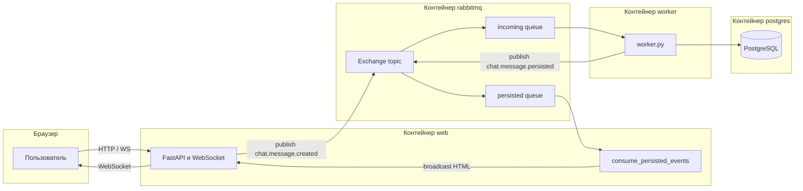

# nickolay-mq — как устроен проект

## Схема: четыре контейнера

Та же схема в виде изображения (если Mermaid в просмотрщике не рендерится):

По стрелкам:

- **Браузер ↔ web** — страница комнаты, WebSocket `/ws/{room_id}` (и при необходимости POST сообщений).
- **web → RabbitMQ** — в exchange попадает событие «сообщение создано», далее очередь `chat.messages.incoming`.
- **worker** — читает входящую очередь, пишет в **postgres**, публикует «сохранено» → очередь `chat.messages.persisted`.
- **web ← RabbitMQ** — задача `consume_persisted_events` в процессе web читает `chat.messages.persisted` и рассылает HTML подписчикам комнаты по WebSocket.

Это учебный/демо **чат по комнатам** с **очередью сообщений (RabbitMQ)**, **отдельным воркером**, **PostgreSQL** и веб-интерфейсом на **FastAPI**, **HTMX** и **WebSocket**.

## Сервисы (Docker Compose)

- **web** — приложение FastAPI (`uvicorn app.main:app`), порт с хоста обычно **8100→8000**.
- **postgres** — база `chat`, таблица сообщений создаётся при старте через SQLAlchemy.
- **rabbitmq** — брокер AMQP (порт **5672**, UI управления **15672**).
- **worker** — отдельный процесс `worker.py`, только потребляет очередь и пишет в БД.

## Поток сообщения (end-to-end)

1. **Клиент** открывает страницу комнаты (`/` для `room-1` или `/rooms/{room_id}`). Чат обёрнут в `hx-ext="ws"`: форма шлёт JSON по WebSocket на `/ws/{room_id}`.

2. **Сервер (main.py)** при получении JSON от WebSocket (или при POST на `/rooms/{room_id}/messages`) собирает payload: `room_id`, `username`, `text`, `created_at` и **публикует** в RabbitMQ в topic-exchange с ключом **`chat.message.created`** (`MQ_ROUTING_KEY_CREATED`). HTTP ответ при POST — `{"status": "queued"}`; само сообщение в UI не рисуется из этого ответа.

3. **Воркер (worker.py)** слушает очередь **`chat.messages.incoming`**, привязанную к тому же routing key `chat.message.created`. Для каждого сообщения:
   - вставляет строку в таблицу `messages`;
   - после успешного коммита публикует событие с ключом **`chat.message.persisted`** (`MQ_ROUTING_KEY_PERSISTED`) в очередь **`chat.messages.persisted`** (и тот же exchange).

4. **Снова web-процесс**: фоновая задача `consume_persisted_events()` в `main.py` читает **`chat.messages.persisted`**, парсит JSON и **broadcast**-ит HTML-фрагмент (готовый кусок разметки с `hx-swap-oob="beforeend"`) всем активным WebSocket в этой `room_id` через `WSManager`.

Итог: **запись в БД и доставка в UI развязаны**: UI обновляется только после того, как воркер сохранил сообщение и сгенерировал событие «persisted».

## Зачем нужен `worker.py`

Воркер **не обязателен** для любого чата «в принципе» — его роль здесь в том, что **сохранение в БД вынесено из веб-процесса** в отдельный этап конвейера.

**Что он делает по факту.** Он **единственный** читатель очереди `chat.messages.incoming` и **единственный**, кто на этом пути пишет строку в PostgreSQL. После успешного коммита он публикует `chat.message.persisted`, и уже web-процесс рассылает HTML в комнату по WebSocket. Цепочка: клиент → web (только в очередь) → worker (БД) → снова web (рассылка в UI).

**Зачем так делают.**

1. **Разгрузка web** — при всплеске трафика тяжёлая работа (транзакции, индексы, возможная будущая валидация или обогащение) слабее бьёт по обработке HTTP/WebSocket в том же процессе; лишнее время сообщения проводят в очереди.
2. **Масштабирование** — можно поднять несколько воркеров и один web; нагрузку на БД регулируют воркеры, а не каждый хендлер.
3. **Устойчивость** — при перезапуске web сообщения в durable-очереди не теряются, воркер их доработает. Без очереди проще потерять «приняли, но до записи в БД не успели».
4. **Явная модель «создано vs сохранено»** — UI обновляется после `persisted`, то есть после реальной записи в БД; так проще рассуждать о консистентности и повторных доставках из брокера.

**Упрощение.** Технически можно писать в БД прямо из `main.py` после приёма сообщения — тогда отдельный `worker.py` для этой задачи не нужен. В этом репозитории воркер — **учебный/архитектурный** элемент: показать **очередь между приёмом и сохранением** и отдельный потребитель, как в сервисах с RabbitMQ и подобными брокерами.

## RabbitMQ (app/mq.py)

- Exchange типа **TOPIC**, durable, имя по умолчанию `chat.events`.
- Две durable-очереди: входящая (`chat.messages.incoming`) и «после сохранения» (`chat.messages.persisted`).
- Сообщения с меткой **persistent** для переживания рестартов брокера (при настроенной персистентности и т.д.).

URL и имена можно переопределить переменными окружения (`RABBITMQ_URL`, `MQ_EXCHANGE`, имена очередей и routing keys).

### Протокол AMQP

**AMQP** (Advanced Message Queuing Protocol) — стандартизованный **прикладной** протокол для обмена сообщениями через **брокер очередей**. Компоненты системы не подключаются друг к другу напрямую для доставки сообщений: каждый клиент говорит с брокером, а брокер хранит и маршрутизирует сообщения по правилам (exchange, bindings, очереди).

**RabbitMQ** в этом проекте принимает от приложений протокол **AMQP 0-9-1** по TCP (в `docker-compose` наружу смотрит порт **5672**). Это бинарный клиент-серверный протокол: команды на объявление очередей, привязки, публикацию и выборку сообщений. **Порт 15672** — это уже **HTTP** (плагин Management UI), к AMQP он не относится; так же и отдельные **STOMP/WebMQTT** и т.п., если бы их включали, — это другие поверхности доступа к брокеру.

Краткий словарь сущностей AMQP в терминах RabbitMQ и этого репозитория:

| Сущность | Роль здесь |
|----------|------------|
| **Connection** | Одно (или несколько) TCP-подключений приложения к брокеру (`amqp://…`). |
| **Channel** | Виртуальное мультиплексирование внутри connection; через канал идут declare, publish, consume. |
| **Exchange** | Куда **публикует** producer; тип **topic**, имя `chat.events`. |
| **Queue** | Буфер: `chat.messages.incoming` (в сторону worker) и `chat.messages.persisted` (к web). |
| **Binding** | Связка exchange + **routing key** → очередь (`chat.message.created` / `…persisted`). |
| **Message** | Тело (у нас JSON в байтах), атрибуты доставки, флаг **persistent** на уровне сообщения. |
| **Ack / Nack** | Подтверждение обработки потребителем; до **ack** сообщение может быть выдано снова или возвращено в очередь (**requeue**), см. `message.process` в коде. |

В одном предложении: **aio-pika** — это клиентская библиотека Python, которая по AMQP 0-9-1 выполняет те же операции, что вы видите в веб-консоли (очереди, exchange, привязки), только из кода.

### Клиент RabbitMQ: aio-pika

К брокеру приложения подключаются **асинхронно**, через [**aio-pika**](https://aio-pika.readthedocs.io/) (в `requirements.txt` — **`aio-pika`**, в коде `import aio_pika`): обёртка над **asyncio** для **AMQP 0-9-1** — соединение, каналы, exchange, очереди, publish/consume без блокировки event loop.

**Где используется.**

- **`app/mq.py`** — класс `MQ`: `connect_robust` (с переподключением), объявление **topic**-exchange и очередей, **bind** по routing key, `exchange.publish` с `DeliveryMode.PERSISTENT`.
- **`worker.py`** — отдельное соединение воркера: та же схема declare/bind, цикл `queue.iterator()` и обработка входящих сообщений через `message.process(...)`.

**Связка с кодом этого репозитория.**

- **`connect_robust`** — устойчивое соединение; в web дополнительно есть цикл повторов в `MQ.connect()`, чтобы дождаться поднятого RabbitMQ при старте Docker Compose.
- **`declare_exchange` / `declare_queue`** с **`durable=True`** — сущности переживают рестарт брокера (содержимое очередей — при persistent-сообщениях и корректной дисковой конфигурации брокера).
- **`queue.iterator()`** + **`async with message.process(requeue=True)`** — потребление сообщений; при ошибке до подтверждения **ack** сообщение можно вернуть в очередь (`requeue=True` в проекте).

Другой распространённый клиент для того же протокола в Python — синхронный **pika**; здесь выбран **aio-pika**, чтобы HTTP/WebSocket в FastAPI и работа с очередью были в одном стиле **async/await**.

### Веб-консоль (Management UI)

Образ `rabbitmq:3-management` поднимает веб-интерфейс управления брокером на порту **15672** (AMQP для приложений — **5672**).

**Как открыть.** Из корня проекта: `docker compose up -d` (хотя бы сервис `rabbitmq`). В браузере: **http://localhost:15672**. Логин и пароль по умолчанию: **`guest`** / **`guest`**. Если страница не открывается — проверьте, что **15672** свободен и контейнер запущен (`docker compose ps`).

Ниже — разделы левого меню и что в них смотреть в контексте этого проекта.

#### Overview

Сводка по **ноде** (в Docker обычно один брокер): ресурсы, число **connections** / **channels** / **queues**. Блок **Message rates** — скорости **publish**, **deliver**, **ack** и т.д.; при отправке сообщений из чата графики должны реагировать, даже если сообщения почти сразу уходят из очередей.

Внизу страницы задаётся **автообновление** (Refresh every …) — удобно следить за потоком в реальном времени.

#### Connections

Список TCP-подключений клиентов к брокеру (порт **5672**). При работающем полном стеке типично минимум два источника (IP будут адресами сети Docker):

- **web** — публикует `chat.message.created`, потребляет `chat.messages.persisted`;
- **worker** — потребляет `chat.messages.incoming`, публикует `chat.message.persisted`.

По клику — детали: пользователь, peer, состояние. Нет соединения от ожидаемого сервиса — приложение не подключилось к RabbitMQ или упало.

#### Channels

Логические мультиплексированные сессии внутри соединения. Для диагностики этого репозитория чаще достаточно **Queues** и **Exchanges**; каналы полезны при разборе низкоуровневых ошибок.

#### Exchanges

Таблица exchange. Найдите **`chat.events`**: тип **topic**, колонка **D** — **durable**.

**Карточка `chat.events`:**

- **Bindings** — маршруты по **routing key**:
  - **`chat.message.created`** → **`chat.messages.incoming`**;
  - **`chat.message.persisted`** → **`chat.messages.persisted`**.
- Внизу **Publish message** — ручная публикация теста: указать routing key (например `chat.message.created`) и тело (у нас JSON UTF-8, как в коде). Worker попытается обработать такое сообщение как обычное — используйте только в осознанных экспериментах.

Графики показывают интенсивность **входа** сообщений в этот exchange.

#### Queues

Очереди **`chat.messages.incoming`** и **`chat.messages.persisted`**. По списку видно **Ready** (доступны выдаче), **Unacked** (отданы потребителю, ack ещё не пришёл), иногда **message rates** — наглядно при «Отправить 100/1000» в UI чата.

**Страница конкретной очереди:**

- **Consumers** — сколько подписчиков **активно**: для **incoming** ожидается **1** (`worker.py`), для **persisted** — **1** (фоновая задача в web). **0** при работающих контейнерах — признак поломки цепочки.
- **Get messages** — прочитать тела сообщений «с полки» (режим **Ack** удалит из очереди, **Nack requeue** вернёт — осторожно).
- **Purge Messages** — полная очистка очереди; имеет смысл только если явно хотите сбросить накопленное.

Если **worker** остановить, при отправке из чата сообщения будут **накапливаться** во **incoming** — наглядная проверка, что web публикует. Если **incoming** пусто, а в чате «тишина» — смотреть web и соединения; если **incoming** растёт — worker не забирает; если растёт **persisted** — web не потребляет вторую очередь.

#### Admin

Пользователи, виртуальные хосты (**vhost**, по умолчанию `/`), политики. Для локального demo с `guest` обычно не нужно.

#### Короткая отладочная схема

1. Есть **exchange** `chat.events` и обе **очереди** с описанными выше **bindings**.
2. Отправка из чата → на **Overview** или у очередей кратко всплески publish/deliver.
3. «Сообщение не дошло до UI»: **incoming** неполный → до брокера не дошло или не тот routing key; **incoming** полон → worker/БД; **persisted** полон → `consume_persisted_events` в web.

**CLI в контейнере** (тот же брокер, текстовый вид): `docker compose exec rabbitmq rabbitmqctl list_queues name messages consumers`, `list_bindings`, `list_exchanges`.

## База данных (app/db.py)

Модель **Message**: `id`, `room_id`, `username`, `text`, `created_at`. Подключение через `DATABASE_URL` (по умолчанию async PostgreSQL).

## WebSocket (app/ws.py)

**WSManager** хранит по каждой комнате множество сокетов, рассылает текст (HTML) всем; мёртвые соединения убирает.

## Интерфейс

Шаблон `room.html`: форма с `ws-send`, список сообщений в `#messages`. Есть кнопки массовой отправки (нагрузочный сценарий) через `requestSubmit()` в цикле.

## Здоровье и тесты

- **`GET /health`** — `{"status": "ok"}` для прогонов CI/проверок.
- В `tests/` — проверки здоровья и WebSocket-сценарии.

## Зачем такая схема (в целом)

Продемонстрированы: **асинхронная обработка**, **идемпотентный путь «создано → записано → разослано»**, разделение **web** и **worker** (зачем отдельно — в разделе про `worker.py` выше), **topic routing** в RabbitMQ и **oob-swaps** HTMX для обновления DOM из WebSocket.
