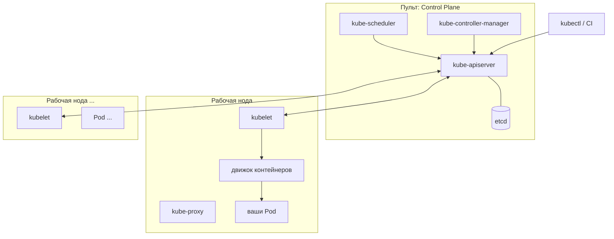
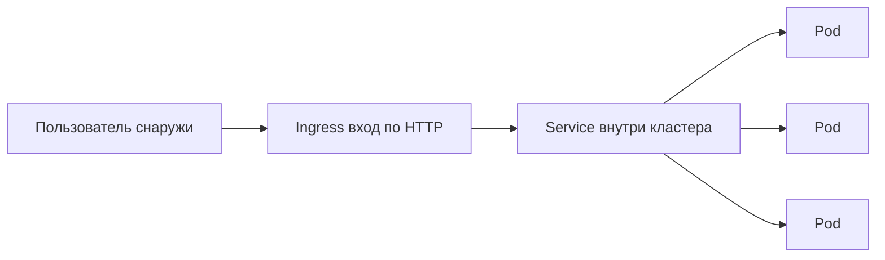
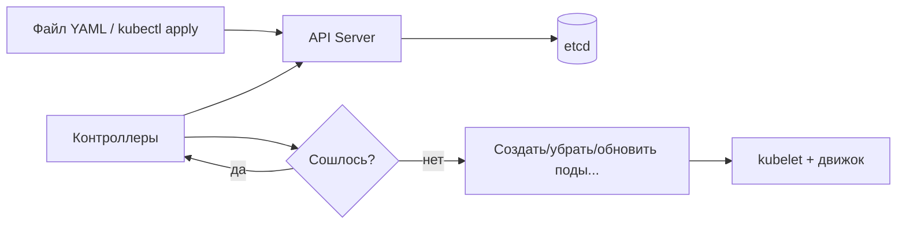
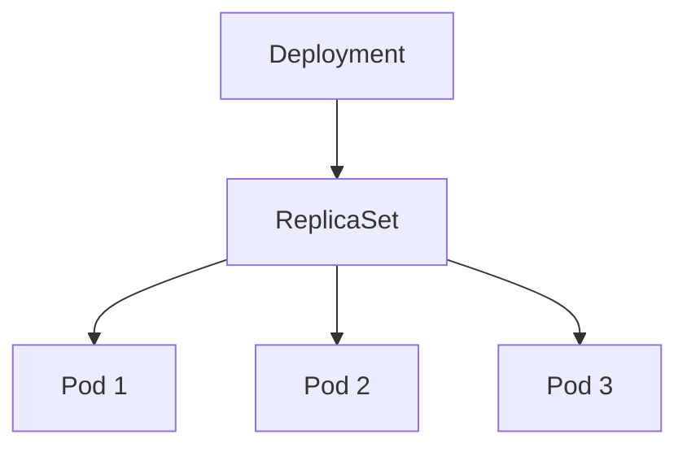
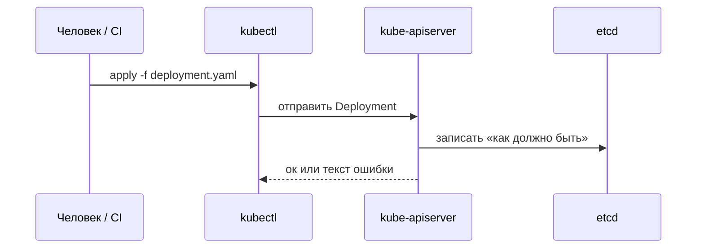

# Слайд 1. Kubernetes: зачем и как он работает

**Простыми словами:** это лекция про «няню для контейнеров» в продакшене — чтобы сервисы сами поднимались, масштабировались и не требовали бегать по серверам с SSH.

* **Зачем:** в компаниях контейнеры в проде чаще всего крутят в Kubernetes — полезно понимать базовый смысл, даже если вы не админ кластера
* **Что разберём на пальцах:** что такое кластер, Pod, Deployment, Service; зачем YAML и команды `kubectl`
* **Главная мысль:** ты говоришь кластеру **«как должно быть»** (три копии, такой образ), а он сам думает, **как это сделать** на машинах
* **После лекции:** сможете своими словами объяснить соседу: зачем API Server, etcd, kubelet и откуда берутся работающие поды

---

# Слайд 2. План лекции

1. Что не так, когда всё на одном сервере и Docker «руками»
2. Что такое Kubernetes и что он **не** волшебная таблетка
3. Две большие части кластера: **мозги (control plane)** и **рабочие машины (workers)**
4. Сущности «по полочкам»: Pod → Deployment → Service, плюс Ingress, namespace, ConfigMap
5. Как люди реально работают: файлы YAML, `kubectl`, почему не лезут на ноды по SSH
6. Где K8s уместен, где избыточен; базы данных внутри кластера — отдельная история

---

# Слайд 3. Мир без Kubernetes

* **Один сервер** — как один розетка на всю квартиру: вырубилось — всё погасло
* **Ручной деплой** — залил файлы по SSH, поправил конфиг руками, перезапустил сервис; завтра другой человек — другая «магия»
* **Упал процесс** — пока никто не заметил в чате, пользователи видят ошибку
* **Одна точка отказа (SPOF)** — сломалось железо или ОС → лежит всё приложение целиком
* **Хочешь два сервера под нагрузку** — по сути дублируешь всю ручную схему ещё раз

**Картинка в голове:**

```text
                    [ Пользователи ]
                            │
                            ▼
                    ┌───────────────┐
                    │  Один сервер  │  ← если он лёг — конец
                    │  приложение   │
                    └───────────────┘
```

---

# Слайд 4. Контейнеры — шаг вперёд

* **Docker** (и похожие штуки) — это «коробка» с приложением и всеми библиотеками внутри: перенёс коробку — везде одинаково
* **На ноуте и на сервере** меньше фразы «у меня работало»: окружение в образе одно и то же
* **Запуск быстрее**, чем поднимать тяжёлую виртуалку на каждый сервис
* **Но коробка сама по себе** не чинит падения, не размножается на пять машин и не настраивает сеть между десятками копий — для этого нужен следующий уровень

---

# Слайд 5. Проблемы Docker без оркестрации

* **Контейнер упал** — кто его поднимет? Написали скрипт? Повесили на systemd? Легко забыть или сделать по-разному на разных серверах
* **Умер целый сервер** — все контейнеры на нём пропали; IP и балансировку кто-то должен руками перекинуть
* **Нагрузка выросла** — не нажмёшь кнопку «дай ещё пять копий» без своей автоматики
* **Обновление версии** часто выглядит так: остановил старый контейнер → **простой** → поднял новый
* Много серверов + много контейнеров без общей системы = **вечные ночные звонки и хаос**

---

# Слайд 6. Нужна оркестрация

* **Оркестратор** — как дирижёр: не ты бегаешь по музыкантам, а ты показал партитуру, остальное согласовано
* **Автоматизация:** «хочу три копии» — система сама следит, чтобы их реально было три
* **Если что-то упало** — перезапустить или пересоздать по правилам, а не ждать, пока человек проснётся
* **Масштаб:** увеличил число в конфиге — появились новые поды (если хватает железа)
* **Обновления** можно делать по очереди (rolling), чтобы не гасить всё разом
* Одной фразой: **планировщик + постоянная проверка «как задумано» vs «как на самом деле»**

---

# Слайд 7. Что такое Kubernetes

* **Kubernetes (K8s)** — программа, которая **разводит контейнеры по серверам** и **держит заданное количество** копий
* **Кластер** — несколько машин, которые для тебя выглядят как **одна площадка**: «запусти мне сервис», а не «зайди на сервер №3»
* **Ты задаёшь цель:** например, «всегда работают три пода с таким образом» — K8s **не отвлекается** и к этому стремится
* **Сеть и диски** «из коробки» бывают по-разному: часто ставят **плагины** (сеть CNI, диски CSI, вход Ingress) — это нормально, не всё вшито внутрь

---

# Слайд 8. Kubernetes простыми словами

* Ты пишешь **«что нужно»:** сколько копий, какой образ, какие порты, переменные окружения
* K8s думает **«как сделать»:** на какой машине что посадить, кого пересоздать, если умерло
* Внутри крутится **бесконечный цикл проверки:** «в базе записано одно, на нодах другое» → поправить
* **Аналогия:** не «зайди на сервер и набери команды», а **«вот договор — держи кластер в соответствии с ним»**; как автопилот, который постоянно подруливает

---

# Слайд 9. Что Kubernetes делает

* **Запускает** твои контейнеры в обёртке **Pod** на рабочих нодах
* **Поднимает заново**, если процесс внутри пода умер (по правилам, которые ты задал)
* **Делает больше или меньше копий**, когда меняешь число реплик (а авто-масштаб по CPU — отдельная тема про HPA)
* **Обновляет версию** постепенно: старые поды меняются на новые не обязательно разом (**rolling**), можно **откатиться**
* **Про «без простоя»:** само по себе K8s не гарантирует идеал — нужно, чтобы приложение **корректно стартовало и завершалось**, были **пробы готовности**, и **не одна копия** на весь мир

---

# Слайд 10. Что Kubernetes не делает

* **Не пишет код за тебя** и **не собирает образы** — сборка в CI, образ лежит в **registry** (как склад контейнеров)
* **Не чинит логические баги:** приложение падает в цикле — K8s может только **тупо перезапускать**, причина всё равно в коде или конфиге
* **Не ускоряет тормоза:** добавил пять копий — просто **пять одинаково медленных** экземпляров
* **Не заменяет глаза:** логи, метрики, алерты — ставят **отдельно** (это другой слой)
* **Не делает базу «самосейф»:** диски, бэкапы, репликация БД — всё равно нужно **проектировать**

---

# Слайд 11. Kubernetes — это кластер

* **Несколько машин (нод):** условно «мозги» (control plane) и «рабочие» (workers); в миникубе на ноуте всё может быть **на одной машине** — для учёбы ок, для настоящего прода так обычно не проектируют
* Ты общаешься с кластером **через один API**, а не логинишься в каждую ВМ по очереди
* **Один язык описания:** Pod, Service, Deployment — одни и те же сущности для всего кластера
* Машин может быть **две или двести** — идея та же, меняется только то, как это **эксплуатируют** люди

---

# Слайд 12. Компоненты кластера

* **Control plane (пульт управления)** — решает *что где должно быть*, хранит настройки; **обычно** сюда не суют ваши бизнес-приложения как на проде
* **Worker nodes (рабочие)** — здесь **реально крутятся** ваши поды: на каждой ноде свой агент **kubelet** и движок контейнеров

**Схема «кто где живёт»**



---

# Слайд 13. Control Plane

* Это **центр принятия решений:** почти всё, что меняет кластер, проходит **через API**, а не «тихо на диске одной ноды»
* **Куда посадить новый под** решает scheduler; **сколько подов держать** подгоняют контроллеры под то, что записано в Deployment и т.д.
* **Память кластера** — **etcd**: там лежит «как должно быть» (в удобном для машин виде)
* Если **пульт сломался**, новые деплои сделать трудно; **уже запущенные** поды могут ещё какое-то время пожить сами по себе — но это не повод расслабляться

---

# Слайд 14. API Server (kube-apiserver)

* **Единая дверь** в управление кластером: и `kubectl`, и внутренние компоненты стучатся сюда
* Любая твоя команда **apply / get / delete** — по сути **запрос к API** (как к сайту, только для инфраструктуры)
* **Проверки:** объект похож на правду? **Кто ты?** (логин) **Тебе можно?** (права, RBAC) **Не нарушаешь ли политики?** (admission — как охрана на входе)
* В нормальной схеме в etcd **пишут через этот сервер**, а не «в обход», как в банке через кассира, а не через черный ход

---

# Слайд 15. Scheduler (kube-scheduler)

* **Задача простая словами:** новый под появился — **на какую из рабочих нод его посадить?**
* Смотрит на **сколько CPU/RAM просит под**, на **метки и ограничения** нод (в духе «только на ноды с SSD» или «не на этот сервер»)
* Сначала **отсекает** неподходящие машины, потом **выбирает лучшую** из оставшихся по своим правилам
* **Сам контейнер не запускает** — только **ставит штамп «этот под — на ноду X»**; дальше работает **kubelet** на той ноде

---

# Слайд 16. Controller Manager

* **Постоянно сравнивает:** «в etcd написано, что должно быть» и «что реально есть»
* **Пример на пальцах:** должно быть 3 пода, живёт 2 → **доложит третий**; живёт лишний → **уберёт**
* Внутри куча маленьких **контроллеров** под разные вещи (Deployment, Job, ноды…)
* Можно запомнить фразу: **смотри → не совпало → подправь** (и так по кругу)

---

# Слайд 17. etcd

* **База настроек кластера:** что за деплойменты, сервисы, сколько реплик — всё это **лежит здесь** (через API Server)
* Если спросить «**что кластер обещает держать?**» — ответ смотрят **в etcd**
* **Сломался или рассинхронился etcd** — как потерять **главную таблицу учёта**: кластером тяжело управлять
* В проде **бэкапы etcd** — не «для гиков», а **страховка**, как копия важного документа

---

# Слайд 18. Worker Node

* **Здесь бежит ваш код** в подах, которые на эту ноду назначили
* **Железо и ресурсы** (процессор, память, диск) тратятся **здесь** — графики нагрузки смотрят по нодам и подам
* На ноде всегда есть **kubelet** (агент), **движок контейнеров**, **kube-proxy** (про сеть сервисов)
* **Руками править контейнеры на сервере** — плохая идея: K8s потом **перезатрёт** или получится **каша** «как в конфиге» vs «как я ночью починил»

---

# Слайд 19. kubelet

* **Сторож этой конкретной ноды:** «я жива, вот мои поды в таком состоянии»
* **Слушает API Server:** ему говорят, **какие поды** на этой ноде должны жить; он **отчитывается**, получилось или нет
* **Реально создаёт под:** тома, запуск контейнера через движок (CRI)
* **Пробы (probes):** периодически **стучится** в приложение по HTTP или команде — «жив ли? готов ли принимать трафик?»

---

# Слайд 20. Container runtime (CRI)

* **kubelet не общается с Docker «напрямую по-старому»** — только через стандарт **CRI** (интерфейс «запусти контейнер»)
* На ноде чаще стоят **containerd** или **CRI-O** — это нормально; **Docker** часто остаётся инструментом **сборки** образа на ноуте или в CI
* Образ **собрали** → **залили в registry** → в манифесте указали **откуда тянуть**
* **Pod** внизу — это что-то вроде **общей «комнаты»** для контейнеров: общая сеть, можно общий диск

---

# Слайд 21. Kube-proxy

* **Service** внутри кластера — это не магия: на каждой ноде **kube-proxy** настраивает правила так, чтобы запрос на «виртуальный адрес сервиса» **дошёл до живых подов**
* **Размазывает нагрузку** между подами, которые **готовы** принимать трафик
* **Не путать:** kube-proxy — про **достучаться до сервиса** (как до стойки внутри здания); **Ingress** — про **вход с улицы по HTTP** (домен, путь, HTTPS)
* Поды переехали или пересоздались — правила **обновятся**, чтобы сервис не смотрел в пустоту

**Цепочка «с улицы до пода»**



---

# Слайд 22. Главная идея Kubernetes

* **Desired state** — «как **должно** быть» по документам в кластере
* **Факт** — «что **есть** сейчас на машинах»
* K8s **всё время подтягивает факт к договору**: создаёт, удаляет, перезапускает
* Ты поменял манифест или нажал apply — дальше **роботы** доводят систему до нового «должно»

**Петля «подогнать реальность под задумку»**



---

# Слайд 23. Декларативный подход

* Ты описываешь **результат:** «вот такое приложение, столько копий»
* Ты **не пишешь сценарий** «зайди на сервер А, выполни 20 команд, потом на Б…»
* Удобно хранить описание в **Git** — видно **кто и что поменял**, можно откатить
* Быстрые команды в консоли (`kubectl run` и т.д.) для эксперимента — ок; в проде чаще **файлы в репозитории** или шаблоны (Helm, Kustomize)

---

# Слайд 24. Пример Desired State

* Говоришь: **«Держи три копии** приложения с образа `myapp:1.2.3`»
* Один под **снёсся** — система **создаст новый**, чтобы снова было три
* Поставил **пять** — будет **пять** (если хватает ресурсов)
* Поменял образ на **новую версию** — старые поды **по очереди** заменятся на новые (как настроишь в Deployment)

---

# Слайд 25. Pod

* **Pod** — минимальная «порция», которую **планируют на ноду** целиком (не «полконтейнера»)
* Внутри пода может быть **один контейнер** или **несколько** — они **делят сеть** (друг к другу как `localhost`) и могут **делить диск**
* Частый пример: **основной сервис** + **помощник сбоку** (логи, прокси) — **sidecar**
* У пода **нет вечного IP**; если нужен **стабильный вход** — вешают **Service**

---

# Слайд 26. Pod ≠ контейнер

* **Под живёт недолго по смыслу:** деплой, нехватка места, смерть ноды — под **пересоздали**, это нормально
* **Контейнеры внутри** — как соседи в одной квартире: сеть общая
* **Вручную Pod для сайта** обычно **не клепают** — ими рулит **Deployment** (или Job, StatefulSet — по задаче)
* **Зачем несколько контейнеров в одном поде?** Когда им **очень нужно** быть рядом: общий том, localhost, один жизненный цикл

---

# Слайд 27. Deployment

* **Deployment** — удобная кнопка «**держи N копий** этого приложения и **обновляй аккуратно**»
* Внутри у него есть **ReplicaSet** (сколько подов из одного шаблона); **вручную ReplicaSet** в обычной жизни не трогают
* **replicas** в YAML — сколько копий
* **Стратегия обновления:** по очереди (**RollingUpdate**) или **всех убить и поднять заново** (**Recreate**) — как выберешь
* Можно **откатиться** на прошлую версию, если новая вела себя плохо

**Кто кого держит**



---

# Слайд 28. Зачем Deployment

* **Сам себя чинит:** под пропал — **новый поднимется**
* **Выкат по-живому:** новая версия **подтекает** постепенно; **откат** — вернуться назад
* **Один файл — одна правда:** не надо помнить, что «на сервере 7 мы забыли обновить»
* Если нужны **стабильные имена** и **свой диск на каждую реплику** (как у баз) — смотрят **StatefulSet**, это другая история

---

# Слайд 29. Service

* **Service** — **постоянная вывеска** на группу подов: пользователи стучатся **в вывеску**, а не в «телефон каждого пода отдельно»
* Типы на пальцах: **внутри кластера** (ClusterIP), **наружу через порт ноды** (NodePort), **балансировщик в облаке** (LoadBalancer) — зависит от облака и настроек
* **DNS-имя** сервиса **не прыгает**, когда поды пересоздали
* **Ingress** — отдельная штука + **программа-контроллер** (nginx, traefik…): **по какому адресу и пути** направить трафик на какой Service

---

# Слайд 30. Зачем Service

* **Поды как одноразовые котята:** IP сменился, под другой — **не надо** переписывать клиентов
* **Service стоит на месте:** тот же **логический адрес** внутри кластера
* **Метки (labels)** — как **бирки** на подах; Service говорит: «мне все с биркой `app: shop`»
* Без сервиса пришлось бы **самим лезть в API** и узнавать, куда стучаться — **ломко и ненадёжно**

---

# Слайд 31. YAML в Kubernetes

* **YAML-файл** — это **заявление** в кластер: какой объект, как его зовут, что внутри (**spec**)
* Кластер **либо принимает**, либо **ругается** — как форма с обязательными полями
* **Namespace** — как **папка** или **квартира в доме**: одни и те же имена в разных namespace не конфликтуют
* **ConfigMap** — настройки **не секретные**; **Secret** — пароли и ключи (всё равно хранить аккуратно, это не абсолютная магия)
* **Хорошая привычка:** манифесты в **Git**, деплой из пайплайна или GitOps

---

# Слайд 32. Пример YAML (идея)

**Не полный прод-манифест**, а «как это вообще выглядит глазами»:

```yaml
apiVersion: apps/v1
kind: Deployment
metadata:
  name: nginx-demo
spec:
  replicas: 3
  selector:
    matchLabels:
      app: nginx-demo
  template:
    metadata:
      labels:
        app: nginx-demo
    spec:
      containers:
        - name: nginx
          image: nginx:1.25
          ports:
            - containerPort: 80
```

* **replicas: 3** — «хочу **три** одинаковых пода»
* **image** — **какой образ** скачать из registry
* Рядом обычно кладут **Service** с тем же **`app: nginx-demo`**, чтобы к ним **стучались по имени**, а не по IP пода

---

# Слайд 33. Как работают с Kubernetes

* **kubectl** — твоя **консоль к кластеру**; в файле **kubeconfig** лежит «куда подключаться»
* **kubectl apply -f папка/** — «**примени** всё, что в файлах»
* **Lens, k9s, веб-дашборд** — удобно **смотреть**; без понимания API это **как GPS без карты в голове**
* В зрелых командах часто **GitOps**: в Git поменяли — **агент сам** подтянул в кластер

**Один apply — что происходит под капотом**



---

# Слайд 34. Основные команды

* **`kubectl apply -f ...`** — **внедрить** конфиг; **`delete`** — **убрать** по файлу
* **`kubectl get …`** — **список**; **`describe`** — **подробности**, почему не стартует
* **`kubectl logs`** — **логи** пода; **`exec`** — зайти **внутрь** как в контейнер (для отладки, не как основной способ жизни)
* **`rollout status` / `rollout undo`** — **докатилось ли** обновление и **откатить** деплоймент
* **`port-forward`** — **пробросить** порт сервиса на свой ноут (**удобно потыкать** сервис изнутри кластера)

---

# Слайд 35. Важное правило

* **Не лечить прод через SSH на ноду**, меняя контейнеры руками — завтра **никто не воспроизведёт**, что ты сделал
* **Не убивать/поднимать docker на сервере мимо K8s** — кластер **вернёт своё** из «правды» в etcd, а ты запутаешься
* **Исключение:** когда **падает сама нода** или сеть — это уже **зона админов**, не ежедневная работа разработчика
* Всё важное — **в манифестах и в Git**, а не «я помню, как в прошлый раз на сервере 5 крутил»

---

# Слайд 36. Где используют Kubernetes

* **Бэкенды и микросервисы** — каждый сервис **своим** деплойментом, команды **разводят по namespace**
* **CI/CD:** собрали образ → **обновили тег** в манифесте или **пнули** GitOps — выкат пошёл
* Большие компании дают разработчикам **«внутренний хостинг»** поверх K8s: лимиты, шаблоны, готовые ingress
* Один и тот же **стиль описания** приложения — **разные кластеры** (тест / прод / облако) — ментально проще, чем **семь уникальных** способов деплоя

---

# Слайд 37. Kubernetes и базы данных

* **База — не как веб-сервер:** ей нужен **диск**, порядок, иногда **имя**, которое не прыгает → чаще **StatefulSet**, **тома (PVC)**, иногда **оператор** (готовый «пакет знаний» про эту БД)
* **Оператор** — как **автоматический админ** для конкретного продукта, но **волшебства без мозгов** не бывает
* Частый выбор: **managed БД в облаке** (RDS и т.п.) **рядом** с кластером — меньше ночных тревог
* **Не класть PostgreSQL как обычный сайт** одним Deployment **без думания про данные** — это путь к **слезам и потере данных**

---

# Слайд 38. Честно о Kubernetes

* **Учить долго:** много слоёв — сеть, диски, права, обновления **самого** кластера
* **Не каждому стартапу нужен:** один сервис на одной ВМ или готовый **PaaS** иногда **дешевле по голове**
* **Деньги и люди:** либо **свои админы**, либо **managed** Kubernetes в облаке + мониторинг
* **Окупается**, когда сервисов **много**, релизы **частые**, команда **больше одного человека** и нужна **предсказуемая** инфраструктура

---

# Слайд 39. Когда Kubernetes нужен

* **Много сервисов и копий** — руками **не разрулить**
* **Нужна живучесть:** упала машина — **остальные** продолжают, поды **переедут** (в рамках настроек)
* **Хочется одного способа** деплоя и масштаба для **всех** команд
* **Когда можно подождать с K8s:** один монолит, один инстанс, **никто** не будет кластером заниматься — может, хватит **простого** хостинга или Docker Compose на одной машине

---

# Слайд 40. Итог лекции

* **Kubernetes** — это **постоянная подгонка** «как на самом деле» под «как задумано», с **записью правды** в etcd и **агентами** на нодах
* **Цепочка на пальцах:** **Pod** (контейнеры) ← **Deployment** (сколько и как обновлять) ← **Service** (стабильный вход) ← при необходимости **Ingress** (HTTP с улицы)
* Дальше в жизни встретите **сеть, диски, безопасность, логи** — но **каркас** вы уже знаете
* **Практика:** minikube / kind / k3s, свои YAML, потом Helm или Kustomize — **руками один раз** пройти бесценно

---

# Слайд 41. Kubernetes как контрольный автомат

**Табличное задание (для отчёта):**

| Сценарий | Docker run | Kubernetes |
|---|---|---|
| Контейнер упал | ❌ | ✅ |
| Масштабирование | ❌ | ✅ |
| Rolling update | ❌ | ✅ |
| Rollback | ❌ | ✅ |
| Конфигурация без пересборки | ❌ | ✅ |

🔹 **Финальное задание (капстоун)**

**Итоговый кейс:**  
«У вас сервис, который должен:

- масштабироваться,
- переживать падения,
- обновляться без простоя,
- не хранить конфигурацию в коде.»

**Требования:**

- Deployment (>=2 реплики)
- Service
- ConfigMap
- probes
- resource limits
- rollout + rollback

---

## Примечание для оформления HTML / Marp

* Диаграммы в блоках `mermaid` при экспорте проверьте поддержку (Marp, reveal.js с плагином, или вставка как изображение).
* При необходимости скопируйте схемы на [mermaid.live](https://mermaid.live) и сохраните как `png`/`svg` в каталог `lect/` рядом с этим файлом.
