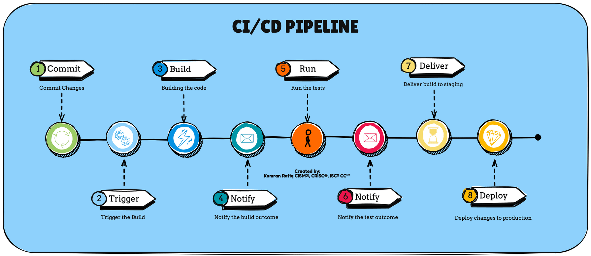
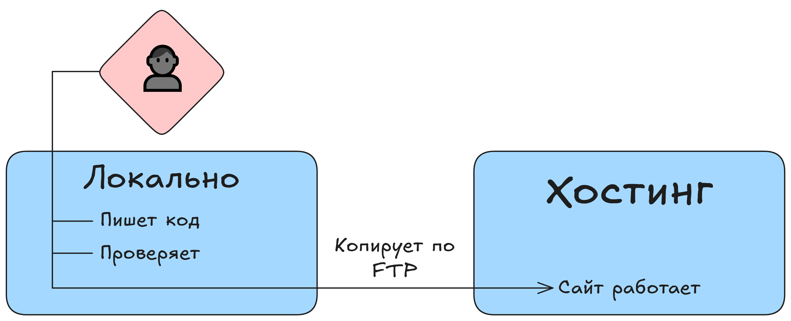
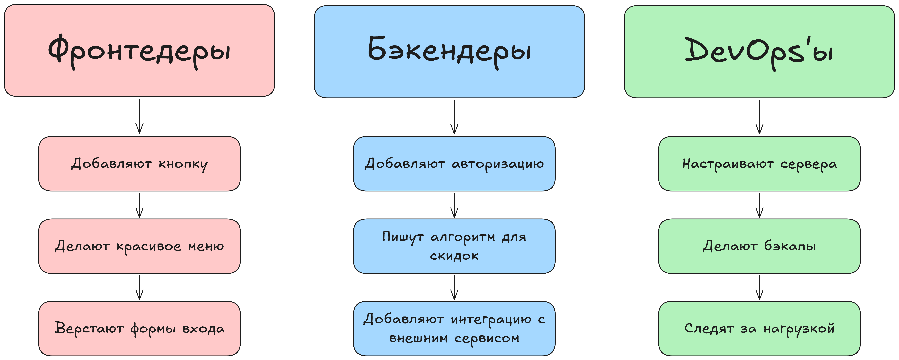
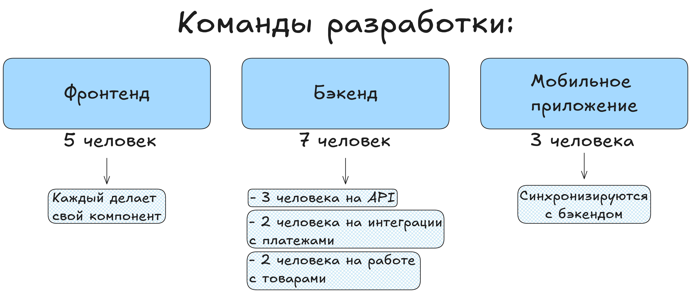
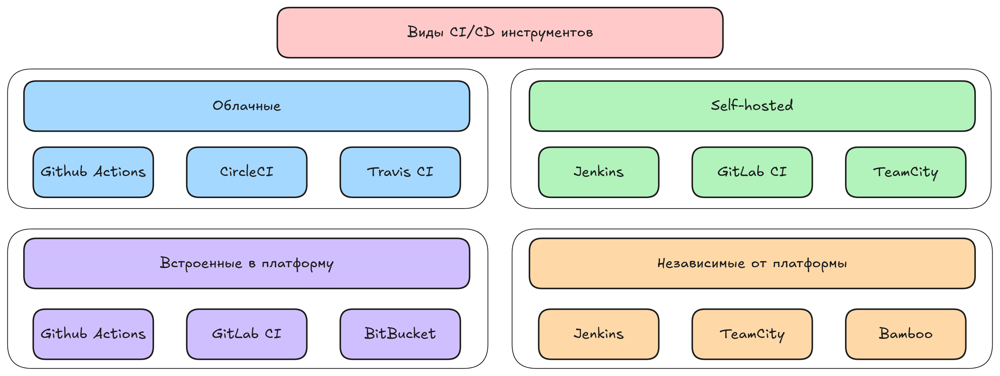

слайд 1 

лекция
# CI/CD: Методология Непрерывной Интеграции и Доставки
## Введение


Мы видим, что многие разработчики и начинающие DevOps-инженеры слышат про CI/CD как про что-то обязательное в современной разработке, но не понимают, как это работает на практике. Все говорят "у нас есть CI/CD", но мало кто может объяснить, что конкретно происходит между добавлением нового кода в репозитории и его появлением на продакшне. 
В данной лекции  простым языком объясняется, как устроены пайплайны, зачем нужна автоматизация и почему без CI/CD современная разработка превращается в хаос.

Мы не будем писать сложные пайплайны на 500 строк или настраивать Kubernetes-операторы. Зато покажем базовые принципы, которые работают везде — от стартапа из трёх человек до корпорации с тысячами разработчиков. 
После практики и выполнения лабораторных вы сможете написать свой первый пайплайн и понимать, что происходит в CI/CD.

слайд 2

## Что такое CI/CD и какие проблемы он решает?


CI/CD (Continuous Integration/Continuous Delivery) — это автоматизация всей цепочки от коммита разработчика до работающего кода на сервере.

CI/CD решает главные боли разработки:

Страх деплоя: вместо "деплоим раз в месяц и всю ночь чиним" получаем "деплоим 10 раз в день и не боимся ошибаться".
Человеческие ошибки: забыл выполнить миграцию БД, не обновил конфиг, перепутал сервер — с CI/CD такого не будет.
Всегда работает: если тесты прошли в CI/CD пайплайне, значит код рабочий. Точка.
Знание CI/CD — это мастхев для любого современного разработчика и абсолютно критичный навык для DevOps-инженера. Компании готовы платить больше тем, кто умеет настраивать пайплайны.

слайд 3
После цикла практических занятий и лабораторных работ вы:




Поймёте, что такое пайплайны, стейджи, джобы и как они работают вместе.
Напишете свои первые конфигурации для GitLab CI и Jenkins — двух самых популярных систем.
Разберётесь с Docker в контексте CI/CD и поймёте, почему без него никуда.
Узнаете, какие инструменты используют в российских компаниях и как выбрать подходящий.
Получите базу для дальнейшего изучения — Kubernetes, ArgoCD, мониторинг и другие продвинутые темы.


слайд 4

Как работает современная разработка?


Если вы недавно пришли в IT или работаете в небольшой команде, может показаться, что разработка — это просто написание кода. Написал, проверил у себя, залил на сервер — готово. Но в реальных проектах, особенно когда в команде больше 3-5 человек, всё гораздо сложнее.

Здесь разберём, как устроен процесс разработки в современных командах и какие проблемы приходится решать каждый день.

От одиночки к команде: как всё усложнилось
Давайте начнём с простого примера. Представьте, что вы делаете сайт для местной пекарни. Вы один, проект небольшой, всё помещается в голове. Процесс выглядит примерно так:


слайд 5 
# Рост и масшатабирование


Просто и понятно. Но что происходит, когда проект растёт? Появляется команда из 10 разработчиков, 3 тестировщиков, менеджер, заказчик, который хочет видеть прогресс каждый день. Добавьте сюда мобильные приложения, микросервисы, базы данных, очереди сообщений — и простая схема превращается в сложную систему.


Теперь процесс выглядит совершенно иначе. У каждого разработчика своя задача, код нужно объединять, проверять, что ничего не сломалось, показывать результаты заказчику, следить за качеством. И всё это нужно делать быстро — конкуренты не спят, рынок требует новых фичей каждую неделю.

Что такое современная разработка
Современная разработка — это не просто написание кода. Это целый процесс, включающий планирование, разработку, тестирование, развёртывание и поддержку. И главное — это всё происходит одновременно и непрерывно.


слайд 6
Ключевые характеристики современного подхода:


Во-первых, это командная работа. Над одним продуктом параллельно работают десятки людей. Фронтенд-разработчики делают интерфейс, бэкенд-разработчики пишут API, мобильные разработчики создают приложения, DevOps-инженеры настраивают инфраструктуру. И все они должны как-то синхронизироваться.


Во-вторых, частые релизы. Если раньше новые версии выпускались раз в полгода или год, то сейчас обновления могут выкатываться несколько раз в день. Amazon, например, деплоит изменения в продакшн каждые 11 секунд.

В-третьих, высокие требования к качеству. Пользователи не прощают багов. Упал сайт интернет-магазина на час — потеряли миллионы рублей и репутацию. Поэтому каждое изменение должно быть тщательно проверено.

слайд 7
## Типичный день в жизни кода

Давайте проследим путь одной фичи от идеи до продакшна в современной команде:
```
День 1: Планирование
├─ Менеджер создаёт задачу в Jira
├─ Команда обсуждает
└─ Разработчик берёт задачу в работу

День 2-3: Разработка
├─ Создание новой ветки в Git
├─ Написание кода
├─ Локальное тестирование
└─ Коммиты в ветку

День 4: Код-ревью
├─ Создание Pull Request
├─ Коллеги проверяют код
├─ Обсуждение, правки
└─ Подтверждение от 2+ разработчиков

День 5: Тестирование
├─ Мердж в develop ветку
├─ Автотесты проверяют код
├─ Ручное тестирование
└─ Баг-репорты, если что-то нашли

День 6-7: Подготовка к релизу
├─ Исправление багов
├─ Повторное тестирование
├─ Мердж в release ветку
└─ Тестирование на стейджинге

День 8: Релиз
├─ Деплой на продакшн
├─ Мониторинг метрик
├─ Откат, если что-то пошло не так
└─ Или празднование успеха
```

Восемь дней на одну фичу. И это ещё оптимистичный сценарий. В реальности могут быть конфликты при мердже, неожиданные баги, проблемы с инфраструктурой. А теперь представьте, что таких фичей в работе одновременно десятки.

слайд 8
## Инструменты современной разработки
```
GitHub, GitLab, Bitbucket
Jira, Trello
Microsoft Teams, Mattermost,  Telegram 
```


Чтобы управлять этим хаосом, команды используют множество инструментов. Каждый решает свою задачу, но все вместе они формируют единую экосистему разработки.

Система контроля версий, Git, стала абсолютным стандартом. Без неё невозможно представить командную разработку. Git позволяет параллельно работать над разными фичами, откатывать изменения, видеть историю каждой строчки кода. GitHub, GitLab, Bitbucket — платформы, которые добавляют к Git удобный веб-интерфейс, код-ревью, управление правами доступа.

Таск-трекеры помогают организовать работу. Jira, Trello и другие — в них живут все задачи проекта. Менеджер видит, кто чем занят, разработчик знает свои приоритеты, тестировщик понимает, что нужно проверить и так далее по списку.

Системы коммуникации связывают команду. Microsoft Teams, Mattermost, да даже Telegram — это не просто чаты. Туда приходят уведомления о коммитах, падениях тестов, деплоях. Вся жизнь проекта отражается в каналах.

Инструменты для тестирования обеспечивают качество. Каждый язык и платформа имеют свои инструменты. Тесты пишутся параллельно с кодом, а иногда и до него.

слайд 9
## Реальный пример процесса разработки

Рассмотрим конкретный пример из российской практики. Средняя продуктовая IT-компания, делают маркетплейс. В команде 30 человек: 15 разработчиков, 5 тестировщиков, 3 DevOps, остальные — менеджеры и аналитики.



Каждое утро в 10:00 — дейлик. 15 минут, все рассказывают что сделали вчера и что планируют сегодня. Раз в две недели — демо для заказчика. Показывают готовые фичи, получают обратную связь.

Проблемы начинаются, когда нужно выкатить релиз. Фронтенд готов, но бэкенд ещё дорабатывает API. Мобилка вообще отстаёт на неделю. Тестировщики нашли критичный баг, но непонятно, чей он — может фронт неправильно отправляет данные, а может бэкенд их неверно обрабатывает.

DevOps'ы говорят, что на стейджинге* всё работает, а на проде падает из-за разных версий библиотек.

Координация — главная проблема
Чем больше команда, тем сложнее координация. Это не линейная зависимость — сложность растёт экспоненциально. В команде из 3 человек всего 3 канала коммуникации. В команде из 10 человек — уже 45 возможных каналов. А в команде из 30 человек — 435!

Каждый разработчик работает в своей ветке Git. Но рано или поздно все эти ветки нужно объединить. И тут начинаются конфликты — два человека изменили один файл по-разному. Или ещё хуже — изменения одного ломают код другого.

слайд 10


Тестирование тоже становится вызовом. Нужно проверить не только новый код, но и то, что старый функционал не сломался. Регрессионное тестирование вручную может занимать дни. А если тестировать каждый коммит? Тестировщики просто не успеют.

Деплой превращается в лотерею. Работает на тестовом сервере — упадёт ли на продакшне?

Попытки решения без автоматизации
Команды пытаются решить эти проблемы организационными методами. Вводят жёсткие правила код-ревью — каждый PR должны проверить минимум два человека. Устанавливают фризы — за день до релиза никаких изменений. Делают чек-листы для деплоя — 50 пунктов, которые нужно проверить вручную.

Но это всё костыли. Люди устают, делают ошибки, забывают проверить важный пункт. Процессы замедляются — вместо быстрых релизов получаем бюрократию. Разработчики злятся, что приходится ждать ревью по три дня. Бизнес недоволен, что фичи выкатываются медленно.

слайд 11 
## Начало автоматизации
```
Что если сервер сам будет проверять код при каждом коммите?
Сам запускать тесты?
Сам деплоить на тестовый сервер?
Сам откатывать изменения при проблемах?
Это и есть CI/CD — подход, который решает большинство описанных проблем.
```

И тут на сцену выходит автоматизация.

Но прежде чем мы погрузимся в CI/CD, важно понимать — автоматизация требует времени на настройку, поддержку, обучение команды.

Зато когда всё работает, жизнь становится значительно проще. Разработчики могут сосредоточиться на коде, а не на рутине. Релизы становятся предсказуемыми и безопасными. Бизнес получает новые фичи быстрее. Именно поэтому CI/CD стал стандартом индустрии. Компании, которые не используют автоматизацию, просто не могут конкурировать по скорости с теми, кто её внедрил.

слайд 12
## Проблемы ручного деплоя и тестирования

День из жизни: ручной vs автоматический
```
РУЧНОЙ ПРОЦЕСС                                    АВТОМАТИЧЕСКИЙ ПРОЦЕСС
─────────────────────────────────────────         ─────────────────────────────
14:00  Открывает чек-лист из 30 пунктов           14:00  git push → запускается пайплайн

14:15  SSH на сервер #1                           14:01  ✓ Тесты прошли
       Забыл пароль, ищет в менеджере             14:02  ✓ Сборка готова
                                                  14:03  ✓ Деплой на staging
14:25  git pull origin master
    Конфликт! Решает руками                    14:05  ✓ Тесты прошли
                                                  14:06  ✓ Деплой в продакшн
14:40  npm install                                14:07  ✓ Healthcheck OK
       Упало. Нет места на диске

15:10  Почистил диск, повторяет

15:30  Копирует файлы

16:00  Перезапускает nginx
    Сайт упал. Забыл про кеш

16:30  Чистит кеш, перезапускает всё
    Работает! Но это только сервер #1

17:00  Повторяет для серверов #2, #3, #4
    На #3 другая версия Node.js :(

18:30  Починил Но уже поздно...

21:00  Звонок: "Почему не работают
    уведомления?"
    Возвращается к работе...
```
В предыдущем уроке мы увидели, как выглядит современная разработка — множество людей, параллельные процессы, постоянные изменения. Теперь давайте подробнее разберём, что происходит, когда всё это пытаются делать вручную, и почему это превращается в настоящий кошмар для команд.

Что такое ручной процесс
Ручной деплой — это когда человек сам выполняет все шаги для развёртывания приложения. Подключается по SSH, копирует файлы, перезапускает сервисы, проверяет логи. Ручное тестирование — когда тестировщик вручную проходит по всем сценариям, кликает кнопки, вводит данные, проверяет результаты.

На первый взгляд кажется, что это просто и понятно. Полный контроль, видишь каждый шаг, можешь остановиться в любой момент. Но давайте посмотрим, как это выглядит в реальности.


Это не преувеличение. Любой, кто хоть раз деплоил вручную на несколько серверов, узнает эти проблемы. А теперь представьте, что таких деплоев несколько в неделю, и каждый раз — вот так.

Цена ошибки в ручном процессе
Главная проблема ручного подхода — человеческий фактор. Люди устают, отвлекаются, забывают. И каждая ошибка может стоить очень дорого.

При этом найти причину проблемы бывает очень сложно. Что именно забыли? На каком шаге ошиблись? Какой сервер не обновили? Начинается детективное расследование, которое может занять много времени.

слайд 13

## Проблема масштабирования
Ручные процессы плохо масштабируются. Посмотрите на простую математику:
```
Время на ручной деплой:
├─ 1 сервер:     30 минут
├─ 5 серверов:   2.5 часа
├─ 20 серверов:  10 часов (больше рабочего дня)
└─ 100 серверов: Физически невозможно

Время на ручное тестирование:
├─ 10 тест-кейсов:   1 час
├─ 50 тест-кейсов:   5 часов
├─ 200 тест-кейсов:  3 дня
└─ 1000 тест-кейсов: Никто не будет это делать
```

В результате команды начинают срезать углы. Тестируют только критичный функционал. Деплоят не на все сервера сразу. Откладывают обновления. И рано или поздно это приводит к катастрофе.

слайд 13
## Реальная история из российской практики


Средний российский e-commerce проект, команда из 20 человек. Релизы раз в неделю, по четвергам. Процесс занимал целый день:
```
Утром тестировщики начинали прогон тест-кейсов. 200 сценариев, 3 человека, каждый проверяет свою часть.
К обеду находят 5-7 багов. Разработчики бросают текущие задачи и чинят.
К 15:00 повторное тестирование. Находят ещё пару проблем. Чинят.
В 17:00 начинают деплой.
DevOps-инженер по чек-листу обновляет 8 серверов.
На пятом сервере что-то идёт не так — версия PHP другая.
Откатываются, разбираются, обновляют PHP.
Уже 19:00. Продолжают деплой.
В 20:00 всё вроде работает, но никто не проверил мобильное приложение — API изменился, приложение падает.
Экстренный фикс, пересборка, публикация.
22:00 — релиз закончен. Все измотаны.

```

Через месяц уставшая команда допускает ошибку — деплоят не ту ветку. Половина функционала исчезает с сайта. Откат занимает 3 часа. А бизнес в это время потерял большие диньги.

Психологический фактор
Ручные процессы создают постоянный стресс. Разработчики боятся релизов — вдруг что-то сломается? Тестировщики выгорают от рутины — одни и те же проверки каждую неделю. DevOps-инженеры не спят ночами — вдруг ночью что-то упадёт?

Появляется "героическая" культура. Тот, кто чинит продакшн в 3 часа ночи — герой. Тот, кто все выходные потратил на откат релиза — молодец. Но это нездоровая ситуация. Люди выгорают, уходят, а с ними уходят знания о том, как что работает.

слайд 14
## Решение проблемы
И тут на сцену выходит этот самый CI/CD, но что скрыто за этими 4 буквами? — разберем в следующи
```
Что такое Continuous Integration
Continuous Integration (CI) — это практика разработки, при которой разработчики регулярно (обычно несколько раз в день) интегрируют свой код в общий репозиторий, и каждая интеграция автоматически проверяется сборкой и тестами.

```
На предыдущих уроках мы увидели проблемы ручных процессов и поняли, что нужна автоматизация. Сейчас мы разберём первую и самую важную часть этой автоматизации — Continuous Integration или — непрерывную интеграцию. Это фундамент, на котором строится весь современный процесс разработки.

Давайте разберём по частям. "Continuous" означает непрерывный, постоянный. "Integration" — это объединение кода от разных разработчиков в единое целое.
То есть CI — это постоянное объединение кода с автоматической проверкой, что ничего не сломалось.

Ключевая идея CI в том, чтобы находить проблемы как можно раньше. Чем раньше найдена ошибка, тем дешевле её исправить. Баг, найденный через 5 минут после написания кода, исправляется за минуты. Баг, найденный через месяц в продакшне, может потребовать дней на исправление.


слайд 15
## Минимальный пример CI процесса

 простейший CI пайплайн в GitLab
```
test:
  script:
    - npm install
    - npm test
```

Что здесь происходит:

test: — название джобы*, которая будет выполняться
npm install — устанавливаем зависимости* проекта
npm test — запускаем тесты


Теперь при каждом пуше в репозиторий GitLab автоматически запустит эти команды. Если тесты упадут, вы сразу узнаете об этом. Никакой магии — просто автоматическое выполнение тех же команд, которые вы запускаете локально.


слайд 16

## Как работает CI: пошаговый разбор

Давайте проследим полный цикл CI на примере типичной веб-разработки:


Весь этот процесс занимает обычно 5-15 минут. Разработчик может переключиться на другую задачу, а когда пайплайн* завершится, получит уведомление о результате. Если что-то сломалось, он увидит точную причину — какой тест упал, на какой строке ошибка.

Основные компоненты CI системы
CI система состоит из нескольких ключевых элементов, каждый из которых выполняет свою роль.

Первый компонент — это триггеры. CI должна знать, когда запускаться. Обычно это происходит при каждом пуше* в репозиторий, но можно настроить более сложные правила. Например, запускать полный набор тестов только для мердж-реквестов*, а для обычных коммитов* — только быстрые проверки.

Второй компонент — окружение выполнения. Где будут запускаться наши проверки? Это может быть выделенный сервер, облачный раннер*, Docker-контейнер или даже ваш локальный компьютер. Главное требование — окружение должно быть чистым и воспроизводимым.

Третий компонент — сам набор проверок. Это сердце CI. Какие тесты запускать? Какие метрики собирать? Какие стандарты кода проверять? От этого зависит качество вашей CI системы.

Четвёртый компонент — система оповещений. CI бесполезна, если никто не знает о её результатах. Уведомления в чате, на почте, хоть где-то — всё это помогает команде быстро реагировать на проблемы.

слайд 17
## Принципы эффективного CI
CI — это не просто автоматизация тестов. Это философия разработки, которая требует соблюдения определённых принципов.

Первый принцип — частая интеграция. Разработчики должны пушить код хотя бы раз в день. Чем дольше код живёт в изолированной ветке, тем сложнее будет его интегрировать. Представьте, что два разработчика месяц работают над разными фичами в одном модуле. Когда придёт время объединять их код, конфликтов будет масса.

Второй принцип — автоматизация всего. Если что-то можно автоматизировать, это нужно автоматизировать. Сборка, тесты, проверка кода, генерация документации, анализ производительности — всё это должна делать машина, а не человек.

Третий принцип — быстрая обратная связь. CI пайплайн должен выполняться быстро. Если разработчик ждёт результат час, он уже переключился на другую задачу и потерял контекст. Идеально — 5-10 минут на базовые проверки.

слайд 18
## CI меняет культуру разработки
Внедрение CI меняет не только технические процессы, но и культуру команды. Появляется ответственность за качество кода. Больше нельзя запушить что попало и надеяться, что никто не заметит — CI заметит и сообщит всем.

```
До CI:                           После CI:
"Работает у меня"        →       "Проходят все тесты"
"Потом починим"          →       "Чиним сразу"
"Кто-то сломал сборку"   →       "CI показывает, кто и когда"
"Не знаю, почему упало"  →       "Вот лог с ошибкой"
"Боюсь мержить"          →       "CI проверил, всё ок"
```

Появляется понятие "зелёной сборки". Если CI горит зелёным — код можно деплоить. Если красным — сначала нужно починить. Это простое правило убирает множество сомнений и споров.

слайд 19
## Реальные метрики эффективности CI

Как понять, что CI работает эффективно? Есть несколько ключевых метрик, на которые стоит обращать внимание.
```
Время выполнения пайплайна — критически важная метрика. Быстрый пайплайн (5-10 минут) позволяет быстро итерироваться. Медленный (30+ минут) тормозит разработку. Если пайплайн занимает больше 15 минут, стоит задуматься об оптимизации.

Частота запусков показывает, насколько активно команда использует CI. В хорошей команде CI запускается десятки раз в день. Если CI запускается раз в неделю перед релизом — это не continuous integration, а просто автоматизация тестов.

Процент успешных сборок говорит о качестве кода. В идеале должно быть 85-95% успешных сборок. Если меньше — разработчики пушат непроверенный код. Если 100% — возможно, тесты недостаточно строгие.
```

слайд 20
## CI в российских реалиях
```
В России есть свои особенности внедрения CI. Санкции затрудняют использование некоторых западных сервисов. GitHub Actions может быть недоступен, Travis CI не работает с российскими картами. Но есть альтернативы — self-hosted GitLab, Jenkins, TeamCity от JetBrains.

В небольших компаниях часто не хватает инфраструктуры. Выделенный сервер для CI? И для продакшна-то еле хватает. Тут помогает контейнеризация — можно запускать CI на том же железе, изолированно от основных сервисов.

Но общая тенденция ясна как день — абсолютно все двигаются в сторону автоматизации, ведь скорость — ключевой фактор эффективности.
```
слайд 22
## Путь к зрелому CI

CI — это не то, что внедряется за день. Это эволюционный процесс, который проходит через несколько стадий:
```

Уровень 0: Нет CI
└─ Всё делается вручную

Уровень 1: Базовая автоматизация
└─ Автоматическая сборка при пуше
└─ Уведомления об ошибках

Уровень 2: Тестирование
└─ Unit-тесты в CI
└─ Проверка стиля кода

Уровень 3: Расширенные проверки
└─ Интеграционные тесты
└─ Анализ безопасности
└─ Метрики покрытия кода

Уровень 4: Полная автоматизация
└─ Автоматический деплой на тестовые среды
└─ Параллельное выполнение
└─ Динамические окружения для каждой ветки

Уровень 5: Оптимизация
└─ Умное кеширование
└─ Выборочный запуск тестов
└─ Предсказание сбоев на основе ML
```

Большинство команд застревают на уровне 2-3. И это нормально. Даже базовый CI даёт огромный выигрыш.


Главное, что нужно запомнить: CI — это не про инструменты. GitLab CI, Jenkins, CircleCI — это просто средства. CI — это про культуру постоянной интеграции и автоматической проверки качества. Когда каждый в команде понимает ценность чистой сборки и быстрой обратной связи, тогда CI действительно работает.

слайд 21

## Что такое Continuous Delivery (CD)?
В предыдущем уроке мы разобрались с Continuous Integration — автоматической проверкой кода при каждом изменении. CI гарантирует, что код работает и соответствует стандартам качества. Но что дальше? Код проверен, тесты зелёные, а как доставить эти изменения пользователям? Здесь начинается территория Continuous Delivery.

Что такое Continuous Delivery
Continuous Delivery (CD) — это практика, при которой код автоматически подготавливается к релизу в продакшн после прохождения всех проверок. Ключевое слово здесь — подготавливается. Код готов к деплою в любой момент, но само решение о релизе принимает человек.

CD расширяет идею CI. Если CI отвечает на вопрос "работает ли код?", то CD отвечает на вопрос "готов ли код к релизу?". Это означает не только прохождение тестов, но и создание артефактов, подготовку окружения, проверку совместимости, генерацию документации — всё, что нужно для безопасного релиза.

Главная цель CD — сделать релизы скучными. Никакого стресса, никаких ночных дежурств, никакого "а вдруг что-то сломается". Релиз становится обычной рутинной операцией, которую можно выполнить в любое время одним кликом.

слайд 22
Минимальный пример CD пайплайна
```
# .gitlab-ci.yml

stages:

- test
- build
- deploy

test:
  stage: test
  script:
    - npm test

build:
  stage: build
  script:
    - npm run build
    - docker build -t myapp:$CI_COMMIT_SHA .
    - docker push registry.example.com/myapp:$CI_COMMIT_SHA

deploy_staging:
  stage: deploy
  script:
    - ssh staging@server "docker pull registry.example.com/myapp:$CI_COMMIT_SHA"
    - ssh staging@server "docker run -d myapp:$CI_COMMIT_SHA"
  environment:
    name: staging

deploy_production:
  stage: deploy
  script:
    - ssh prod@server "docker pull registry.example.com/myapp:$CI_COMMIT_SHA"
    - ssh prod@server "docker run -d myapp:$CI_COMMIT_SHA"
  environment:
    name: production
  when: manual  # Ключевой момент - ручное подтверждение!
```

Что здесь происходит:

test — стейдж CI, проверяем что код работает
build — создаём Docker-образ и отправляем в реестр
deploy_staging — автоматически деплоим на тестовый сервер
deploy_production — готовим деплой в прод, но запускаем только вручную (when: manual)
После прохождения всех автоматических стейджей код готов к продакшн-релизу, но кнопку нажимает человек. Это и есть Continuous Delivery — постоянная готовность к поставке.

слайд 23
## Как CD расширяет CI: полная картина

CI и CD работают вместе, формируя единый конвейер доставки кода от разработчика к пользователю. Давайте посмотрим на полный процесс:
```
Разработчик пушит код
         ↓
┌─── CI часть ────────────────────────┐
│                                     │
│  1. Клонирование кода               │
│  2. Установка зависимостей          │
│  3. Линтинг и форматирование        │
│  4. Unit-тесты                      │
│  5. Интеграционные тесты            │
│  6. Анализ безопасности             │
│                                     │
└─────────────────────────────────────┘
  Все проверки прошли
          ↓
┌─── CD часть ────────────────────────┐
│                                     │
│  7.  Сборка приложения              │
│  8.  Создание Docker-образа         │
│  9.  Публикация в реестр            │
│  10. Деплой на dev-окружение        │
│  11. Тесты на dev                   │
│  12. Деплой на стейджинг            │
│  13. Тесты на стейджинг             │
│  14. [MANUAL] Деплой на продакшн    │
│                                     │
└─────────────────────────────────────┘
```

CI-часть фокусируется на качестве кода. CD-часть фокусируется на подготовке к релизу. Вместе они обеспечивают быструю и безопасную доставку изменений.

слайд 24
# Артефакты — основа CD

Центральное понятие в CD — это артефакт. Артефакт — это готовый к деплою пакет вашего приложения. Это может быть Docker-образ, JAR-файл, ZIP-архив, RPM-пакет — любой формат, который можно развернуть на сервере.

Важный принцип: "Build once, deploy many". Артефакт собирается один раз и затем используется на всех окружениях. Никакой пересборки для продакшна! Тот же самый артефакт, который тестировался на стейджинге, идёт в продакшн. Это гарантирует, что в продакшн попадёт именно то, что было протестировано.

```
Принцип "Build once, deploy many":

    CI Pipeline
           │
      [Build Stage]
           │
      npm run build
           │
           ▼
  ┌────────────────────┐
  │   АРТЕФАКТ         │
  │ app-7f3a8b9.tar.gz │  ← Собирается ОДИН РАЗ
  │                    │     с уникальной версией (commit SHA)
  └────────┬───────────┘
           │
           ├─────────────────┬──────────────────┬─────────────────┐
           ▼                 ▼                  ▼                 ▼
    [Dev окружение]   [Test окружение]   [Staging]        [Production]
           │                 │                  │                 │
    Тот же артефакт   Тот же артефакт   Тот же артефакт  Тот же артефакт
    app-7f3a8b9       app-7f3a8b9       app-7f3a8b9       app-7f3a8b9
           │                 │                  │                 │
           ▼                 ▼                  ▼                 ▼
      Развернуто         Протестировано    Проверено        В продакшне
                                           заказчиком

Неправильно (старый подход):              Правильно (CD подход):
─────────────────────────────              ──────────────────────

Code → Build for Dev    → Deploy           Code → Build ONCE → app-v1.tar.gz
Code → Build for Test   → Deploy                              ↓
Code → Build for Stage  → Deploy                    ┌─────────┴─────────┐
Code → Build for Prod   → Deploy                    ▼         ▼         ▼
                                                   Dev      Stage     Prod

  Каждый раз новая сборка =                 Один и тот же артефакт везде =
  = риск различий                           = гарантия идентичности
```

Здесь мы создаём архив с собранным приложением и используем его для всех деплоев. Версионирование по SHA коммита позволяет точно знать, какая версия кода где развёрнута.

слайд 25
# Окружения в CD
CD подразумевает наличие нескольких окружений, через которые проходит код на пути к продакшну. Типичная схема выглядит так:

Development (dev) — самое нестабильное окружение. Сюда деплоится каждый коммит в основную ветку. Здесь могут быть баги, здесь тестируются новые идеи. Разработчики используют его для проверки интеграции.

Testing/QA — окружение для тестировщиков. Более стабильное, чем dev. Сюда попадают изменения, которые прошли базовые проверки. Тестировщики проводят здесь ручное и автоматизированное тестирование.

Staging — копия продакшна. Такое же железо, такие же данные (обезличенные), такие же настройки. Здесь проводится финальная проверка перед релизом. Если работает на стейджинге, должно работать и на продакшне.

Production — боевое окружение, где работают реальные пользователи. Сюда попадает только проверенный код после всех стадий тестирования.

слайд 26
# Стратегии деплоя в CD

CD не просто копирует файлы на сервер. Современные стратегии деплоя минимизируют риски и позволяют быстро откатиться при проблемах.

Blue-Green деплой использует два идентичных окружения. Blue — текущий продакшн, Green — новая версия. После проверки Green, трафик переключается с Blue на Green. Если что-то пошло не так, можно мгновенно вернуться на Blue.

```
Текущее состояние:
┌─────────────┐
│   Blue v1   │ ← 100% трафика
└─────────────┘
┌─────────────┐
│  Green v2   │ ← 0% трафика (подготовка)
└─────────────┘

После переключения:
┌─────────────┐
│   Blue v1   │ ← 0% трафика (резерв)
└─────────────┘
┌─────────────┐
│  Green v2   │ ← 100% трафика
└─────────────┘
```


Canary деплой постепенно переводит трафик на новую версию. Сначала 5% пользователей, потом 25%, потом 50%, и так далее. Если метрики ухудшаются, деплой останавливается.

Rolling деплой обновляет реплики приложения по одному. В кластере из 10 серверов сначала обновляется первый, потом второй, и так далее. Приложение остаётся доступным в течение всего процесса.

слайд 27
## Автоматизация релиз-процессов
```
CD автоматизирует не только технические аспекты деплоя, но и организационные процессы вокруг релиза.

Генерация заметок релиза происходит автоматически на основе коммитов и pull request'ов. Больше не нужно вручную собирать информацию о том, что вошло в релиз. CI/CD система знает все изменения между версиями и может сформировать читаемый список.

Версионирование тоже автоматизируется. Semantic Versioning (MAJOR.MINOR.PATCH) можно вычислять на основе типов коммитов.
Ключевое изменение — увеличиваем MAJOR, новая фича — MINOR, багфикс — PATCH. Те самые v1.0.1 и подобные.

Управление конфигурацией становится частью пайплайна. Переменные окружения, секреты, настройки — всё это автоматически применяется при деплое. Никакого ручного редактирования конфигов на сервере.
```

слайд 28
## Метрики и мониторинг в CD
```
CD не заканчивается на деплое. Важная часть — это мониторинг того, что происходит после релиза. Современные CD системы интегрируются с инструментами мониторинга и автоматически отслеживают ключевые метрики.

Если после деплоя метрики ухудшаются (растёт количество ошибок, падает производительность), система может автоматически откатить изменения. Это называется automated rollback и спасает от многих проблем.
```

слайд 29
## Разница между Continuous Delivery и Continuous Deployment

Важно понимать разницу между Continuous Delivery и Continuous Deployment. В Continuous Delivery финальный деплой в продакшн требует ручного подтверждения. Человек принимает решение, когда релизить. В Continuous Deployment даже это автоматизировано — если все проверки пройдены, код автоматически идёт в продакшн.

Continuous Delivery подходит большинству компаний. Она даёт контроль над релизами, позволяет учитывать бизнес-факторы (не релизить в пятницу вечером, дождаться маркетинговой кампании). Continuous Deployment требует очень высокой зрелости процессов и подходит не всем.

Далее мы подробно разберём Continuous Deployment — вершину автоматизации, где код попадает к пользователям без какого-либо ручного вмешательства.

слайд 30
## Что такое Continuous Deployment?

На предыдущих уроках мы разобрали Continuous Integration и Continuous Delivery. CI автоматизирует проверку кода, CD автоматизирует подготовку к релизу. Но в CD остаётся один ручной шаг — нажатие кнопки для деплоя в продакшн. А что если убрать и его? Добро пожаловать в мир Continuous Deployment — полной автоматизации пути от коммита до продакшна.

Что такое Continuous Deployment
```
Continuous Deployment — это практика, при которой каждое изменение кода, прошедшее все автопроверки, автоматически попадает в продакшн без какого-либо ручного вмешательства. Написал код, запушил, прошли тесты — и через 15-30 минут изменения уже доступны потребителям.

Это радикальный подход. Никаких релиз-менеджеров, никаких бесконечных созвонов "деплоим или подождём?". Код течёт в продакшн непрерывным потоком. Отсюда и название — непрерывное развёртывание.
```

Важно понимать разницу между Continuous Delivery и Continuous Deployment. В Delivery вы готовы релизить в любой момент, но решение принимает человек. В Deployment решение принимает машина на основе результатов тестов. Если всё зелёное — деплоим.

слайд 31
## Минимальный пример Continuous Deployment

# .gitlab-ci.yml - полностью автоматический деплой
```
stages:

- test
- build
- deploy

test:
  stage: test
  script:
    - npm test
    - npm run test:integration
    - npm run test:e2e

build:
  stage: build
  script:
    - docker build -t myapp:$CI_COMMIT_SHA .
    - docker push registry.example.com/myapp:$CI_COMMIT_SHA

deploy_production:
  stage: deploy
  script:
    - kubectl set image deployment/myapp myapp=registry.example.com/myapp:$CI_COMMIT_SHA
    - ./check_deployment_health.sh
  environment:
    name: production
  only:
    - main  # Только для основной ветки
```

Что здесь происходит:

test — запускаются ВСЕ виды тестов (unit, интеграционные, e2e)
build — создаётся Docker-образ с уникальным тегом
deploy_production — автоматический деплой в Kubernetes без подтверждения
check_deployment_health.sh — проверка, что деплой прошёл успешно
Никаких кнопок, никаких ожиданий. Код сам доезжает до продакшна, если проходит все проверки.

слайд 32
Как работает полный цикл Continuous Deployment
```

09:30  Разработчик пушит код
         │
         ├─ 09:31  Unit-тесты (2 мин)
         ├─ 09:33  Интеграционные тесты (3 мин)
         ├─ 09:36  E2E тесты (5 мин)
         ├─ 09:41  Сборка и публикация образа (2 мин)
         ├─ 09:43  Деплой не на всех пользователей (1% трафика)
         ├─ 09:45  Мониторинг метрик (5 мин)
         ├─ 09:50  Расширение на 10% трафика
         ├─ 09:55  Мониторинг метрик (5 мин)
         ├─ 10:00  Расширение на 50% трафика
         ├─ 10:05  Мониторинг метрик (5 мин)
         └─ 10:10  Полный релиз на 100% трафика

10:10  Код в продакшне у всех пользователей

Итого: 40 минут от пуша до продакшна
```

Это реальный сценарий из практики крупных технологических компаний. Amazon, например, деплоит код в продакшн каждые 11.6 секунд. Netflix — каждые 16 минут. Google — тысячи раз в день. И всё это происходит автоматически.

слайд 33
## Предпосылки для Continuous Deployment

Continuous Deployment — это фундаментальное изменение подхода к разработке. Чтобы безопасно внедрить Continuous Deployment, нужны определённые предпосылки.

Первое и главное — это культура качества. Каждый разработчик должен понимать, что его код может попасть в продакшн через полчаса. Нет времени на "потом допилю". Код должен быть качественным с первого раза.

Второе — это покрытие тестами. И не просто формальные 80% покрытия unit-тестами. Нужны интеграционные тесты, контрактные тесты, e2e тесты, тесты производительности. Если тесты пропустили баг в продакшн, виноваты не тесты, а их недостаток.

Третье — это мониторинг и observability. Метрики, логи, трейсы — всё должно быть настроено и работать.

## слайд 34

## Стратегии безопасного Continuous Deployment
Автоматический деплой в продакшн звучит страшно. А если код сломает всё? А если тесты пропустили критичный баг? Современные стратегии минимизируют эти риски.

Progressive Rollout (постепенный релиз) — самая популярная стратегия. Новая версия сначала получает малую часть трафика, затем постепенно расширяется:

```
Стадии Progressive Rollout:
│
├─ Canary: 1-2% трафика
│  └─ Мониторинг 10-15 минут
│      └─ Метрики в норме? → Продолжаем
│      └─ Проблемы? → Откат
│
├─ Early Adopters: 5-10% трафика
│  └─ Мониторинг 20-30 минут
│      └─ Часто это бета-тестеры или сотрудники
│
├─ Partial: 25-50% трафика
│  └─ Мониторинг 30-60 минут
│      └─ A/B тестирование старой и новой версии
│
└─ Full Rollout: 100% трафика
   └─ Финальный мониторинг
```

слайд 35
## Feature Flags (флаги функциональности) 
позволяют отделить деплой кода от включения функциональности. Код может быть в продакшне, но выключен. Включение происходит через изменение конфигурации без деплоя.
```
// Пример использования feature flags
function processPayment(order) {
    if (featureFlags.isEnabled('new-payment-system')) {
        // Новая логика оплаты
        return newPaymentProcessor.process(order);
    } else {
        // Старая проверенная логика
        return legacyPaymentProcessor.process(order);
    }
}

// Feature flags в конфигурации
{
    "new-payment-system": {
        "enabled": true,
        "percentage": 10,  // Включено для 10% пользователей
        "users": ["beta-tester-1", "beta-tester-2"]  // И для конкретных пользователей
    }
}
```
слайд 36

## Инфраструктура для Continuous Deployment

Continuous Deployment требует особой инфраструктуры. Обычная впска с nginx уже не подойдёт. Нужны инструменты, которые поддерживают динамическое управление и мониторинг.
```
Оркестраторы контейнеров (Kubernetes) обеспечивают плавное обновление приложений. Они умеют делать rolling updates (бесшовное обновление версий), следить за подами, автоматически перезапускать упавшие контейнеры.

Service Mesh (Istio) добавляет крутую маршрутизацию трафика. Можно направить 1% трафика на новую версию, не меняя код приложения. Также Service Mesh собирает детальные метрики о каждом запросе.

Системы мониторинга (Prometheus + Grafana) отслеживают состояние приложения в реальном времени.
```

слайд 37
## Когда НЕ нужен Continuous Deployment

Continuous Deployment — это не серебряная пуля. Есть ситуации, когда он не подходит или даже вреден.

Регулируемые индустрии (банки, медицина, авиация) часто требуют ручного контроля релизов. Каждое изменение должно быть задокументировано, проверено комплаенс-отделом, одобрено регулятором. Автоматический деплой здесь невозможен по определению.

B2B продукты с крупными клиентами тоже плохо подходят для Continuous Deployment. Клиенты хотят знать заранее об изменениях, проводить свои тесты, планировать обучение пользователей.

Embedded системы и десктоп-приложения технически сложно обновлять непрерывно. Пользователь должен скачать и установить обновление. IoT-устройства могут быть офлайн.

слайд 38

## Continuous Deployment в России: реалии и перспективы
В российском IT Continuous Deployment встречается редко. Яндекс, VK, Авито используют его для некоторых сервисов. Но большинство компаний останавливаются на Continuous Delivery.

Основные препятствия — это не технологии, а менталитет. "А вдруг что-то сломается?" — главный страх. Предпочитают контролировать релизы, даже если это замедляет поставку. Также сказывается недостаток опыта — мало кто видел, как Continuous Deployment работает на практике.

Но ситуация меняется. Молодые стартапы сразу строят процессы с прицелом на автоматизацию. Крупные компании экспериментируют с Continuous Deployment для внутренних сервисов.

Далее мы рассмотрим преимущества CI/CD для команды и бизнеса, подведём итоги и поговорим о том, как эти практики влияют на успех продукта и счастье разработчиков.

слайд 39

## Преимущества CI/CD для команды и бизнеса

Мы изучили, что такое CI/CD, как это работает технически, какие бывают подходы. Но зачем всё это нужно? Какую реальную пользу приносит автоматизация? В этом уроке разберём конкретные преимущества CI/CD — не абстрактные "повышение эффективности", а измеримые результаты, которые меняют жизнь команд и приносят деньги бизнесу.

Что получает команда разработки
Начнём с тех, кто работает с CI/CD каждый день — разработчиков, тестировщиков, DevOps-инженеров. Для них CI/CD — это не просто инструмент, а новое качество жизни.

Первое и главное — это скорость обратной связи. Без CI/CD разработчик узнаёт о проблеме через дни или недели, когда тестировщик доберётся до его кода. С CI/CD — через 5-10 минут после пуша. Представьте разницу: искать баг в коде, который написал час назад, или в коде двухнедельной давности, когда уже забыл, о чём думал.
```
Время обнаружения проблемы:
                             Без CI/CD      С CI/CD
Синтаксическая ошибка         2 часа       30 секунд
Сломанный тест                1 день       2 минуты
Проблема интеграции           1 неделя     10 минут
Баг в продакшне               2 недели     30 минут
```
Стоимость исправления растёт экспоненциально со временем!

Второе преимущество — уверенность в коде. Зелёный пайплайн означает, что код прошёл все проверки. Можно смело рефакторить, зная, что тесты поймают проблемы. Можно обновлять зависимости без страха всё разрушить.

слайд 40
## Как CI/CD меняет работу тестировщиков

Без CI/CD тестировщик тратит 70% времени на регрессионное тестирование — проверку, что старый функционал не сломался. Кликать одни и те же кнопки каждую неделю — это путь к профессиональному выгоранию. С CI/CD регрессию выполняют автотесты, а тестировщик занимается исследовательским тестированием, проектированием тест-кейсов, анализом результатов.

CI/CD также даёт тестировщикам суперсилу — возможность тестировать каждое изменение. Раньше приходилось ждать сборку для тестирования раз в неделю. Теперь каждый коммит автоматически деплоится на тестовый стенд. Можно проверить фичу через минуту после того, как разработчик её закончил.


слайд 41
## DevOps
Для DevOps-инженеров CI/CD — это переход от реактивной к проактивной работе. Без автоматизации DevOps — это пожарная команда, которая тушит проблемы в продакшне. С CI/CD они становятся инженерами, которые строят и улучшают системы.

```
Распределение времени DevOps:

БЕЗ CI/CD:                      С CI/CD:
40% - Ручные деплои             5% - Мониторинг деплоев
30% - Тушение пожаров           10% - Инциденты
20% - Настройка серверов        20% - Инфраструктура
10% - Улучшения                 65% - Автоматизация и улучшения
```
Видите разницу? 65% времени на улучшения вместо 10%!

CI/CD также снижает стресс. Больше не нужно деплоить по ночам, в выходные, в отпуске. Деплой становится обычной операцией, которая происходит автоматически. Можно спокойно уйти в отпуск, зная, что система справится сама.

слайд 42

## Бизнес-метрики: где деньги?
Теперь поговорим на языке бизнеса — время, деньги, конкурентные преимущества. CI/CD приносит измеримую пользу по всем этим направлениям.
```
Time to Market — ключевая метрика для бизнеса. Это время от идеи до её реализации для пользователей. Компании с CI/CD выпускают фичи в 2-3 раза быстрее. Представьте: конкурент выкатывает новую функцию за 3 месяца, а вы — за месяц. Кто захватит рынок?

Снижение стоимости багов
Известное правило: чем позже найден баг, тем дороже его исправить. Баг, найденный на этапе разработки, стоит условно 100 у.е. Тот же баг в продакшн может стоить 10.000 у.е., а то и больше.

CI/CD ловит большинство багов на ранних стадиях. Автотесты находят проблемы за минуты, а не дни. Проверка на множестве окружений до продакшена позволяет ловить и те баги, которые не попались в тестах.
```

слайд 43
## Влияние на качество продукта
CI/CD напрямую влияет на качество продукта, которое видят пользователи. Частые релизы означают быстрое исправление багов. Автотесты гарантируют стабильность базового функционала. Возможность быстрого отката минимизирует время недоступности сервиса.

Пользователи это замечают. Net Promoter Score (готовность рекомендовать продукт) у компаний с CI/CD в среднем на 23 пункта выше. Retention (удержание пользователей) лучше на 15-20%. Количество негативных отзывов о багах снижается в 3-4 раза.

Более того, CI/CD позволяет быстрее реагировать на обратную связь. Пользователь пожаловался на неудобство в интерфейсе? Через день уже можно выкатить исправление. Конкурент выпустил новую фичу? Можно быстро ответить своей реализацией.

Наём и удержание талантов
Неочевидное, но важное преимущество — CI/CD помогает привлекать и удерживать лучших специалистов. Современные разработчики не хотят работать в компаниях с устаревшими процессами.

Компании с хорошо настроенным CI/CD проще нанимать. Новый разработчик может в первый же день сделать коммит и увидеть результат. Не нужно неделями разбираться, как что-то задеплоить.

Удержание тоже улучшается. Разработчики счастливее, когда могут сосредоточиться на коде, а не на рутине. Меньше стресса от сломанных продакшнов. Больше удовлетворения от быстрой доставки фич пользователям. По статистике, текучка в командах с CI/CD на 40% ниже.

Культурные изменения
CI/CD меняет культуру компании. Появляется культура экспериментов вместо культуры страха. Можно попробовать новую идею, быстро выкатить MVP, получить обратную связь. Если не сработало — откатить или изменить.

Культура БЕЗ CI/CD:                 Культура С CI/CD:
"А вдруг сломается?"           →    "Давайте попробуем"
"Проверим в следующем релизе"  →    "Проверим сегодня"
"Это слишком рискованно"       →    "Выкатим на 1% и посмотрим"
"Кто виноват?"                 →    "Что можно улучшить?"
"Не трогай, работает"          →    "Давайте отрефакторим"

Эта культурная трансформация влияет на инновации. Компании с CI/CD выпускают в 3 раза больше экспериментальных фич. A/B тестирование становится нормой.

Снижение рисков
Парадоксально, но частые релизы снижают риски. Логика простая: чем меньше изменений в релизе, тем меньше может пойти не так. Релиз с 1000 изменений — это русская рулетка. Релиз с 10 изменениями — контролируемый процесс.

CI/CD также улучшает восстановление после катастроф. Если что-то пошло сильно не так (хакерская атака, сбой инфраструктуры), можно быстро передеплоить всю систему из Git и Docker-образов. Компании с CI/CD восстанавливаются после инцидентов в 10 раз быстрее.

Соответствие регуляторным требованиям тоже упрощается. Все изменения проходят через контролируемый процесс. Это особенно важно для финтеха, медицины, госсектора.

Подсчитаем общую выгоду
CI/CD приносит пользу всем. Разработчики получают удовольствие от работы и меньше стресса. Тестировщики занимаются интересными задачами вместо рутины. DevOps строят системы вместо тушения пожаров. Менеджеры могут точно планировать релизы. Бизнес получает быструю поставку фич и довольных клиентов.

Инвестиции в CI/CD окупаются за 3-6 месяцев. После этого — чистая прибыль от повышения эффективности. Но главное — это не деньги. Главное — это возможность сосредоточиться на создании ценности для пользователей, а не на борьбе с техническими проблемами.

Обзор инструментов CI/CD
В предыдущих уроках мы разобрались, что такое CI/CD и зачем это нужно. Теперь пришло время познакомиться с конкретными инструментами.

Категории инструментов CI/CD
Все инструменты CI/CD можно разделить на несколько категорий по разным признакам. Понимание этих категорий поможет вам быстрее сориентироваться в многообразии решений.

По способу развёртывания инструменты делятся на облачные (SaaS) и self-hosted. Облачные решения работают на серверах провайдера — вы просто регистрируетесь и начинаете использовать. Self-hosted решения вы устанавливаете на свои сервера и полностью контролируете.

По модели оплаты есть опенсорс решения (бесплатные, с открытым кодом), freemium (базовая версия бесплатна, расширенные возможности платные) и полностью коммерческие продукты.

По интеграции с системами контроля версий выделяют встроенные решения (GitLab CI, GitHub Actions — часть платформы) и независимые (Jenkins, TeamCity — работают с любыми Git-серверами).



Jenkins — ветеран CI/CD

Jenkins — это дедушка всех CI/CD инструментов. Появился в 2011 году и до сих пор остаётся одним из самых популярных решений, особенно в энтерпрайзе. Полностью опенсорсный, написан на Java, работает везде, где есть JVM.

Главное преимущество Jenkins — его гибкость. Существует более 1800 плагинов для интеграции практически с любым инструментом, который используется в разработке. Нужна интеграция с экзотической системой мониторинга из 2005 года? Скорее всего, для Jenkins есть плагин.

Но эта гибкость — одновременно и недостаток. Jenkins требует значительных усилий для настройки и поддержки. Из коробки вы получаете довольно примитивный интерфейс и базовый функционал. Чтобы собрать полноценную CI/CD систему, придётся установить десятки плагинов, настроить их взаимодействие, следить за обновлениями и совместимостью.

В российских реалиях Jenkins популярен в крупных компаниях и банках. Во-первых, он бесплатный. Во-вторых, его можно полностью изолировать от внешнего мира — никаких данных наружу не утекает. В-третьих, есть большое сообщество и много специалистов, которые умеют с ним работать.

GitLab CI — всё в одном
GitLab CI — это встроенная в GitLab система CI/CD. Если ваш код уже в GitLab, то CI/CD получаете бесплатно, без дополнительных настроек. Просто добавляете файл .gitlab-ci.yml в репозиторий, и пайплайн начинает работать.

Главное преимущество GitLab CI — тесная интеграция со всей экосистемой GitLab. Код-ревью, управление задачами, CI/CD, мониторинг, безопасность — всё в одном месте. Не нужно настраивать интеграции между разными системами, всё работает из коробки.

GitLab предлагает несколько вариантов использования. GitLab.com — облачная версия с бесплатным тарифом (400 минут CI в месяц). GitLab Community Edition — бесплатная self-hosted версия со всеми базовыми возможностями. GitLab Enterprise Edition — расширенная версия с продвинутыми функциями для больших команд.

В России GitLab CI очень популярен. Многие компании используют self-hosted версию, которую можно развернуть в своей инфраструктуре. Это решает вопросы с безопасностью данных и независимостью от внешних сервисов. При этом Community Edition покрывает потребности большинства команд.

GitHub Actions

GitHub Actions появился относительно недавно (2019 год), но быстро набрал популярность. Если код на GitHub, это самый простой способ добавить CI/CD — никаких дополнительных настроек не требуется.

Особенность GitHub Actions — маркетплейс с тысячами готовых экшенов.

Бесплатный план включает 2000 минут в месяц для приватных репозиториев и неограниченное использование для публичных. Для опенсорс проектов это идеальный вариант — мощная CI/CD система совершенно бесплатно.

Но в России с GitHub Actions есть проблемы. Из-за санкций могут быть сложности с оплатой платных планов. Некоторые компании опасаются хранить код на американских серверах. Self-hosted версии GitHub Actions не существует — только облако. Поэтому в российских компаниях GitHub Actions чаще используется для опенсорс проектов, чем для коммерческой разработки.

TeamCity
TeamCity — продукт от JetBrains, создателей IntelliJ IDEA, PyCharm и других популярных IDE. Это мощная CI/CD система с фокусом на удобство использования и производительность.

Главная фишка TeamCity — умная оптимизация сборок. Система анализирует историю изменений и тестов, чтобы запускать только необходимые проверки. Изменили один модуль? TeamCity запустит только тесты, связанные с этим модулем. Это экономит время и ресурсы.

TeamCity предлагает удобный визуальный конфигуратор пайплайнов. Не нужно писать YAML или Groovy — всё настраивается через веб-интерфейс. Для сложных сценариев есть Kotlin DSL — типизированный язык конфигурации с автодополнением в IDE.

Модель лицензирования TeamCity довольно щедрая. Бесплатная версия позволяет использовать 3 агента сборки и 100 конфигураций. Этого хватает небольшим командам и стартапам. JetBrains — компания с российскими корнями (хотя юридически зарегистрирована в Чехии), поэтому их продукты традиционно популярны в России.

Разные облачные сервисы
CircleCI, Travis CI, Drone CI, Codeship — это облачные CI/CD сервисы, которые берут на себя всю инфраструктуру. Вы подключаете репозиторий, добавляете конфигурацию, и всё работает. Не нужно думать о серверах, обновлениях, масштабировании.

Эти сервисы отлично подходят для стартапов и небольших команд. Быстрый старт, предсказуемые расходы, никакой головной боли с инфраструктурой. Многие предлагают щедрые бесплатные планы для опенсорс проектов.

Однако в российских реалиях с ними есть сложности. Во-первых, санкции — некоторые сервисы прямо запрещены для российских пользователей, с другими проблемы с оплатой. Во-вторых, безопасность — не все компании готовы отправлять свой код на зарубежные сервера. В-третьих, зависимость от интернета — если связь с облаком прервётся, разработка остановится.

ArgoCD и GitOps инструменты
ArgoCD — это декларативный инструмент непрерывной доставки для Kubernetes, который реализует GitOps подход. Если традиционные CI/CD инструменты "проталкивают" изменения в кластер, то ArgoCD вытягивает их из Git-репозитория, постоянно синхронизируя желаемое состояние с фактическим.

GitOps — это методология, где Git становится единственным источником истины для инфраструктуры и приложений. Вся конфигурация хранится в Git, любые изменения происходят через коммиты, а специальный оператор в кластере следит за репозиторием и применяет изменения автоматически.

Традиционный CI/CD vs GitOps:

Традиционный подход (Push):
Developer → Git → CI/CD → Push → Kubernetes
         |
         └─ CI/CD имеет доступ к кластеру

GitOps подход (Pull):
Developer → Git ← ArgoCD → Apply → Kubernetes
         |
         └─ Git единственный источник истины
         └─ ArgoCD живёт в кластере

Главные преимущества ArgoCD — это повышенная безопасность (CI/CD системе не нужен доступ к продакшн-кластеру), полная история изменений в Git, автоматическая синхронизация и самовосстановление при расхождениях. Если кто-то вручную изменит что-то в кластере, ArgoCD автоматически вернёт состояние к тому, что описано в Git.

ArgoCD предоставляет удобный веб-интерфейс для визуализации приложений в кластере. Можно видеть статус всех ресурсов, историю синхронизаций, различия между Git и кластером.

В российских компаниях, активно использующих Kubernetes, ArgoCD становится всё популярнее. Он полностью опенсорсный, может работать в изолированной инфраструктуре, не требует внешних зависимостей. Многие компании используют связку GitLab CI для сборки образов и ArgoCD для деплоя в Kubernetes.

Кроме ArgoCD, в экосистеме GitOps есть и другие инструменты. Flux — более легковесная, но с меньшим функционалом. Rancher Fleet — GitOps решение для мультикластерных развёртываний. Для российских компаний важно, что все эти инструменты open source и могут работать полностью в своей инфраструктуре.

Типичный пайплайн с ArgoCD:

1. Разработчик пушит код в Git
2. GitLab CI/Jenkins собирает и тестирует
3. Создаётся Docker-образ, пушится в registry
4. Обновляется манифест в Git (новая версия образа)
5. ArgoCD видит изменение в Git
6. ArgoCD применяет изменения в Kubernetes
7. Приложение обновляется без прямого доступа CI к кластеру

Сравнение ключевых характеристик
Каждый инструмент имеет свои сильные и слабые стороны. Давайте сравним их по ключевым параметрам, важным для выбора.

Простота начала работы — насколько быстро можно запустить первый пайплайн. GitHub Actions и GitLab CI лидируют здесь — если код уже на платформе, достаточно добавить один файл конфигурации. Jenkins требует установки, настройки плагинов, создания джоб — это может занять дни.

Гибкость настройки — возможность реализовать нестандартные сценарии. Jenkins здесь вне конкуренции благодаря огромному количеству плагинов. GitLab CI и GitHub Actions покрывают большинство типовых сценариев, но для чего-то экзотического придётся писать собственные скрипты.

Стоимость владения включает не только лицензии, но и затраты на инфраструктуру и поддержку. Опенсорс решения (Jenkins, GitLab CE) не требуют оплаты лицензий, но нужны сервера и администратор. Облачные сервисы берут фиксированную плату, но не требуют администрирования.

Масштабируемость — способность справляться с ростом нагрузки. Облачные сервисы масштабируются автоматически, но это стоит денег. Self-hosted решения требуют ручного масштабирования, зато вы полностью контролируете расходы.

Экосистема и интеграции
CI/CD инструмент не живёт в вакууме — он должен интегрироваться с другими системами в вашем технологическом стеке. Рассмотрим, как разные инструменты работают с популярными сервисами.

Интеграция с системами контроля версий критически важна. Jenkins работает с любыми Git-серверами через плагины, но требует настройки. GitLab CI и GitHub Actions встроены в свои платформы, но ограничены ими.

Работа с контейнерами стала стандартом в современной разработке. GitLab CI и GitHub Actions нативно поддерживают Docker, можно запускать пайплайны в контейнерах без дополнительных настроек. Jenkins требует установки Docker плагина. TeamCity поддерживает Docker, но настройка не самая очевидная.

Уведомления и мониторинг помогают команде быть в курсе статуса сборок. Все инструменты поддерживают базовые уведомления (email, вебхуки). Jenkins имеет плагины для всего. GitLab и GitHub Actions — встроенные интеграции с популярными сервисами. TeamCity требует настройки через вебхуки.

Деплой и оркестрация — финальная стадия CI/CD пайплайна. Jenkins через плагины работает с любыми платформами деплоя. GitLab имеет встроенную поддержку Kubernetes и популярных облачных платформ. GitHub Actions использует экшены для разных платформ. TeamCity интегрируется с облаками через плагины и REST API.

Производительность и оптимизация
Скорость выполнения пайплайнов напрямую влияет на продуктивность команды. Разные инструменты предлагают свои подходы к оптимизации.

Параллельное выполнение джоб позволяет значительно ускорить пайплайн. GitLab CI и GitHub Actions поддерживают это из коробки — просто указываете, какие джобы могут выполняться параллельно. В Jenkins нужен пайплайн плагин и правильная конфигурация агентов. TeamCity автоматически распараллеливает независимые сборки.

Кеширование зависимостей экономит время на повторную установку пакетов. GitLab CI имеет встроенный механизм кеширования с гибкими настройками. GitHub Actions предлагает готовые экшены для кеширования. Jenkins требует настройки через плагины или скрипты. TeamCity имеет умное кеширование артефактов между сборками.

Инкрементальные сборки — запуск только необходимых проверок на основе изменений в коде. TeamCity лидирует здесь со своей системой анализа зависимостей. GitLab CI позволяет настроить правила only/except для контроля запуска джоб. В Jenkins это реализуется через плагины или скрипты.

Безопасность и соответствие требованиям
В эпоху утечек данных и кибератак безопасность CI/CD инфраструктуры критически важна. Разные инструменты предлагают разные уровни защиты.

Self-hosted решения (Jenkins, GitLab CE/EE, TeamCity) дают полный контроль над данными. Код не покидает вашу инфраструктуру, вы сами отвечаете за безопасность. Это важно для компаний с жёсткими требованиями или работающих с гостайной.

В следующем уроке мы подробно разберём, как выбрать подходящий инструмент именно для проекта, учитывая размер команды, технологический стек, бюджет и другие факторы.

Как выбрать инструмент для своего проекта?
После обзора инструментов CI/CD у вас наверняка возник вопрос: а какой же выбрать для конкретного проекта? Универсального ответа нет — каждая команда и проект уникальны. В этом уроке мы разберём, какие факторы влияют на выбор, рассмотрим типовые сценарии и поможем определиться с инструментом для старта.

Факторы выбора CI/CD инструмента
Выбор CI/CD инструмента — это не техническое, а стратегическое решение. Оно повлияет на процессы разработки на годы вперёд. Поэтому важно учесть все факторы, а не только технические характеристики.

Размер и структура команды — первое, на что стоит обратить внимание. Для команды из 3 человек избыточно разворачивать Jenkins с десятками плагинов. А для команды из 100 разработчиков GitHub Actions может оказаться слишком дорогим. Также важна техническая зрелость команды — готовы ли разработчики изучать новый инструмент или нужно что-то максимально простое.

Текущий технологический стек во многом определяет выбор. Если весь код уже в GitLab, логично использовать GitLab CI. Если команда работает с продуктами JetBrains, TeamCity будет естественным выбором. Используете Kubernetes? Стоит присмотреться к ArgoCD для деплоя.

Требования к безопасности могут стать решающим фактором. Работаете с персональными данными или гостайной? — Только self-hosted решения. Стартап без особых требований? — Можно использовать облачные сервисы.

Бюджет — болезненная, но важная тема. Нужно считать не только прямые расходы на лицензии, но и косвенные — на инфраструктуру, поддержку, обучение команды. Опенсорс решения бесплатны по лицензии, но требуют времени на настройку и поддержку. Облачные сервисы дороже, но экономят время.

Миграция между инструментами
Важно понимать, что выбор CI/CD инструмента — это не навсегда. Компании мигрируют между решениями по мере роста и изменения требований. Но миграция — это всегда боль, поэтому лучше выбирать с запасом на рост.

Самая простая миграция — между GitLab CI и GitHub Actions. Синтаксис похожий, концепции одинаковые, есть инструменты для автоматической конвертации конфигураций. Переезд займёт дни, а не месяцы.

Миграция с Jenkins сложнее из-за уникальности настроек и плагинов. Часто проще переписать пайплайны с нуля, чем пытаться их сконвертировать. Зато Jenkins может работать параллельно с новой системой, позволяя мигрировать проекты постепенно.

Матрица сравнения для быстрого выбора
Быстрый выбор по критериям:

Если...                              То...
─────────────────────────────────    ──────────────────────────
Код на GitHub                     →  GitHub Actions
Код на GitLab                     →  GitLab CI
Нужен максимальный контроль       →  Jenkins
Используете продукты JetBrains    →  TeamCity
Всё на Kubernetes                 →  Tekton + ArgoCD
Нужно быстро и просто             →  GitHub Actions / GitLab.com
Жёсткие требования безопасности   →  Self-hosted Jenkins / GitLab
Ограниченный бюджет               →  GitLab CI / Jenkins
Legacy-системы и интеграции       →  Jenkins
Большая команда (100+)            →  GitLab CI / Jenkins

Помните, что изучение CI/CD — это не просто изучение инструментов. Это понимание философии автоматизации, непрерывной интеграции, быстрой обратной связи. Инструменты — это просто средства достижения цели. Главное — понять принципы и научиться их применять.

В следующем модуле мы перейдём от теории к практике и начнём создавать настоящие пайплайны. Вы узнаете, что такое pipeline, jobs и stages, напишете свои первые конфигурации для GitLab CI и Jenkins.
