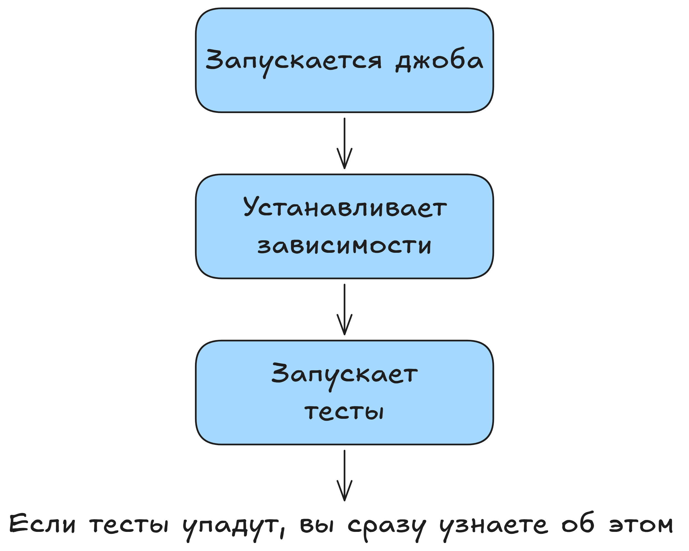
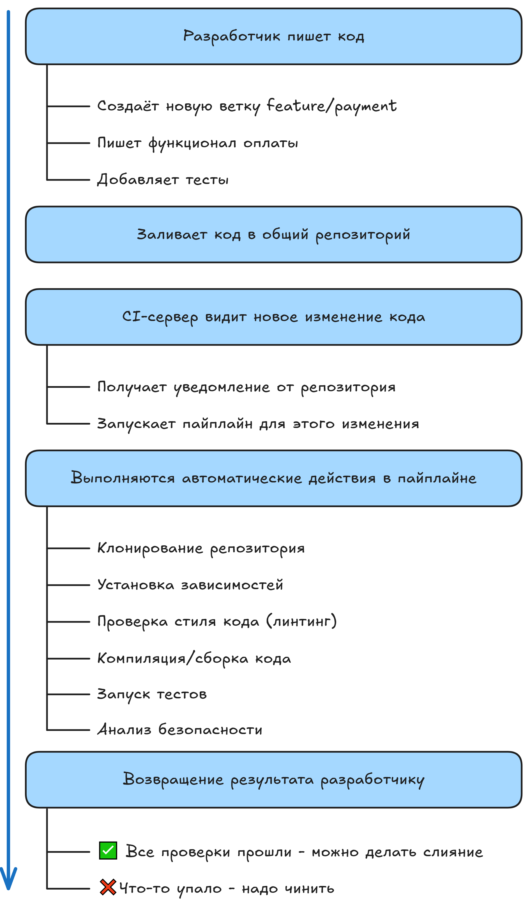

# CI/CD: Методология Непрерывной Интеграции и Доставки

## Введение

Парадокс современной разработки в том, что подавляющее большинство команд декларируют наличие CI/CD, но редко кто может чётко сформулировать архитектурные принципы и механизмы автоматизации. Разрыв между теоретическим пониманием и практической реализацией систематически приводит к недостижению целей, ради которых внедрялась автоматизация.

Курс базируется на опыте успешной трансформации разработки в организациях размером от микротимов до крупных корпоративных структур. Мы рассмотрим фундаментальные принципы, которые остаются неизменными независимо от выбора инструментария.

## Определение и Проблемное Поле

### CI/CD как архитектурная парадигма

**CI/CD (Continuous Integration / Continuous Delivery)** — это система архитектурных и организационных практик, обеспечивающих автоматизацию цепочки преобразований: `Code → VCS → Build → Test → Deploy → Monitor`

Диаграмма Мартина Фаулера (2006) остаётся актуальной: методология функционирует на трёх слоях:

1. **Техническом** — инструментарий автоматизации
2. **Процессном** — определение workflow'ов и stage'ей
3. **Культурном** — коллективное принятие парадигмы качества

### Исторический контекст

- **2000-е** — возникновение концепции (Martin Fowler, Steve McConnell)
- **2010-е** — массовое внедрение (Netflix, Amazon, Google обеспечивают 1000+ деплоев/день)
- **2020-е** — нормализация как обязательный стандарт, появление GitOps

### Основные Solve Points

| Проблема | Традиционный подход | CI/CD решение |
|----------|-----------------|---------------|
| **Деплой** | Раз в месяц, ручной, подверженный ошибкам | Автоматический, множественный в день, предсказуемый |
| **Интеграция кода** | Интеграционный ад (merge hell) | Микроинтеграции, immediate feedback |
| **Регрессия** | Обнаруживается в продакшене, дорогой откат | Перехватывается на стадии build, cost ≈ 1:100 |
| **Release Management** | Процедурный, подверженный человеческому фактору | Декларативный, повторяемый |
| **Mean Time to Recovery (MTTR)** | Часы/дни | Минуты |

### Компетентностные требования

Владение CI/CD является **conditio sine qua non** для современного разработчика. Дифференциальная заработная плата в пользу инженеров, компетентных в автоматизации, составляет 15-30% (данные Stack Overflow Survey 2023-2024).

## Образовательные Цели

После завершения курса участники будут способны:

### На уровне Знания (Knowledge)
- Объяснить архитектурные различия между CI, CD и Continuous Deployment
- Воспроизвести цикл SDLC с использованием автоматизации
- Описать синтаксические структуры конфигураций для GitLab CI / Jenkins

### На уровне Навыков (Skills)
- Проектировать pipelines, удовлетворяющие требованиям конкретной предметной области
- Диагностировать и разрешать конфликты интеграции в контексте параллельной разработки
- Оптимизировать время выполнения пайплайнов через кеширование, parallelization, lazy evaluation

### На уровне Компетентности (Competence)
- Выбирать инструментарий на основе критериев организационной зрелости
- Снизить MTTR (Mean Time To Recovery) в команде на 70-80%
- Повысить коэффициент успешных деплоев (успешность 85%+ вместо 60-70%)


## Эволюция Организации Разработки: От Монолита к Масштабированию

### Парадигма 1: Единоличный Разработчик

```
Developer → Local Build → Manual Deploy
                ↓
           Personal Repository
```

**Характеристики**: Детерминистичный процесс, минимальные overheads, но отсутствие воспроизводимости и версионирования.

### Парадигма 2: Малая Команда (3-5 человек)

Включение 2-3 дополнительных разработчиков экспоненциально увеличивает сложность:
- Количество потенциальных каналов коммуникации: ${n(n-1) \over 2}$ где n=количество участников
- Для n=3: 3 канала
- Для n=5: 10 каналов
- Для n=10: 45 каналов

**Возникающие проблемы**:
1. **Merge Conflicts** — параллельная работа над общими модулями
2. **Environment Parity Problem** — различия между локальной, dev, staging, production
3. **Regression Risk** — невозможно протестировать все комбинации вручную
4. **Knowledge Silos** — информация о peculiarities инфраструктуры живёт только в голове team lead'а

### Парадигма 3: Масштабированная Организация (10+ человек)

На этом уровне система управления разработкой становится критичной.

**Жизненный цикл Feature в типичной Scrum/Kanban организации**:

| День | Фаза | Операции | Duration |
|------|------|----------|----------|
| 1 | Planning | Task creation, discussion, estimation | 0.5h |
| 2-3 | Development | Branch creation, coding, local tests | 16h |
| 4 | Code Review | PR creation, peer review, revisions | 4-8h |
| 5 | Integration | Merge to dev, automated tests, artifact creation | 2h |
| 5-6 | QA | Manual testing, regression testing | 8-16h |
| 6-7 | Pre-Release | Bug fixes, release branch, staging validation | 8h |
| 8 | Release | Production deployment, monitoring, rollback prep | 4h |

**Итого: 8 calendar days on critical path**

При отсутствии автоматизации: **43-39 person-hours** на одну feature, из которых:
- ~60% в ручном тестировании и развёртывании
- ~35% в ожидании (потоки синхронизируются)
- ~5% в полезной работе над логикой

## Технологический Stack Современной Разработки

Управление сложностью требует специализированного инструментария:

| Категория | Примеры | Назначение |
|-----------|---------|-----------|
| **VCS** | Git (GitHub, GitLab, Gitea) | SSOT для кода, история изменений, branch management |
| **Task Management** | Jira, Linear, ClickUp | Synchronization между team members, roadmapping |
| **Communication** | Slack, Mattermost, Discord | Async updates, notifications from CI/CD pipeline |
| **Testing Framework** | Jest, Pytest, Go test, RSpec | Automated quality gates |
| **CI/CD Orchestration** | Jenkins, GitLab CI, GitHub Actions | Pipeline automation |
| **Artifact Registry** | Docker Registry, Nexus, Artifactory | Immutable build artifacts |
| **Container Runtime** | Docker, Podman, containerd | Reproducible execution environment |

### Интеграционные Механизмы

Ключевая метрика — **Lead Time (от коммита до продакшена)**. В организациях высокой эффективности:
- DevOps Research and Assessment (DORA) показывает: лучшие команды дают *< 1 часа* (vs 6+ месяцев у отстающих)
- Deployment frequency: *≥ 1 раз в день* (vs раз в месяц или реже)


## Патологии Ручного Управления Релизами

### Определение и Границы

**Ручной деплой** — это множество операций, выполняемых оператором через SSH/RDP без использования Infrastructure as Code парадигмы.

**Ручное тестирование** — регрессионное покрытие, осуществляемое человеком путём клик-тестирования всех user paths.

Оба механизма основаны на **процедурном знании** (knowing how) вместо **декларативного** (knowing that).

### Экспериментальное Доказательство: Ручной vs Автоматический Процесс

Сценарий: Деплой 10 микросервисов на 15 production серверов

```
РУЧНОЙ ДЕПЛОЙ                          АВТОМАТИЧЕСКИЙ ДЕПЛОЙ
─────────────────────────────────      ─────────────────────────────
14:00 SSH подключение #1               14:00 git push
      (забыл пароль → +5 мин)          14:01 ✓ Unit tests (2 мин)
                                       14:03 ✓ Integration tests (3 мин)
14:25 git pull (конфликт)              14:06 ✓ Build (2 мин)
      Ручное resolution                14:08 ✓ Security scan (2 мин)
                                       14:10 ✓ Deploy staging (2 мин)
14:40 npm install (disk full)          14:12 ✓ Smoke tests staging (3 мин)
      Cleanup, retry                   14:15 ✓ Deploy canary (1%, 5 мин)
                                       14:20 ✓ Metrics analysis
15:10 Копирование артефактов           14:25 ✓ Deploy 25% (5 мин)
                                       14:30 ✓ Deploy 100% (3 мин)
15:40 nginx reload                     14:33 ✓ Health checks
      Cache стал невалидным            14:35 ✓ Rollback plan ready
                                       
16:30 Сервер #2, #3, #4               ИТОГО: 35 минут, 0 человека
      (на #3 другая версия Node)       Автоматический откат при P95 latency rise
                                       
18:30 Всё готово?..                   
     Звонок о падении API в 21:00
     
ИТОГО: 7+ часов, не гарантирует успех
```

### Критические Точки Отказа и Их Метрики

| Failure Mode | Вероятность | Cost | Root Cause |
|--------------|------------|------|-----------|
| **Incomplete Migration** | 25-40% | Откат + downtime | Environment mismatch |
| **Dependency Issue** | 30-45% | BugFix + 2-day cycle | Missing dependency check |
| **Configuration Drift** | 35-50% | Intermittent failures | Manual edits not tracked |
| **Async Job Failures** | 40-60% | Data corruption | No pre-deployment validation |
| **Service Discovery** | 20-35% | DNS/LB issues | Manual endpoint updates |

### Кейс-исследование: Стоимость Ручного Управления

**Компания**: Российский e-commerce (20 инженеров, 8 live сервисов)
**Слишком долгий цикл**: Раз в неделю по четвергам

```
09:00 - 12:00: QA тестирование (200 тест-кейсов, 3 человека)
              Обнаружено: 5-7 критичных bagов
12:00 - 14:00: Разработчики в режиме firefighting
14:00 - 15:00: Повторное тестирование
15:00 - 17:00: DevOps: ручной чек-лист из 50 пунктов
17:00 - 20:00: Одна из проблем: на prod другой PHP
20:00 - 22:00: Мобильный API несовместим, экстренный релиз
22:00: Финальная проверка

Через месяц: неверная ветка деплоена → 3 часа downtime → потеря $100K
```

**Метрики ущерба**:
- Change Failure Rate: 35-40% (вместо 5% с CI/CD)
- Time to Recover: 180+ минут (вместо 5 минут)
- Per-incident cost: $10K-$50K

### Психосоциологические Следствия

1. **Burnout Culture** — героический overnight debugging как норма
2. **Knowledge Bus Factor** — один инженер = критичный узел отказа
3. **Risk Aversion** — хорошие фичи откладываются из-за страха деплоя
4. **Context Switching** — разработчики прерываются для firefighting


Что такое Continuous Integration (CI)?
На предыдущих уроках мы увидели проблемы ручных процессов и поняли, что нужна автоматизация. Сейчас мы разберём первую и самую важную часть этой автоматизации — Continuous Integration или — непрерывную интеграцию. Это фундамент, на котором строится весь современный процесс разработки.

Что такое Continuous Integration
Continuous Integration (CI) — это практика разработки, при которой разработчики регулярно (обычно несколько раз в день) интегрируют свой код в общий репозиторий, и каждая интеграция автоматически проверяется сборкой и тестами.

Давайте разберём по частям. "Continuous" означает непрерывный, постоянный. "Integration" — это объединение кода от разных разработчиков в единое целое.
То есть CI — это постоянное объединение кода с автоматической проверкой, что ничего не сломалось.

Ключевая идея CI в том, чтобы находить проблемы как можно раньше. Чем раньше найдена ошибка, тем дешевле её исправить. Баг, найденный через 5 минут после написания кода, исправляется за минуты. Баг, найденный через месяц в продакшне, может потребовать дней на исправление.

Минимальный пример CI процесса
# простейший CI пайплайн в GitLab 
test:
  script:
    - npm install
    - npm test

                  
Что здесь происходит:

test: — название джобы*, которая будет выполняться
npm install — устанавливаем зависимости* проекта
npm test — запускаем тесты





Теперь при каждом пуше в репозиторий GitLab автоматически запустит эти команды. Если тесты упадут, вы сразу узнаете об этом. Никакой магии — просто автоматическое выполнение тех же команд, которые вы запускаете локально.

Как работает CI: пошаговый разбор
Давайте проследим полный цикл CI на примере типичной веб-разработки:





Весь этот процесс занимает обычно 5-15 минут. Разработчик может переключиться на другую задачу, а когда пайплайн* завершится, получит уведомление о результате. Если что-то сломалось, он увидит точную причину — какой тест упал, на какой строке ошибка.

Основные компоненты CI системы
CI система состоит из нескольких ключевых элементов, каждый из которых выполняет свою роль.

Первый компонент — это триггеры. CI должна знать, когда запускаться. Обычно это происходит при каждом пуше* в репозиторий, но можно настроить более сложные правила. Например, запускать полный набор тестов только для мердж-реквестов*, а для обычных коммитов* — только быстрые проверки.

Второй компонент — окружение выполнения. Где будут запускаться наши проверки? Это может быть выделенный сервер, облачный раннер*, Docker-контейнер или даже ваш локальный компьютер. Главное требование — окружение должно быть чистым и воспроизводимым.

Третий компонент — сам набор проверок. Это сердце CI. Какие тесты запускать? Какие метрики собирать? Какие стандарты кода проверять? От этого зависит качество вашей CI системы.

Четвёртый компонент — система оповещений. CI бесполезна, если никто не знает о её результатах. Уведомления в чате, на почте, хоть где-то — всё это помогает команде быстро реагировать на проблемы.

Принципы эффективного CI
CI — это не просто автоматизация тестов. Это философия разработки, которая требует соблюдения определённых принципов.

Первый принцип — частая интеграция. Разработчики должны пушить код хотя бы раз в день. Чем дольше код живёт в изолированной ветке, тем сложнее будет его интегрировать. Представьте, что два разработчика месяц работают над разными фичами в одном модуле. Когда придёт время объединять их код, конфликтов будет масса.

Второй принцип — автоматизация всего. Если что-то можно автоматизировать, это нужно автоматизировать. Сборка, тесты, проверка кода, генерация документации, анализ производительности — всё это должна делать машина, а не человек.

Третий принцип — быстрая обратная связь. CI пайплайн должен выполняться быстро. Если разработчик ждёт результат час, он уже переключился на другую задачу и потерял контекст. Идеально — 5-10 минут на базовые проверки.

CI меняет культуру разработки
Внедрение CI меняет не только технические процессы, но и культуру команды. Появляется ответственность за качество кода. Больше нельзя запушить что попало и надеяться, что никто не заметит — CI заметит и сообщит всем.


До CI:                           После CI:
"Работает у меня"        →       "Проходят все тесты"
"Потом починим"          →       "Чиним сразу"
"Кто-то сломал сборку"   →       "CI показывает, кто и когда"
"Не знаю, почему упало"  →       "Вот лог с ошибкой"
"Боюсь мержить"          →       "CI проверил, всё ок"

                  
Появляется понятие "зелёной сборки". Если CI горит зелёным — код можно деплоить. Если красным — сначала нужно починить. Это простое правило убирает множество сомнений и споров.

Реальные метрики эффективности CI
Как понять, что CI работает эффективно? Есть несколько ключевых метрик, на которые стоит обращать внимание.

Время выполнения пайплайна — критически важная метрика. Быстрый пайплайн (5-10 минут) позволяет быстро итерироваться. Медленный (30+ минут) тормозит разработку. Если пайплайн занимает больше 15 минут, стоит задуматься об оптимизации.

Частота запусков показывает, насколько активно команда использует CI. В хорошей команде CI запускается десятки раз в день. Если CI запускается раз в неделю перед релизом — это не continuous integration, а просто автоматизация тестов.

Процент успешных сборок говорит о качестве кода. В идеале должно быть 85-95% успешных сборок. Если меньше — разработчики пушат непроверенный код. Если 100% — возможно, тесты недостаточно строгие.

CI в российских реалиях
В России есть свои особенности внедрения CI. Санкции затрудняют использование некоторых западных сервисов. GitHub Actions может быть недоступен, Travis CI не работает с российскими картами. Но есть альтернативы — self-hosted GitLab, Jenkins, TeamCity от JetBrains.

В небольших компаниях часто не хватает инфраструктуры. Выделенный сервер для CI? И для продакшна-то еле хватает. Тут помогает контейнеризация — можно запускать CI на том же железе, изолированно от основных сервисов.

Но общая тенденция ясна как день — абсолютно все двигаются в сторону автоматизации, ведь скорость — ключевой фактор эффективности.

Путь к зрелому CI
CI — это не то, что внедряется за день. Это эволюционный процесс, который проходит через несколько стадий:

Уровень 0: Нет CI
└─ Всё делается вручную

Уровень 1: Базовая автоматизация
└─ Автоматическая сборка при пуше
└─ Уведомления об ошибках

Уровень 2: Тестирование
└─ Unit-тесты в CI
└─ Проверка стиля кода

Уровень 3: Расширенные проверки
└─ Интеграционные тесты
└─ Анализ безопасности
└─ Метрики покрытия кода

Уровень 4: Полная автоматизация
└─ Автоматический деплой на тестовые среды
└─ Параллельное выполнение
└─ Динамические окружения для каждой ветки

Уровень 5: Оптимизация
└─ Умное кеширование
└─ Выборочный запуск тестов
└─ Предсказание сбоев на основе ML

                  
Большинство команд застревают на уровне 2-3. И это нормально. Даже базовый CI даёт огромный выигрыш.

Главное, что нужно запомнить: CI — это не про инструменты. GitLab CI, Jenkins, CircleCI — это просто средства. CI — это про культуру постоянной интеграции и автоматической проверки качества. Когда каждый в команде понимает ценность чистой сборки и быстрой обратной связи, тогда CI действительно работает.

В следующем уроке мы разберём вторую часть уравнения — Continuous Delivery и Continuous Deployment. Если CI отвечает за качество кода, то CD отвечает за его доставку пользователям.

Что такое Continuous Delivery (CD)?
В предыдущем уроке мы разобрались с Continuous Integration — автоматической проверкой кода при каждом изменении. CI гарантирует, что код работает и соответствует стандартам качества. Но что дальше? Код проверен, тесты зелёные, а как доставить эти изменения пользователям? Здесь начинается территория Continuous Delivery.

Что такое Continuous Delivery
Continuous Delivery (CD) — это практика, при которой код автоматически подготавливается к релизу в продакшн после прохождения всех проверок. Ключевое слово здесь — подготавливается. Код готов к деплою в любой момент, но само решение о релизе принимает человек.

CD расширяет идею CI. Если CI отвечает на вопрос "работает ли код?", то CD отвечает на вопрос "готов ли код к релизу?". Это означает не только прохождение тестов, но и создание артефактов, подготовку окружения, проверку совместимости, генерацию документации — всё, что нужно для безопасного релиза.

Главная цель CD — сделать релизы скучными. Никакого стресса, никаких ночных дежурств, никакого "а вдруг что-то сломается". Релиз становится обычной рутинной операцией, которую можно выполнить в любое время одним кликом.

Минимальный пример CD пайплайна
# .gitlab-ci.yml
stages:
  - test
  - build
  - deploy

test:
  stage: test
  script:
    - npm test

build:
  stage: build
  script:
    - npm run build
    - docker build -t myapp:$CI_COMMIT_SHA .
    - docker push registry.example.com/myapp:$CI_COMMIT_SHA

deploy_staging:
  stage: deploy
  script:
    - ssh staging@server "docker pull registry.example.com/myapp:$CI_COMMIT_SHA"
    - ssh staging@server "docker run -d myapp:$CI_COMMIT_SHA"
  environment:
    name: staging

deploy_production:
  stage: deploy
  script:
    - ssh prod@server "docker pull registry.example.com/myapp:$CI_COMMIT_SHA"
    - ssh prod@server "docker run -d myapp:$CI_COMMIT_SHA"
  environment:
    name: production
  when: manual  # Ключевой момент - ручное подтверждение!

                  
Что здесь происходит:

test — стейдж CI, проверяем что код работает
build — создаём Docker-образ и отправляем в реестр
deploy_staging — автоматически деплоим на тестовый сервер
deploy_production — готовим деплой в прод, но запускаем только вручную (when: manual)
После прохождения всех автоматических стейджей код готов к продакшн-релизу, но кнопку нажимает человек. Это и есть Continuous Delivery — постоянная готовность к поставке.

Как CD расширяет CI: полная картина
CI и CD работают вместе, формируя единый конвейер доставки кода от разработчика к пользователю. Давайте посмотрим на полный процесс:

Разработчик пушит код
         ↓
┌─── CI часть ────────────────────────┐
│                                     │
│  1. Клонирование кода               │
│  2. Установка зависимостей          │
│  3. Линтинг и форматирование        │
│  4. Unit-тесты                      │
│  5. Интеграционные тесты            │
│  6. Анализ безопасности             │
│                                     │
└─────────────────────────────────────┘       
  Все проверки прошли
          ↓
┌─── CD часть ────────────────────────┐
│                                     │
│  7.  Сборка приложения              │
│  8.  Создание Docker-образа         │
│  9.  Публикация в реестр            │
│  10. Деплой на dev-окружение        │
│  11. Тесты на dev                   │
│  12. Деплой на стейджинг            │
│  13. Тесты на стейджинг             │
│  14. [MANUAL] Деплой на продакшн    │
│                                     │
└─────────────────────────────────────┘

                  
CI-часть фокусируется на качестве кода. CD-часть фокусируется на подготовке к релизу. Вместе они обеспечивают быструю и безопасную доставку изменений.

Артефакты — основа CD
Центральное понятие в CD — это артефакт. Артефакт — это готовый к деплою пакет вашего приложения. Это может быть Docker-образ, JAR-файл, ZIP-архив, RPM-пакет — любой формат, который можно развернуть на сервере.

Важный принцип: "Build once, deploy many". Артефакт собирается один раз и затем используется на всех окружениях. Никакой пересборки для продакшна! Тот же самый артефакт, который тестировался на стейджинге, идёт в продакшн. Это гарантирует, что в продакшн попадёт именно то, что было протестировано.

Принцип "Build once, deploy many":

       CI Pipeline
           │
      [Build Stage]
           │
      npm run build
           │
           ▼
  ┌────────────────────┐
  │   АРТЕФАКТ         │
  │ app-7f3a8b9.tar.gz │  ← Собирается ОДИН РАЗ
  │                    │     с уникальной версией (commit SHA)
  └────────┬───────────┘
           │
           ├─────────────────┬──────────────────┬─────────────────┐
           ▼                 ▼                  ▼                 ▼
    [Dev окружение]   [Test окружение]   [Staging]        [Production]
           │                 │                  │                 │
    Тот же артефакт   Тот же артефакт   Тот же артефакт  Тот же артефакт
    app-7f3a8b9       app-7f3a8b9       app-7f3a8b9       app-7f3a8b9
           │                 │                  │                 │
           ▼                 ▼                  ▼                 ▼
      Развернуто         Протестировано    Проверено        В продакшне
                                           заказчиком


Неправильно (старый подход):              Правильно (CD подход):
─────────────────────────────              ──────────────────────
                                           
Code → Build for Dev    → Deploy           Code → Build ONCE → app-v1.tar.gz
Code → Build for Test   → Deploy                              ↓
Code → Build for Stage  → Deploy                    ┌─────────┴─────────┐
Code → Build for Prod   → Deploy                    ▼         ▼         ▼
                                                   Dev      Stage     Prod
                                                   
  Каждый раз новая сборка =                 Один и тот же артефакт везде =
  = риск различий                           = гарантия идентичности

                  
Здесь мы создаём архив с собранным приложением и используем его для всех деплоев. Версионирование по SHA коммита позволяет точно знать, какая версия кода где развёрнута.

Окружения в CD
CD подразумевает наличие нескольких окружений, через которые проходит код на пути к продакшну. Типичная схема выглядит так:

Development (dev) — самое нестабильное окружение. Сюда деплоится каждый коммит в основную ветку. Здесь могут быть баги, здесь тестируются новые идеи. Разработчики используют его для проверки интеграции.

Testing/QA — окружение для тестировщиков. Более стабильное, чем dev. Сюда попадают изменения, которые прошли базовые проверки. Тестировщики проводят здесь ручное и автоматизированное тестирование.

Staging — копия продакшна. Такое же железо, такие же данные (обезличенные), такие же настройки. Здесь проводится финальная проверка перед релизом. Если работает на стейджинге, должно работать и на продакшне.

Production — боевое окружение, где работают реальные пользователи. Сюда попадает только проверенный код после всех стадий тестирования.

Стратегии деплоя в CD
CD не просто копирует файлы на сервер. Современные стратегии деплоя минимизируют риски и позволяют быстро откатиться при проблемах.

Blue-Green деплой использует два идентичных окружения. Blue — текущий продакшн, Green — новая версия. После проверки Green, трафик переключается с Blue на Green. Если что-то пошло не так, можно мгновенно вернуться на Blue.

Текущее состояние:
┌─────────────┐
│   Blue v1   │ ← 100% трафика
└─────────────┘
┌─────────────┐
│  Green v2   │ ← 0% трафика (подготовка)
└─────────────┘

После переключения:
┌─────────────┐
│   Blue v1   │ ← 0% трафика (резерв)
└─────────────┘
┌─────────────┐
│  Green v2   │ ← 100% трафика
└─────────────┘

                  
Canary деплой постепенно переводит трафик на новую версию. Сначала 5% пользователей, потом 25%, потом 50%, и так далее. Если метрики ухудшаются, деплой останавливается.

Rolling деплой обновляет реплики приложения по одному. В кластере из 10 серверов сначала обновляется первый, потом второй, и так далее. Приложение остаётся доступным в течение всего процесса.

Автоматизация релиз-процессов
CD автоматизирует не только технические аспекты деплоя, но и организационные процессы вокруг релиза.

Генерация заметок релиза происходит автоматически на основе коммитов и pull request'ов. Больше не нужно вручную собирать информацию о том, что вошло в релиз. CI/CD система знает все изменения между версиями и может сформировать читаемый список.

Версионирование тоже автоматизируется. Semantic Versioning (MAJOR.MINOR.PATCH) можно вычислять на основе типов коммитов.
Ключевое изменение — увеличиваем MAJOR, новая фича — MINOR, багфикс — PATCH. Те самые v1.0.1 и подобные.

Управление конфигурацией становится частью пайплайна. Переменные окружения, секреты, настройки — всё это автоматически применяется при деплое. Никакого ручного редактирования конфигов на сервере.

Метрики и мониторинг в CD
CD не заканчивается на деплое. Важная часть — это мониторинг того, что происходит после релиза. Современные CD системы интегрируются с инструментами мониторинга и автоматически отслеживают ключевые метрики.

Если после деплоя метрики ухудшаются (растёт количество ошибок, падает производительность), система может автоматически откатить изменения. Это называется automated rollback и спасает от многих проблем.

Разница между Continuous Delivery и Continuous Deployment
Важно понимать разницу между Continuous Delivery и Continuous Deployment. В Continuous Delivery финальный деплой в продакшн требует ручного подтверждения. Человек принимает решение, когда релизить. В Continuous Deployment даже это автоматизировано — если все проверки пройдены, код автоматически идёт в продакшн.

Continuous Delivery подходит большинству компаний. Она даёт контроль над релизами, позволяет учитывать бизнес-факторы (не релизить в пятницу вечером, дождаться маркетинговой кампании). Continuous Deployment требует очень высокой зрелости процессов и подходит не всем.

В следующем уроке мы подробно разберём Continuous Deployment — вершину автоматизации, где код попадает к пользователям без какого-либо ручного вмешательства.


Что такое Continuous Deployment?
На предыдущих уроках мы разобрали Continuous Integration и Continuous Delivery. CI автоматизирует проверку кода, CD автоматизирует подготовку к релизу. Но в CD остаётся один ручной шаг — нажатие кнопки для деплоя в продакшн. А что если убрать и его? Добро пожаловать в мир Continuous Deployment — полной автоматизации пути от коммита до продакшна.

Что такое Continuous Deployment
Continuous Deployment — это практика, при которой каждое изменение кода, прошедшее все автопроверки, автоматически попадает в продакшн без какого-либо ручного вмешательства. Написал код, запушил, прошли тесты — и через 15-30 минут изменения уже доступны потребителям.

Это радикальный подход. Никаких релиз-менеджеров, никаких бесконечных созвонов "деплоим или подождём?". Код течёт в продакшн непрерывным потоком. Отсюда и название — непрерывное развёртывание.

Важно понимать разницу между Continuous Delivery и Continuous Deployment. В Delivery вы готовы релизить в любой момент, но решение принимает человек. В Deployment решение принимает машина на основе результатов тестов. Если всё зелёное — деплоим.

Минимальный пример Continuous Deployment
# .gitlab-ci.yml - полностью автоматический деплой
stages:
  - test
  - build
  - deploy

test:
  stage: test
  script:
    - npm test
    - npm run test:integration
    - npm run test:e2e

build:
  stage: build
  script:
    - docker build -t myapp:$CI_COMMIT_SHA .
    - docker push registry.example.com/myapp:$CI_COMMIT_SHA

deploy_production:
  stage: deploy
  script:
    - kubectl set image deployment/myapp myapp=registry.example.com/myapp:$CI_COMMIT_SHA
    - ./check_deployment_health.sh
  environment:
    name: production
  only:
    - main  # Только для основной ветки

                  
Что здесь происходит:

test — запускаются ВСЕ виды тестов (unit, интеграционные, e2e)
build — создаётся Docker-образ с уникальным тегом
deploy_production — автоматический деплой в Kubernetes без подтверждения
check_deployment_health.sh — проверка, что деплой прошёл успешно
Никаких кнопок, никаких ожиданий. Код сам доезжает до продакшна, если проходит все проверки.

Как работает полный цикл Continuous Deployment
09:30  Разработчик пушит код
         │
         ├─ 09:31  Unit-тесты (2 мин)
         ├─ 09:33  Интеграционные тесты (3 мин)
         ├─ 09:36  E2E тесты (5 мин)
         ├─ 09:41  Сборка и публикация образа (2 мин)
         ├─ 09:43  Деплой не на всех пользователей (1% трафика)
         ├─ 09:45  Мониторинг метрик (5 мин)
         ├─ 09:50  Расширение на 10% трафика
         ├─ 09:55  Мониторинг метрик (5 мин)
         ├─ 10:00  Расширение на 50% трафика
         ├─ 10:05  Мониторинг метрик (5 мин)
         └─ 10:10  Полный релиз на 100% трафика
         
10:10  Код в продакшне у всех пользователей

Итого: 40 минут от пуша до продакшна

                  
Это реальный сценарий из практики крупных технологических компаний. Amazon, например, деплоит код в продакшн каждые 11.6 секунд. Netflix — каждые 16 минут. Google — тысячи раз в день. И всё это происходит автоматически.

Предпосылки для Continuous Deployment
Continuous Deployment — это фундаментальное изменение подхода к разработке. Чтобы безопасно внедрить Continuous Deployment, нужны определённые предпосылки.

Первое и главное — это культура качества. Каждый разработчик должен понимать, что его код может попасть в продакшн через полчаса. Нет времени на "потом допилю". Код должен быть качественным с первого раза.

Второе — это покрытие тестами. И не просто формальные 80% покрытия unit-тестами. Нужны интеграционные тесты, контрактные тесты, e2e тесты, тесты производительности. Если тесты пропустили баг в продакшн, виноваты не тесты, а их недостаток.

Третье — это мониторинг и observability. Метрики, логи, трейсы — всё должно быть настроено и работать. 

Стратегии безопасного Continuous Deployment
Автоматический деплой в продакшн звучит страшно. А если код сломает всё? А если тесты пропустили критичный баг? Современные стратегии минимизируют эти риски.

Progressive Rollout (постепенный релиз) — самая популярная стратегия. Новая версия сначала получает малую часть трафика, затем постепенно расширяется:

Стадии Progressive Rollout:
│
├─ Canary: 1-2% трафика
│  └─ Мониторинг 10-15 минут
│      └─ Метрики в норме? → Продолжаем
│      └─ Проблемы? → Откат
│
├─ Early Adopters: 5-10% трафика  
│  └─ Мониторинг 20-30 минут
│      └─ Часто это бета-тестеры или сотрудники
│
├─ Partial: 25-50% трафика
│  └─ Мониторинг 30-60 минут
│      └─ A/B тестирование старой и новой версии
│
└─ Full Rollout: 100% трафика
   └─ Финальный мониторинг

                  
Feature Flags (флаги функциональности) позволяют отделить деплой кода от включения функциональности. Код может быть в продакшене, но выключен. Включение происходит через изменение конфигурации без деплоя.

// Пример использования feature flags
function processPayment(order) {
    if (featureFlags.isEnabled('new-payment-system')) {
        // Новая логика оплаты
        return newPaymentProcessor.process(order);
    } else {
        // Старая проверенная логика
        return legacyPaymentProcessor.process(order);
    }
}

// Feature flags в конфигурации
{
    "new-payment-system": {
        "enabled": true,
        "percentage": 10,  // Включено для 10% пользователей
        "users": ["beta-tester-1", "beta-tester-2"]  // И для конкретных пользователей
    }
}

                  
Инфраструктура для Continuous Deployment
Continuous Deployment требует особой инфраструктуры. Обычная впска с nginx уже не подойдёт. Нужны инструменты, которые поддерживают динамическое управление и мониторинг.

Оркестраторы контейнеров (Kubernetes) обеспечивают плавное обновление приложений. Они умеют делать rolling updates (бесшовное обновление версий), следить за подами, автоматически перезапускать упавшие контейнеры.

Service Mesh (Istio) добавляет крутую маршрутизацию трафика. Можно направить 1% трафика на новую версию, не меняя код приложения. Также Service Mesh собирает детальные метрики о каждом запросе.

Системы мониторинга (Prometheus + Grafana) отслеживают состояние приложения в реальном времени. 

Когда НЕ нужен Continuous Deployment
Continuous Deployment — это не серебряная пуля. Есть ситуации, когда он не подходит или даже вреден.

Регулируемые индустрии (банки, медицина, авиация) часто требуют ручного контроля релизов. Каждое изменение должно быть задокументировано, проверено комплаенс-отделом, одобрено регулятором. Автоматический деплой здесь невозможен по определению.

B2B продукты с крупными клиентами тоже плохо подходят для Continuous Deployment. Клиенты хотят знать заранее об изменениях, проводить свои тесты, планировать обучение пользователей. 

Embedded системы и десктоп-приложения технически сложно обновлять непрерывно. Пользователь должен скачать и установить обновление. IoT-устройства могут быть офлайн.

Continuous Deployment в России: реалии и перспективы
В российском IT Continuous Deployment встречается редко. Яндекс, VK, Авито используют его для некоторых сервисов. Но большинство компаний останавливаются на Continuous Delivery.

Основные препятствия — это не технологии, а менталитет. "А вдруг что-то сломается?" — главный страх. Предпочитают контролировать релизы, даже если это замедляет поставку. Также сказывается недостаток опыта — мало кто видел, как Continuous Deployment работает на практике.

Но ситуация меняется. Молодые стартапы сразу строят процессы с прицелом на автоматизацию. Крупные компании экспериментируют с Continuous Deployment для внутренних сервисов. 

В следующем уроке мы рассмотрим преимущества CI/CD для команды и бизнеса, подведём итоги и поговорим о том, как эти практики влияют на успех продукта и счастье разработчиков.

Преимущества CI/CD для команды и бизнеса
Мы изучили, что такое CI/CD, как это работает технически, какие бывают подходы. Но зачем всё это нужно? Какую реальную пользу приносит автоматизация? В этом уроке разберём конкретные преимущества CI/CD — не абстрактные "повышение эффективности", а измеримые результаты, которые меняют жизнь команд и приносят деньги бизнесу.

Что получает команда разработки
Начнём с тех, кто работает с CI/CD каждый день — разработчиков, тестировщиков, DevOps-инженеров. Для них CI/CD — это не просто инструмент, а новое качество жизни.

Первое и главное — это скорость обратной связи. Без CI/CD разработчик узнаёт о проблеме через дни или недели, когда тестировщик доберётся до его кода. С CI/CD — через 5-10 минут после пуша. Представьте разницу: искать баг в коде, который написал час назад, или в коде двухнедельной давности, когда уже забыл, о чём думал.

Время обнаружения проблемы:
                             Без CI/CD      С CI/CD
Синтаксическая ошибка         2 часа       30 секунд
Сломанный тест                1 день       2 минуты
Проблема интеграции           1 неделя     10 минут
Баг в продакшне               2 недели     30 минут

Стоимость исправления растёт экспоненциально со временем!

                  
Второе преимущество — уверенность в коде. Зелёный пайплайн означает, что код прошёл все проверки. Можно смело рефакторить, зная, что тесты поймают проблемы. Можно обновлять зависимости без страха всё разрушить.

Как CI/CD меняет работу тестировщиков
Без CI/CD тестировщик тратит 70% времени на регрессионное тестирование — проверку, что старый функционал не сломался. Кликать одни и те же кнопки каждую неделю — это путь к профессиональному выгоранию. С CI/CD регрессию выполняют автотесты, а тестировщик занимается исследовательским тестированием, проектированием тест-кейсов, анализом результатов.

CI/CD также даёт тестировщикам суперсилу — возможность тестировать каждое изменение. Раньше приходилось ждать сборку для тестирования раз в неделю. Теперь каждый коммит автоматически деплоится на тестовый стенд. Можно проверить фичу через минуту после того, как разработчик её закончил.

DevOps
Для DevOps-инженеров CI/CD — это переход от реактивной к проактивной работе. Без автоматизации DevOps — это пожарная команда, которая тушит проблемы в продакшне. С CI/CD они становятся инженерами, которые строят и улучшают системы.

Распределение времени DevOps:

БЕЗ CI/CD:                      С CI/CD:
40% - Ручные деплои             5% - Мониторинг деплоев
30% - Тушение пожаров           10% - Инциденты
20% - Настройка серверов        20% - Инфраструктура
10% - Улучшения                 65% - Автоматизация и улучшения

Видите разницу? 65% времени на улучшения вместо 10%!

                  
CI/CD также снижает стресс. Больше не нужно деплоить по ночам, в выходные, в отпуске. Деплой становится обычной операцией, которая происходит автоматически. Можно спокойно уйти в отпуск, зная, что система справится сама.

Бизнес-метрики: где деньги?
Теперь поговорим на языке бизнеса — время, деньги, конкурентные преимущества. CI/CD приносит измеримую пользу по всем этим направлениям.

Time to Market — ключевая метрика для бизнеса. Это время от идеи до её реализации для пользователей. Компании с CI/CD выпускают фичи в 2-3 раза быстрее. Представьте: конкурент выкатывает новую функцию за 3 месяца, а вы — за месяц. Кто захватит рынок?

Снижение стоимости багов
Известное правило: чем позже найден баг, тем дороже его исправить. Баг, найденный на этапе разработки, стоит условно 100 у.е. Тот же баг в продакшн может стоить 10.000 у.е., а то и больше.

CI/CD ловит большинство багов на ранних стадиях. Автотесты находят проблемы за минуты, а не дни. Проверка на множестве окружений до продакшена позволяет ловить и те баги, которые не попались в тестах.

Влияние на качество продукта
CI/CD напрямую влияет на качество продукта, которое видят пользователи. Частые релизы означают быстрое исправление багов. Автотесты гарантируют стабильность базового функционала. Возможность быстрого отката минимизирует время недоступности сервиса.

Пользователи это замечают. Net Promoter Score (готовность рекомендовать продукт) у компаний с CI/CD в среднем на 23 пункта выше. Retention (удержание пользователей) лучше на 15-20%. Количество негативных отзывов о багах снижается в 3-4 раза.

Более того, CI/CD позволяет быстрее реагировать на обратную связь. Пользователь пожаловался на неудобство в интерфейсе? Через день уже можно выкатить исправление. Конкурент выпустил новую фичу? Можно быстро ответить своей реализацией.

Наём и удержание талантов
Неочевидное, но важное преимущество — CI/CD помогает привлекать и удерживать лучших специалистов. Современные разработчики не хотят работать в компаниях с устаревшими процессами.

Компании с хорошо настроенным CI/CD проще нанимать. Новый разработчик может в первый же день сделать коммит и увидеть результат. Не нужно неделями разбираться, как что-то задеплоить.

Удержание тоже улучшается. Разработчики счастливее, когда могут сосредоточиться на коде, а не на рутине. Меньше стресса от сломанных продакшнов. Больше удовлетворения от быстрой доставки фич пользователям. По статистике, текучка в командах с CI/CD на 40% ниже.

Культурные изменения
CI/CD меняет культуру компании. Появляется культура экспериментов вместо культуры страха. Можно попробовать новую идею, быстро выкатить MVP, получить обратную связь. Если не сработало — откатить или изменить.

Культура БЕЗ CI/CD:                 Культура С CI/CD:
"А вдруг сломается?"           →    "Давайте попробуем"
"Проверим в следующем релизе"  →    "Проверим сегодня"
"Это слишком рискованно"       →    "Выкатим на 1% и посмотрим"
"Кто виноват?"                 →    "Что можно улучшить?"
"Не трогай, работает"          →    "Давайте отрефакторим"

                  
Эта культурная трансформация влияет на инновации. Компании с CI/CD выпускают в 3 раза больше экспериментальных фич. A/B тестирование становится нормой.

Снижение рисков
Парадоксально, но частые релизы снижают риски. Логика простая: чем меньше изменений в релизе, тем меньше может пойти не так. Релиз с 1000 изменений — это русская рулетка. Релиз с 10 изменениями — контролируемый процесс.

CI/CD также улучшает восстановление после катастроф. Если что-то пошло сильно не так (хакерская атака, сбой инфраструктуры), можно быстро передеплоить всю систему из Git и Docker-образов. Компании с CI/CD восстанавливаются после инцидентов в 10 раз быстрее.

Соответствие регуляторным требованиям тоже упрощается. Все изменения проходят через контролируемый процесс. Это особенно важно для финтеха, медицины, госсектора.

Подсчитаем общую выгоду
CI/CD приносит пользу всем. Разработчики получают удовольствие от работы и меньше стресса. Тестировщики занимаются интересными задачами вместо рутины. DevOps строят системы вместо тушения пожаров. Менеджеры могут точно планировать релизы. Бизнес получает быструю поставку фич и довольных клиентов.

Инвестиции в CI/CD окупаются за 3-6 месяцев. После этого — чистая прибыль от повышения эффективности. Но главное — это не деньги. Главное — это возможность сосредоточиться на создании ценности для пользователей, а не на борьбе с техническими проблемами.
```