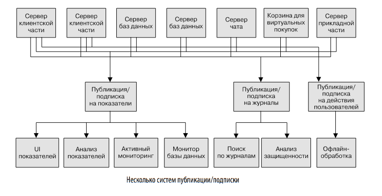
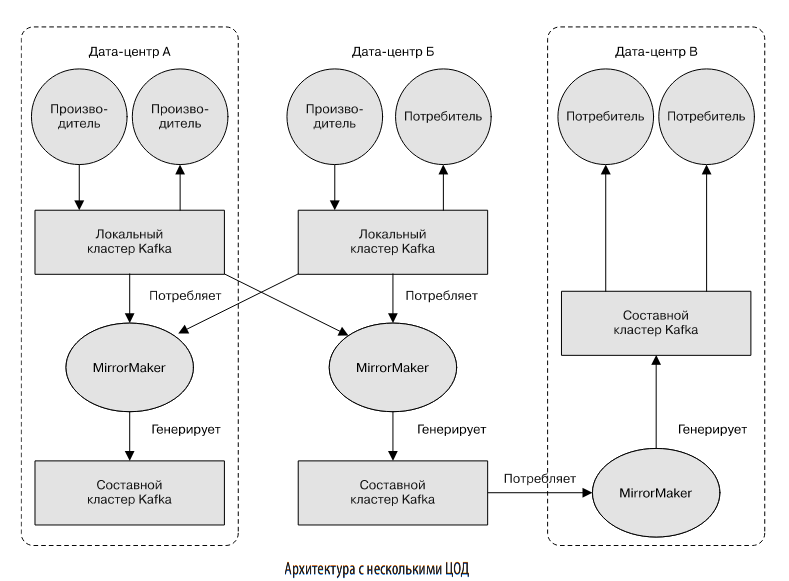

Прежде чем перейти к обсуждению нюансов Apache Kafka, важно понять кон-
цепцию обмена сообщениями по типу «публикация/подписка» и причину, по
которой она является критически важным компонентом приложений, управля-
емых данными. Обмен сообщениями по типу «публикация/подписка» (publish/
subscribe (pub/sub) messaging) — паттерн проектирования, отличающийся тем
Обмен сообщениями по типу «публикация/подписка» что отправитель (издатель) элемента данных (сообщения) не направляет его
конкретному потребителю. Вместо этого он каким-то образом классифициру-
ет сообщения, а потребитель (подписчик) подписывается на определенные их
классы. В системы типа «публикация/подписка» для упрощения этих действий
часто включают брокер — центральный пункт публикации сообщений.

Множество сценариев использования публикации/подписки начинается оди-
наково — с простой очереди сообщений или канала обмена ими между про-
цессами. Например, вы создали приложение, которому необходимо отправлять
куда-либо мониторинговую информацию, для чего приходится открывать пря-
мое соединение между вашим приложением и приложением, отображающим
показатели на инструментальной панели, и передавать последние через это
соединение

Это простое решение простой задачи, удобное для начала мониторинга. Но вскоре
вам захочется анализировать показатели за больший период времени, а на ин-
струментальной панели это не слишком удобно. Вы создадите новый сервис для
получения показателей, их хранения и анализа. Для поддержки этого измените
свое приложение так, чтобы оно могло записывать их в обе системы. К этому
времени у вас появятся еще три генерирующих показатели приложения, каждое из
которых будет точно так же подключаться к этим двум сервисам. Один из коллег
предложит идею активных опросов сервисов для оповещения, так что вы добавите
к каждому из приложений сервер, выдающий показатели по запросу. Вскоре у вас
появятся дополнительные приложения, использующие эти серверы для получе-
ния отдельных показателей в различных целях. Архитектура станет напоминать
рисунке, возможно, соединениями, которые еще труднее отслеживать.

Некоторая недоработка тут очевидна, так что вы решаете ее исправить. Создаете
единое приложение, получающее показатели от всех имеющихся приложений
и включающее сервер, — у него станут их запрашивать все системы, которым
нужны эти показатели. Благодаря этому сложность архитектуры уменьшается
(рис. 1.3). Поздравляем, вы создали систему обмена сообщениями по типу «пу-
бликация/подписка»!

Отдельные системы
организации очередей
В то время как вы боролись с показателями, один из ваших коллег аналогичным
образом трудился над сообщениями журнала. А еще один работал над отсле-
живанием действий пользователей на веб-сайте клиентской части и передачей
этой информации разработчикам, занимающимся машинным обучением, парал-
лельно с формированием отчетов для начальства. Вы все шли одним и тем же
путем, создавая системы, разделяющие издателей информации и подписчиков
на нее. Инфраструктура с тремя отдельными системами публикации/подписки
показана на рис. 1.4.
Использовать ее намного лучше, чем прямые соединения (см. рис. 1.2), но
возникает существенное дублирование. Компании приходится сопровождать
несколько систем организации очередей, в каждой из которых имеются соб-
ственные ошибки и ограничения. А между тем вы знаете, что скоро появятся
новые сценарии обмена сообщениями. Необходима единая централизованная
система, поддерживающая публикацию обобщенных типов данных, которая
могла бы развиваться по мере расширения вашего бизнеса.

Открываем для себя систему Kafka
Apache Kafka была разработана в качестве системы обмена сообщениями по
принципу «публикация/подписка», предназначенной для решения описанной
задачи. Ее часто называют распределенным журналом фиксации транзакций,
а в последнее время — распределенной платформой потоковой обработки.
Журнал фиксации файловой системы или базы данных предназначены для
обеспечения долговременного хранения всех транзакций таким образом, чтобы
можно было их воспроизвести с целью восстановления согласованного со-
стояния системы. Аналогично данные в Kafka хранятся долго, упорядоченно,
и их можно читать когда угодно. Кроме того, они могут распределяться по
системе в качестве меры дополнительной защиты от сбоев, равно как и ради
повышения производительности.

Сообщения и пакеты
Используемая в Kafka единица данных называется сообщением (message). Если
ранее вы работали с базами данных, то можете рассматривать сообщение как
аналог строки (row) или записи (record). С точки зрения Kafka сообщение
представляет собой просто массив байтов, так что для нее содержащиеся в нем
данные не имеют формата или какого-либо смысла. В сообщении может быть
дополнительный фрагмент метаданных, называемый ключом (key). Он тоже
представляет собой массив байтов и, как и сообщение, не несет для Kafka ника-
кого смысла. Ключи используются при необходимости лучше управлять записью
сообщений в разделы. Простейшая схема такова: генерация единообразного
хеш-значения ключа с последующим выбором номера раздела для сообщения
путем деления этого значения по модулю общего числа разделов в топике. Это га-
рантирует попадание сообщений с одним ключом в один раздел (при условии,
что количество разделов не изменится).
Для большей эффективности сообщения в Kafka записываются пакетами.
Пакет (batch) представляет собой просто набор сообщений, относящихся
к одному топику и разделу. Передача каждого сообщения туда и обратно по
сети привела бы к существенному перерасходу ресурсов, а объединение со-
общений в пакет эту проблему уменьшает. Конечно, необходимо соблюдать
баланс между временем задержки и пропускной способностью: чем больше
пакеты, тем больше сообщений можно обрабатывать за единицу времени, но
тем дольше распространяется отдельное сообщение. Пакеты обычно сжима-
ются, что позволяет передавать и хранить данные более эффективно за счет
некоторого расхода вычислительных ресурсов. Мы обсудим ключи и пакеты
более подробно в главе 3

Сообщения и пакеты
Используемая в Kafka единица данных называется сообщением (message). Если
ранее вы работали с базами данных, то можете рассматривать сообщение как
аналог строки (row) или записи (record). С точки зрения Kafka сообщение
представляет собой просто массив байтов, так что для нее содержащиеся в нем
данные не имеют формата или какого-либо смысла. В сообщении может быть
дополнительный фрагмент метаданных, называемый ключом (key). Он тоже
представляет собой массив байтов и, как и сообщение, не несет для Kafka ника-
кого смысла. Ключи используются при необходимости лучше управлять записью
сообщений в разделы. Простейшая схема такова: генерация единообразного
хеш-значения ключа с последующим выбором номера раздела для сообщения
путем деления этого значения по модулю общего числа разделов в топике. Это га-
рантирует попадание сообщений с одним ключом в один раздел (при условии,
что количество разделов не изменится).
Для большей эффективности сообщения в Kafka записываются пакетами.
Пакет (batch) представляет собой просто набор сообщений, относящихся
к одному топику и разделу. Передача каждого сообщения туда и обратно по
сети привела бы к существенному перерасходу ресурсов, а объединение со-
общений в пакет эту проблему уменьшает. Конечно, необходимо соблюдать
баланс между временем задержки и пропускной способностью: чем больше
пакеты, тем больше сообщений можно обрабатывать за единицу времени, но
тем дольше распространяется отдельное сообщение. Пакеты обычно сжима-
ются, что позволяет передавать и хранить данные более эффективно за счет
некоторого расхода вычислительных ресурсов. Мы обсудим ключи и пакеты
более подробно в главе 3

Топики и разделы
Сообщения в Kafka распределяются по топикам (topics). Ближайшая анало-
гия — таблица базы данных или каталог файловой системы. Топики, в свою
очередь, разбиваются на разделы (partitions). Если вернуться к описанию
журнала фиксации, то раздел представляет собой отдельный журнал. Сообще-
ния записываются в него путем добавления в конец, а читаются по порядку
от начала к концу. Заметим: поскольку топик обычно состоит из нескольких
разделов, не гарантируется упорядоченность сообщений в пределах всего топи-
ка — лишь в пределах отдельного раздела. На рис. 1.5 показан топик с четырьмя
разделами, в конец каждого из которых добавляются сообщения. Благодаря
разделам Kafka обеспечивает также избыточность и масштабируемость. Любой
из разделов можно разместить на отдельном сервере, что означает возможность
горизонтального масштабирования системы на несколько серверов для до-
стижения производительности, далеко выходящей за пределы возможностей
одного сервера. Кроме того, разделы могут быть реплицированы, так что на
разных серверах будет храниться копия одного и того же раздела на случай
выхода из строя одного сервера.

При обсуждении данных, находящихся в таких системах, как Kafka, часто ис-
пользуется термин «поток данных» (stream). Чаще всего он рассматривается
отдельным топиком независимо от числа разделов, представляющих собой еди-
ный поток данных, перемещающихся от производителей к потребителям. Чаще
всего сообщения рассматривают подобным образом при обсуждении потоковой
обработки, при которой фреймворки, в частности Kafka Streams, Apache Samza
и Storm, работают с сообщениями в режиме реального времени. Принцип их
действия подобен принципу работы офлайн-фреймворков, в частности Hadoop,
предназначенных для операций с большими данными. Обзор темы потоковой
обработки приведен в главе 14.

Производители и потребители
Пользователи Kafka делятся на два основных типа: производители и по-
требители. Существуют также продвинутые клиентские API — API Kafka
Connect для интеграции данных и Kafka Streams для потоковой обработки.
Продвинутые клиенты применяют производители и потребители в качестве
строительных блоков, предоставляя на их основе функциональность более
высокого уровня.
Производители (producers) генерируют новые сообщения. В других системах
обмена сообщениями по типу «публикация/подписка» их называют издате-
лями (publishers) или авторами (writers). Производители сообщений создают
их для конкретного топика. По умолчанию производитель будет равномерно
поставлять сообщения во все разделы топика. В некоторых случаях он направ-
ляет сообщение в конкретный раздел. Для этого обычно служат ключ сообще-
ния и объект Partitioner, генерирующий хеш ключа и устанавливающий его
соответствие с конкретным разделом. Это гарантирует запись всех сообщений
с одинаковым ключом в один и тот же раздел. Производитель может также вос-
пользоваться собственным объектом Partitioner со своими бизнес-правилами
распределения сообщений по разделам. Более подробно поговорим о произво-
дителях в главе 3.
Потребители (consumers) читают сообщения. В других системах обмена сообще-
ниями по типу «публикация/подписка» их называют подписчиками (subscribers)
или читателями (readers). Потребитель подписывается на один топик или более
и читает сообщения в порядке их создания в каждом разделе. Он отслеживает,
какие сообщения он уже прочитал, запоминая смещение сообщений. Смещение
(offset) — непрерывно возрастающее целочисленное значение — еще один эле-
мент метаданных, который Kafka добавляет в каждое сообщение при его созда-
нии. Смещения сообщений в конкретном разделе не повторяются, а следующее
сообщение имеет большее смещение (хотя и не обязательно монотонно большее).

