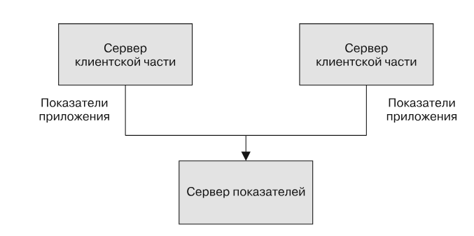
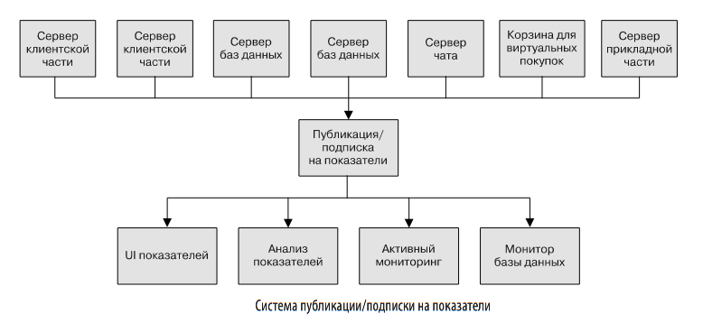
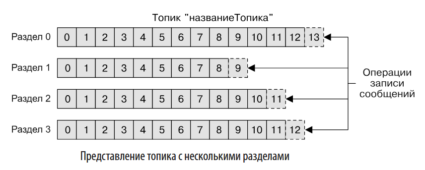

# Лекция: Apache Kafka. Основы и архитектура
## Главы 1-2 (90 минут, 45 слайдов)

**Преподаватель:** Серов Н.Е.  
**Дисциплина:** Разработка высоконагруженных систем  
**Время:** 90 минут (2 академических часа)

---

## Слайд 1: Титульный

# 🚀 Apache Kafka
## Потоковая обработка и анализ данных

### Главы 1-2: Основы и архитектура

**Преподаватель:** Серов Н.Е.  
**МПГУ, 2025**

---

## Слайд 2: План лекции

### Что мы изучим сегодня:

1. **Паттерн публикация/подписка** (15 мин)
   - Зачем нужен pub/sub
   - Проблемы прямых соединений
   - Эволюция архитектуры

2. **Apache Kafka - введение** (20 мин)
   - Что такое Kafka
   - Распределенный журнал транзакций
   - Основные концепции

3. **Архитектура Kafka** (30 мин)
   - Сообщения и пакеты
   - Топики и разделы
   - Производители и потребители
   - Брокеры и кластеры

4. **Практические примеры** (20 мин)
   - Сценарии использования
   - Сравнение с альтернативами

5. **Вопросы и ответы** (5 мин)

---

## Слайд 3: Вопрос для размышления

### 🤔 Проблема, которую решает Kafka

**Сценарий:** У вас есть приложение, которое генерирует метрики мониторинга.

**Вопрос:** Как передать эти метрики нескольким системам одновременно?

- Система мониторинга в реальном времени
- Система хранения для анализа
- Система алертинга
- Система отчетности

**Классическое решение:** Прямые соединения от каждого приложения к каждой системе

**Проблема:** Что если приложений 10, а систем 5? = 50 соединений! 😱

---

## Слайд 4: Часть 1. Паттерн публикация/подписка

### Что такое pub/sub?

**Публикация/подписка (publish/subscribe)** — паттерн проектирования, где:

- **Издатель (publisher)** не знает конкретных получателей
- Сообщения классифицируются по категориям
- **Подписчик (subscriber)** выбирает интересующие категории
- **Брокер** — центральный пункт обмена сообщениями

**Аналогия:** Как газета — издатель публикует статьи, читатели подписываются на интересующие разделы.

---

## Слайд 5: Эволюция архитектуры - Шаг 1

### Начало: Прямое соединение

```
Приложение → Прямое соединение → Dashboard
```

**Плюсы:**
- Простота реализации
- Низкая задержка

**Минусы:**
- Одно приложение = одно соединение
- Нет масштабируемости
- Сложно добавить новых потребителей



---

## Слайд 6: Эволюция архитектуры - Шаг 2

### Проблема масштабирования

Когда появляется:
- 3 приложения, генерирующих метрики
- 2 системы, которым нужны метрики
- Система опроса по запросу

**Результат:** Паутина соединений!

```
App1 ──┐
App2 ──┼──→ Dashboard
App3 ──┘
       └──→ Storage
       └──→ Alerting
       └──→ Polling Server
```

**Проблема:** Сложность растет экспоненциально!


---

## Слайд 7: Эволюция архитектуры - Шаг 3

### Решение: Единый брокер сообщений

```
App1 ──┐
App2 ──┼──→ [Брокер сообщений] ──┐
App3 ──┘                          ├──→ Dashboard
                                   ├──→ Storage
                                   ├──→ Alerting
                                   └──→ Polling Server
```

**Преимущества:**
- ✅ Разделение издателей и подписчиков
- ✅ Легко добавлять новых потребителей
- ✅ Централизованное управление
- ✅ Масштабируемость

**Поздравляем!** Вы создали систему pub/sub! 🎉

---

## Слайд 8: Проблема множественных систем

### Отдельные системы организации очередей

**Сценарий:** В компании одновременно используются:
- Система для метрик
- Система для логов
- Система для событий пользователей

**Проблема:**
- Дублирование функциональности
- Разные ошибки и ограничения
- Сложность поддержки
- Новые сценарии = новые системы

**Решение:** Нужна **единая централизованная система** для всех типов данных!

---

## Слайд 9: Часть 2. Знакомство с Apache Kafka

### Что такое Apache Kafka?

**Apache Kafka** — распределенная система обмена сообщениями:

1. **Распределенный журнал транзакций**
   - Долговременное хранение
   - Упорядоченность данных
   - Возможность перечитывания

2. **Платформа потоковой обработки**
   - Обработка в реальном времени
   - Высокая пропускная способность
   - Масштабируемость

**Аналогия:** Как журнал транзакций БД, но для всего предприятия!

---

## Слайд 10: Журнал фиксации транзакций

### Концепция из мира БД

**Журнал транзакций (transaction log):**
- Записывает все операции в порядке выполнения
- Используется для восстановления после сбоев
- Гарантирует консистентность данных

**Kafka как журнал:**
- Сообщения записываются последовательно
- Можно читать с любого места
- Данные хранятся долго (дни, недели, месяцы)
- Распределен по нескольким серверам

**Ключевое отличие:** Kafka — это журнал для **всего предприятия**, а не только для одной БД.

---

## Слайд 11: Архитектура Kafka - Обзор

### Высокоуровневая схема

```
Производители → [Kafka Cluster] → Потребители
     ↓              ↓                  ↓
  App1, App2    Брокеры          Consumer1
  App3, App4    (Brokers)        Consumer2
                                    Consumer3
```

**Компоненты:**
- **Производители (Producers)** — отправляют сообщения
- **Брокеры (Brokers)** — хранят и обрабатывают сообщения
- **Потребители (Consumers)** — читают сообщения
- **Кластер** — несколько брокеров для надежности



---

## Слайд 12: Часть 3. Основные концепции Kafka

### Базовые элементы

1. **Сообщение (Message)** — единица данных
2. **Топик (Topic)** — категория сообщений
3. **Раздел (Partition)** — часть топика для масштабирования
4. **Производитель (Producer)** — создает сообщения
5. **Потребитель (Consumer)** — читает сообщения
6. **Брокер (Broker)** — сервер Kafka
7. **Кластер (Cluster)** — группа брокеров

**Аналогия:** Топик = газета, Раздел = страница, Сообщение = статья

---

## Слайд 13: Сообщения (Messages)

### Единица данных в Kafka

**Структура сообщения:**
```
┌─────────┬──────────┬─────────────┐
│  Key    │  Value   │  Metadata   │
│ (байты) │ (байты)  │ (offset, ts)│
└─────────┴──────────┴─────────────┘
```

**Характеристики:**
- **Value** — сами данные (массив байтов)
- **Key** — опциональный ключ для маршрутизации
- **Metadata** — offset, timestamp, headers

**Важно:** Kafka не знает формат данных — это просто байты!

**Аналогия с БД:** Сообщение = строка таблицы

---

## Слайд 14: Ключи сообщений

### Зачем нужен ключ?

**Ключ (Key):**
- Опциональный массив байтов
- Используется для маршрутизации
- Сообщения с одинаковым ключом → один раздел

**Алгоритм маршрутизации:**
```
hash(key) % количество_разделов = номер_раздела
```

**Пример:**
- Ключ: `user-123`
- Hash: `42`
- Разделов: `4`
- Результат: `42 % 4 = 2` → раздел 2

**Гарантия:** Сообщения с одним ключом всегда в одном разделе!

---

## Слайд 15: Пакеты (Batches)

### Оптимизация производительности

**Проблема:** Отправка каждого сообщения отдельно = overhead

**Решение:** Объединение сообщений в пакеты

```
Сообщение 1 ─┐
Сообщение 2 ─┼──→ [Пакет] ──→ Kafka
Сообщение 3 ─┘
```

**Преимущества:**
- ✅ Меньше сетевых запросов
- ✅ Лучшая пропускная способность
- ✅ Сжатие пакетов

**Компромисс:**
- ⚖️ Больше пакет = больше задержка
- ⚖️ Меньше пакет = меньше throughput

**Типичный размер:** 16-64 KB

---

## Слайд 16: Топики (Topics)

### Категории сообщений

**Топик** — именованная категория сообщений

**Аналогии:**
- Таблица в БД
- Каталог в файловой системе
- Раздел газеты

**Примеры топиков:**
- `user-events` — события пользователей
- `metrics` — метрики системы
- `logs` — логи приложений
- `orders` — заказы

**Характеристики:**
- Может иметь множество разделов
- Может иметь множество производителей
- Может иметь множество потребителей

---

## Слайд 17: Разделы (Partitions)

### Масштабирование топиков

**Раздел** — упорядоченная последовательность сообщений

**Структура:**
```
Топик: user-events
├── Раздел 0: [msg1, msg2, msg3, ...]
├── Раздел 1: [msg4, msg5, msg6, ...]
├── Раздел 2: [msg7, msg8, msg9, ...]
└── Раздел 3: [msg10, msg11, ...]
```

**Преимущества:**
- ✅ Горизонтальное масштабирование
- ✅ Параллельная обработка
- ✅ Репликация для надежности

**Важно:** Порядок гарантирован только в пределах раздела!



---

## Слайд 18: Разделы - Детали

### Как работают разделы

**Запись:**
- Сообщения добавляются в конец раздела (append-only)
- Каждое сообщение получает уникальный offset

**Чтение:**
- Последовательное чтение от начала к концу
- Можно читать с любого offset

**Масштабирование:**
- Каждый раздел на отдельном сервере
- Параллельная обработка разделов

**Репликация:**
- Копии разделов на разных серверах
- Защита от потери данных

---

## Слайд 19: Offset - Смещение сообщений

### Как Kafka отслеживает позицию

**Offset** — уникальный номер сообщения в разделе

```
Раздел 0:
offset: 0  → msg1
offset: 1  → msg2
offset: 2  → msg3
offset: 3  → msg4
...
```

**Характеристики:**
- Уникален в пределах раздела
- Монотонно возрастает
- Не переиспользуется (даже после удаления)

**Использование:**
- Потребитель запоминает свой offset
- Может перечитать сообщения
- Может начать с любого offset

---

## Слайд 20: Потоки данных (Streams)

### Концепция потока

**Поток данных (Stream):**
- Последовательность сообщений из топика
- Не зависит от количества разделов
- Единый поток от производителей к потребителям

**Использование:**
- Потоковая обработка в реальном времени
- Kafka Streams, Apache Samza, Storm
- Аналогия с batch-обработкой (Hadoop)

**Пример:**
```
Топик: user-clicks
Поток: click1 → click2 → click3 → ...
```

---

## Слайд 21: Производители (Producers)

### Кто создает сообщения

**Производитель (Producer):**
- Создает и отправляет сообщения
- Выбирает топик для сообщения
- Может указать раздел (через ключ)

**Альтернативные названия:**
- Publisher (издатель)
- Writer (писатель)

**Поведение по умолчанию:**
- Равномерное распределение по разделам (round-robin)
- Или маршрутизация по ключу

**Кастомизация:**
- Собственный Partitioner
- Бизнес-логика распределения

---

## Слайд 22: Производители - Маршрутизация

### Как сообщение попадает в раздел

**Вариант 1: Без ключа**
```
Producer → Round-robin → Разделы 0, 1, 2, 3, 0, 1, ...
```

**Вариант 2: С ключом**
```
Key: user-123 → hash(user-123) % 4 → Раздел 2
Key: user-456 → hash(user-456) % 4 → Раздел 0
```

**Вариант 3: Кастомный Partitioner**
```
Producer → Custom Logic → Выбранный раздел
```

**Гарантия:** Сообщения с одинаковым ключом → один раздел

---

## Слайд 23: Потребители (Consumers)

### Кто читает сообщения

**Потребитель (Consumer):**
- Читает сообщения из топиков
- Подписывается на один или несколько топиков
- Отслеживает свою позицию (offset)

**Альтернативные названия:**
- Subscriber (подписчик)
- Reader (читатель)

**Поведение:**
- Читает сообщения в порядке их создания
- Запоминает offset для каждого раздела
- Может перечитать сообщения

---

## Слайд 24: Потребители - Группы

### Consumer Groups

**Consumer Group:**
- Группа потребителей, работающих вместе
- Каждый раздел читается только одним потребителем группы
- Масштабирование через добавление потребителей

**Пример:**
```
Топик: orders (4 раздела)
Consumer Group: order-processors
├── Consumer 1 → Разделы 0, 1
├── Consumer 2 → Раздел 2
└── Consumer 3 → Раздел 3
```

**Добавили Consumer 4:**
```
├── Consumer 1 → Раздел 0
├── Consumer 2 → Раздел 1
├── Consumer 3 → Раздел 2
└── Consumer 4 → Раздел 3
```

**Ребалансировка:** Автоматическое перераспределение разделов

---

## Слайд 25: Брокеры (Brokers)

### Серверы Kafka

**Брокер:**
- Сервер, хранящий данные Kafka
- Обрабатывает запросы производителей и потребителей
- Управляет разделами и репликацией

**Функции:**
- Хранение сообщений
- Обработка запросов на запись/чтение
- Управление метаданными (топики, разделы)
- Координация с другими брокерами

**Идентификация:**
- Уникальный ID (broker.id)
- Список портов (9092, 9093 для SSL)

---

## Слайд 26: Кластер Kafka

### Группа брокеров

**Кластер:**
- Несколько брокеров, работающих вместе
- Обеспечивает надежность и масштабируемость

**Преимущества:**
- Отказоустойчивость (если один брокер упал)
- Распределение нагрузки
- Горизонтальное масштабирование

**Пример кластера:**
```
Kafka Cluster:
├── Broker 1 (id: 1)
├── Broker 2 (id: 2)
└── Broker 3 (id: 3)
```

**Минимум:** 1 брокер (для разработки)  
**Рекомендуется:** 3+ брокера (для production)

---

## Слайд 27: Репликация

### Защита от потери данных

**Репликация:**
- Копии разделов на разных брокерах
- Leader и Followers
- Автоматическое переключение при сбое

**Пример:**
```
Раздел 0:
├── Leader: Broker 1
├── Follower: Broker 2
└── Follower: Broker 3
```

**Factor репликации:**
- replication.factor = 3
- 1 оригинал + 2 копии
- Данные не потеряются при падении 2 брокеров

---

## Слайд 28: Leader и Followers

### Роли в репликации

**Leader:**
- Обрабатывает все запросы на запись/чтение
- Координирует репликацию

**Followers:**
- Копируют данные от Leader
- Готовы стать Leader при сбое

**Процесс записи:**
```
Producer → Leader → Follower 1
                  → Follower 2
```

**Процесс чтения:**
```
Consumer → Leader (или Follower для чтения)
```

**Failover:** При падении Leader автоматически выбирается новый

---

## Слайд 29: Часть 4. Сценарии использования

### Где используется Kafka?

1. **Метрики и мониторинг**
   - Сбор метрик от множества приложений
   - Централизованная обработка

2. **Логирование**
   - Агрегация логов
   - Централизованное хранение

3. **События пользователей**
   - Клики, просмотры, покупки
   - Аналитика в реальном времени

4. **Интеграция систем**
   - Связь между микросервисами
   - Event-driven архитектура

---

## Слайд 30: Пример 1: Метрики

### Сбор метрик в реальном времени

**Архитектура:**
```
App1 ──┐
App2 ──┼──→ Kafka (metrics) ──┐
App3 ──┘                       ├──→ Grafana
                                ├──→ InfluxDB
                                └──→ Alerting
```

**Преимущества:**
- Единая точка сбора
- Множество потребителей
- Масштабируемость

**Примеры метрик:**
- CPU, Memory, Disk
- HTTP requests, response times
- Business metrics

---

## Слайд 31: Пример 2: Event Sourcing

### Хранение событий

**Концепция:**
- Сохраняем не состояние, а события
- Состояние = результат применения событий

**Пример:**
```
События в Kafka:
- user-created
- user-updated
- user-deleted

Состояние = применение всех событий
```

**Преимущества:**
- Полная история изменений
- Возможность пересчета состояния
- Аудит и отладка

---

## Слайд 32: Пример 3: Микросервисы

### Связь между сервисами

**Проблема:**
- Множество микросервисов
- Нужна связь между ними
- Синхронные вызовы = проблемы

**Решение через Kafka:**
```
Service A → Kafka → Service B
                └──→ Service C
                └──→ Service D
```

**Преимущества:**
- Асинхронная связь
- Слабая связанность
- Масштабируемость

---

## Слайд 33: Сравнение с альтернативами

### Kafka vs другие системы

**RabbitMQ:**
- ✅ Проще в настройке
- ❌ Меньше throughput
- ❌ Нет долгого хранения

**Apache Pulsar:**
- ✅ Похожая архитектура
- ✅ Лучше для multi-tenancy
- ❌ Меньше экосистема

**Redis Pub/Sub:**
- ✅ Очень быстро
- ❌ Нет персистентности
- ❌ Ограниченная функциональность

**Kafka:**
- ✅ Высокий throughput
- ✅ Долгое хранение
- ✅ Большая экосистема
- ❌ Сложнее в настройке

---

## Слайд 34: Когда использовать Kafka?

### Подходящие сценарии

**✅ Используйте Kafka, когда:**
- Нужен высокий throughput (миллионы сообщений/сек)
- Нужно долгое хранение данных
- Множество производителей и потребителей
- Нужна потоковая обработка
- Важна надежность и отказоустойчивость

**❌ Не используйте Kafka, когда:**
- Низкий объем данных (< 1000 сообщений/сек)
- Простая очередь задач
- Нужны сложные маршрутизации
- Ограниченные ресурсы

---

## Слайд 35: Производительность Kafka

### Цифры, которые впечатляют

**Пропускная способность:**
- 2 миллиона сообщений/сек на одном брокере
- Линейное масштабирование с количеством брокеров

**Задержка:**
- < 10ms для записи
- < 10ms для чтения (из памяти)

**Хранение:**
- Терабайты данных на брокер
- Настраиваемое время хранения (дни, недели, месяцы)

**Масштабирование:**
- Тысячи топиков
- Десятки тысяч разделов
- Миллионы сообщений

---

## Слайд 36: Экосистема Kafka

### Дополнительные компоненты

**Kafka Connect:**
- Интеграция с внешними системами
- Готовые коннекторы (DB, S3, Elasticsearch)

**Kafka Streams:**
- Потоковая обработка данных
- Библиотека для Java/Scala

**Schema Registry:**
- Управление схемами данных
- Версионирование схем

**Kafka UI:**
- Визуализация топиков и сообщений
- Мониторинг кластера

---

## Слайд 37: Безопасность Kafka

### Защита данных

**Аутентификация:**
- SASL (PLAIN, SCRAM, GSSAPI)
- SSL/TLS сертификаты
- OAuth

**Авторизация:**
- ACL (Access Control Lists)
- RBAC (Role-Based Access Control)
- Разрешения на топики и группы

**Шифрование:**
- TLS для передачи данных
- Шифрование на диске (опционально)

**Аудит:**
- Логирование всех операций
- Отслеживание доступа

---

## Слайд 38: Мониторинг Kafka

### Что нужно отслеживать?

**Метрики брокеров:**
- CPU, Memory, Disk I/O
- Network throughput
- Request latency

**Метрики топиков:**
- Размер разделов
- Lag потребителей
- Throughput записи/чтения

**Метрики производителей:**
- Скорость отправки
- Ошибки
- Размер пакетов

**Метрики потребителей:**
- Lag (отставание)
- Скорость обработки
- Ошибки

---

## Слайд 39: Типичные проблемы

### Что может пойти не так?

**1. Consumer Lag:**
- Потребители не успевают обрабатывать
- **Решение:** Увеличить количество потребителей

**2. Нехватка разделов:**
- Нельзя масштабировать дальше
- **Решение:** Увеличить количество разделов (осторожно!)

**3. Нехватка дискового пространства:**
- Разделы переполняются
- **Решение:** Настроить retention policy

**4. Network saturation:**
- Сеть перегружена
- **Решение:** Сжатие, оптимизация размера пакетов

---

## Слайд 40: Best Practices

### Рекомендации по использованию

**Топики:**
- Используйте осмысленные имена
- Планируйте количество разделов заранее
- Настройте retention policy

**Производители:**
- Используйте пакеты для лучшей производительности
- Используйте ключи для упорядоченности
- Обрабатывайте ошибки

**Потребители:**
- Используйте группы для масштабирования
- Настройте auto-commit правильно
- Обрабатывайте сообщения идемпотентно

**Кластер:**
- Минимум 3 брокера для production
- Replication factor = 3
- Мониторинг и алертинг

---

## Слайд 41: Резюме - Ключевые концепции

### Что мы изучили:

1. **Pub/Sub паттерн** — разделение издателей и подписчиков
2. **Kafka** — распределенный журнал транзакций
3. **Сообщения** — единица данных с ключом и значением
4. **Топики** — категории сообщений
5. **Разделы** — для масштабирования и параллелизма
6. **Производители** — создают сообщения
7. **Потребители** — читают сообщения
8. **Брокеры** — серверы Kafka
9. **Кластер** — группа брокеров
10. **Репликация** — защита от потери данных

---

## Слайд 42: Резюме - Преимущества Kafka

### Почему Kafka популярен?

✅ **Высокая производительность**
- Миллионы сообщений в секунду
- Низкая задержка

✅ **Масштабируемость**
- Горизонтальное масштабирование
- Тысячи топиков и разделов

✅ **Надежность**
- Репликация данных
- Отказоустойчивость

✅ **Долгое хранение**
- Настраиваемое время хранения
- Возможность перечитывания

✅ **Экосистема**
- Множество инструментов
- Активное сообщество

---

## Слайд 43: Что дальше?

### Следующие темы

**Глава 3:**
- Детали работы производителей
- Конфигурация и оптимизация
- Обработка ошибок

**Глава 4:**
- Детали работы потребителей
- Consumer Groups
- Offset management

**Практика:**
- Установка Kafka
- Создание топиков
- Написание производителей и потребителей

---

## Слайд 44: Полезные ресурсы

### Где учиться дальше?

**Документация:**
- https://kafka.apache.org/documentation/
- Официальная документация (очень подробная!)

**Книги:**
- "Kafka: The Definitive Guide" (O'Reilly)
- "Kafka Streams in Action" (Manning)

**Практика:**
- Docker образы Kafka
- Локальная установка для экспериментов
- Примеры кода на GitHub

**Сообщество:**
- Apache Kafka mailing lists
- Stack Overflow
- Reddit r/apachekafka

---

## Слайд 45: Вопросы и ответы

### ❓ Время для вопросов

**Частые вопросы:**

1. **Можно ли изменить количество разделов?**
   - Да, но осторожно! Может нарушить упорядоченность

2. **Что происходит при падении брокера?**
   - Автоматический failover на реплику

3. **Как обеспечить порядок сообщений?**
   - Используйте ключи и один раздел

4. **Можно ли удалять старые сообщения?**
   - Да, через retention policy

**Ваши вопросы?**

---

## Приложение: Схемы и диаграммы

### Визуальные материалы

1. **Эволюция архитектуры:**
   - Прямое соединение → Pub/Sub → Kafka
   - См. слайды 5-7

2. **Архитектура Kafka:**
   - Производители → Брокеры → Потребители
   - См. слайд 11

3. **Топики и разделы:**
   - Структура топика с разделами
   - См. слайд 17

4. **Репликация:**
   - Leader и Followers
   - См. слайд 27

---

## Приложение: Команды Kafka

### Базовые команды для практики

**Создание топика:**
```bash
kafka-topics.sh --create \
  --topic my-topic \
  --partitions 3 \
  --replication-factor 2 \
  --bootstrap-server localhost:9092
```

**Отправка сообщения:**
```bash
kafka-console-producer.sh \
  --topic my-topic \
  --bootstrap-server localhost:9092
```

**Чтение сообщений:**
```bash
kafka-console-consumer.sh \
  --topic my-topic \
  --from-beginning \
  --bootstrap-server localhost:9092
```

---

## Приложение: Примеры кода

### Producer (Python)

```python
from kafka import KafkaProducer

producer = KafkaProducer(
    bootstrap_servers=['localhost:9092'],
    value_serializer=lambda v: v.encode('utf-8')
)

producer.send('my-topic', value='Hello Kafka!')
producer.flush()
```

### Consumer (Python)

```python
from kafka import KafkaConsumer

consumer = KafkaConsumer(
    'my-topic',
    bootstrap_servers=['localhost:9092'],
    auto_offset_reset='earliest'
)

for message in consumer:
    print(f"Received: {message.value}")
```

---

**Конец лекции**

*Спасибо за внимание!*

**Вопросы?** 🤔
