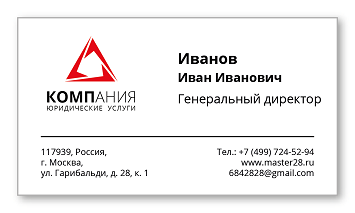

# Проект учебного технического задания

**Дисциплина:** "Управление разработкой программного обеспечения"

## 📋 Программа по распознаванию информации с визитных карт

> **Методология разработки:** SCRUM

### 🎯 Описание проекта

Распознавание и извлечение информации из отсканированных визитных карточек с выделением следующих данных:

- 👤 **Имя**
- 💼 **Должность**
- 📞 **Телефон**
- 📍 **Адрес**
- 📧 **Адрес электронной почты**
- 🏢 **Компания**
- ℹ️ **Дополнительная информация**

---

## 🚀 Этапы разработки

### 📦 Этап 1: MVP (Minimum Viable Product)

**Цель:** Создание базовой функциональности

- ⚡ **Консольное приложение**
- 🤖 **Использование API LLM** для распознавания текста
- 📄 **Запись распознанной информации** в текстовый файл

**Критерии готовности:**

- [ ] Приложение запускается из командной строки
- [ ] Обрабатывает изображения визитных карт
- [ ] Сохраняет результат в .txt файл

---

### 🖥️ Этап 2: Десктопное приложение

**Цель:** Улучшение пользовательского интерфейса

- 🎨 **Десктопный интерфейс** (GUI)
- 📊 **Структурированное сохранение** в JSON-файлы

**Критерии готовности:**

- [ ] Графический интерфейс пользователя
- [ ] Drag & Drop для загрузки изображений
- [ ] Экспорт в JSON формате
- [ ] Предварительный просмотр результатов

---

### 🌐 Этап 3: Веб-приложение

**Цель:** Создание веб-интерфейса с базой данных

- 🗄️ **Проектирование и выбор БД**
- 🔧 **Выбор веб-фреймворка**
- 🌍 **Создание веб-интерфейса**

**Критерии готовности:**

- [ ] Выбрана и настроена база данных
- [ ] Реализован веб-интерфейс
- [ ] API для работы с данными
- [ ] Аутентификация пользователей

---

### 📈 Этап 4: Аналитика и оптимизация

**Цель:** Добавление аналитических возможностей

- 📊 **Аналитика данных** по базе данных
- 🔍 **Индексация данных** для быстрого поиска

**Критерии готовности:**

- [ ] Дашборд с аналитикой
- [ ] Поиск по всем полям
- [ ] Статистика использования
- [ ] Экспорт отчетов

---

### 🐳 Этап 5: Масштабирование и мониторинг

**Цель:** Подготовка к продакшену

- 📦 **Контейнеризация и оркестрация** (Docker, Kubernetes)
- 🔍 **Elasticsearch и Kibana** для поиска и мониторинга
- ⚡ **Профилирование и оптимизация** производительности

**Критерии готовности:**

- [ ] Docker-контейнеры для всех сервисов
- [ ] CI/CD pipeline
- [ ] Мониторинг и логирование
- [ ] Автоматическое масштабирование
- [ ] Документация для развертывания

---

## 📋 SCRUM Артефакты

### Product Backlog

- Все функциональные требования разбиты по этапам
- Приоритизация по бизнес-ценности
- Оценка в Story Points

### Sprint Backlog

- Задачи текущего спринта
- Definition of Done для каждой задачи
- Ответственные за выполнение

### Increment

- Рабочая версия продукта после каждого спринта
- Готова к демонстрации заказчику
- Соответствует критериям качества

---

## 👥 Команда проекта

- **Product Owner** - определяет требования и приоритеты
- **Scrum Master** - обеспечивает соблюдение процессов
- **Development Team** - разрабатывает продукт

---

## 📅 Временные рамки

| Этап             | Длительность  | Спринты               |
| -------------------- | ------------------------- | ---------------------------- |
| Этап 1           | 2 недели            | 1 спринт               |
| Этап 2           | 2 недели            | 1 спринт               |
| Этап 3           | 4 недели            | 2 спринта             |
| Этап 4           | 2 недели            | 1 спринт               |
| Этап 5           | 2 недели            | 1 спринт               |
| **Итого** | **12 недель** | **6 спринтов** |
