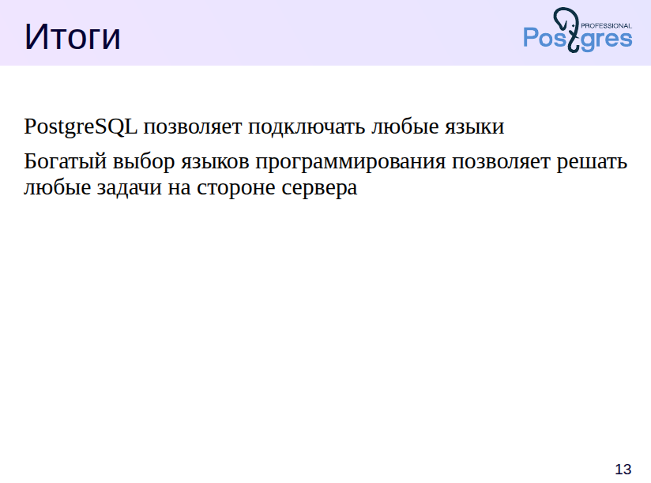

# Языки, используемые для создания пользовательских функций и процедур в PostgreSQL.

В PostgreSQL для создания пользовательских функций и процедур (user-defined functions and procedures) можно использовать несколько языков программирования. Основные из них:

### 1. **SQL**

* Простейший язык, встроенный в PostgreSQL.
* Используется для написания функций, которые выполняют простые SQL-операции.
* Пример:

  ```sql
  CREATE FUNCTION add_numbers(a INT, b INT)
  RETURNS INT AS $$
  SELECT a + b;
  $$ LANGUAGE sql;
  ```

### 2. **PL/pgSQL (Procedural Language/PostgreSQL)**

* Основной процедурный язык PostgreSQL.
* Позволяет использовать конструкции управления потоком (if, loop и т.д.).
* Имеет тесную интеграцию с SQL и хорошо подходит для написания сложной логики.
* Пример:

  ```sql
  CREATE FUNCTION factorial(n INT)
  RETURNS INT AS $$
  DECLARE
    result INT := 1;
  BEGIN
    FOR i IN 1..n LOOP
      result := result * i;
    END LOOP;
    RETURN result;
  END;
  $$ LANGUAGE plpgsql;
  ```

### 3. **PL/Python**

* Позволяет использовать Python (версии Python 2 или 3).
* Удобен для вычислений, обработки текста, машинного обучения и т.д.
* Пример:

  ```sql
  CREATE FUNCTION py_add(a INT, b INT)
  RETURNS INT AS $$
  return a + b
  $$ LANGUAGE plpython3u;
  ```

### 4. **PL/Perl**

* Позволяет писать функции на Perl.
* Подходит для текстовой обработки, регулярных выражений и пр.
* Пример:

  ```sql
  CREATE FUNCTION perl_add(a INT, b INT)
  RETURNS INT AS $$
  return $a + $b;
  $$ LANGUAGE plperl;
  ```

### 5. **PL/Tcl**

* Поддержка языка Tcl.
* Используется реже, но также возможен.
* Пример:

  ```sql
  CREATE FUNCTION tcl_add(a INT, b INT)
  RETURNS INT AS $$
  return [expr $1 + $2]
  $$ LANGUAGE pltcl;
  ```

### 6. **C (на уровне расширений)**

* Можно писать функции на C, компилировать их как расширения и подключать к PostgreSQL.
* Используется для максимально высокой производительности.

### 7. **Другие внешние языки (через расширения)**

* Можно добавить поддержку других языков через расширения, например:

  * **PL/R** — для языка R.
  * **PL/V8** — для JavaScript (на движке V8).
  * **PL/Java** — для Java.
  * **PL/Lua** — для Lua.

### Замечание:

Языки, помеченные как **небезопасные** (например, `plpython3u`), требуют суперпользовательских прав для создания функций.

