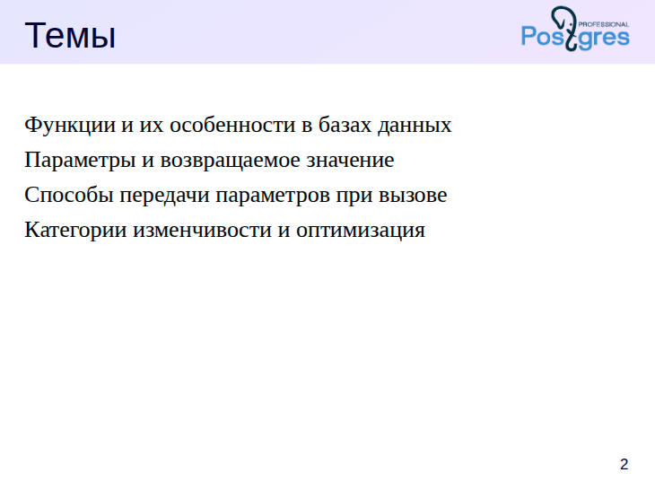
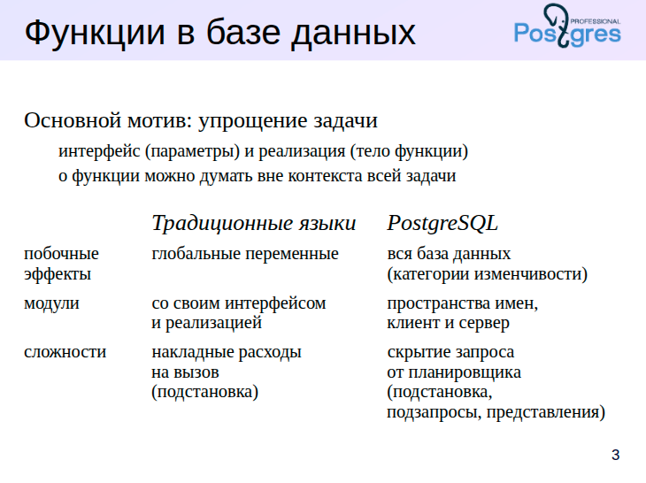
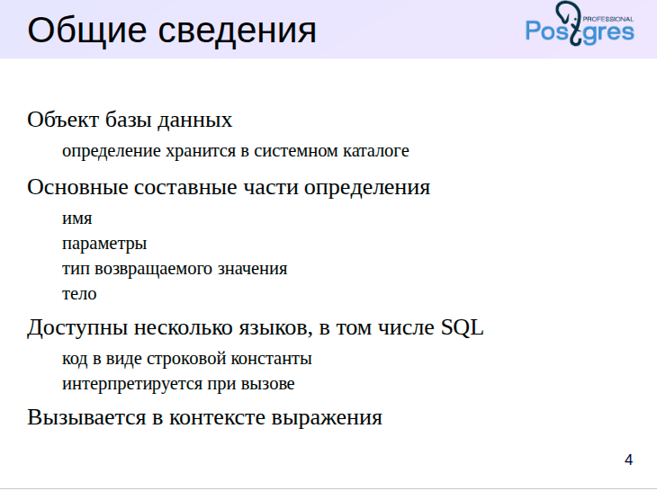
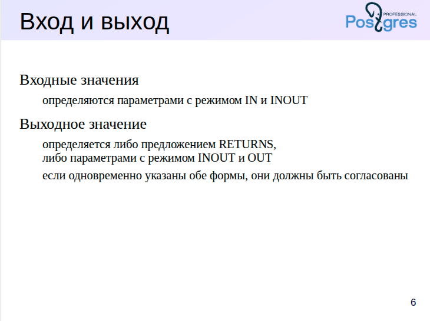
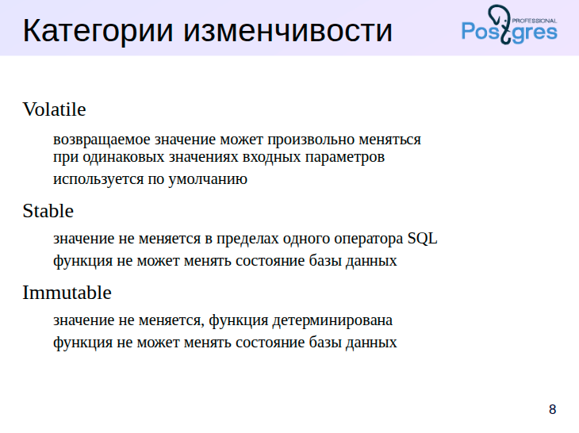
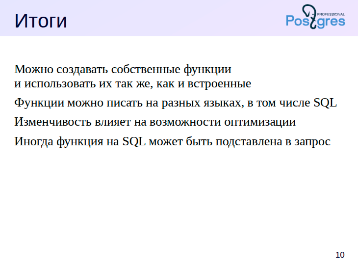
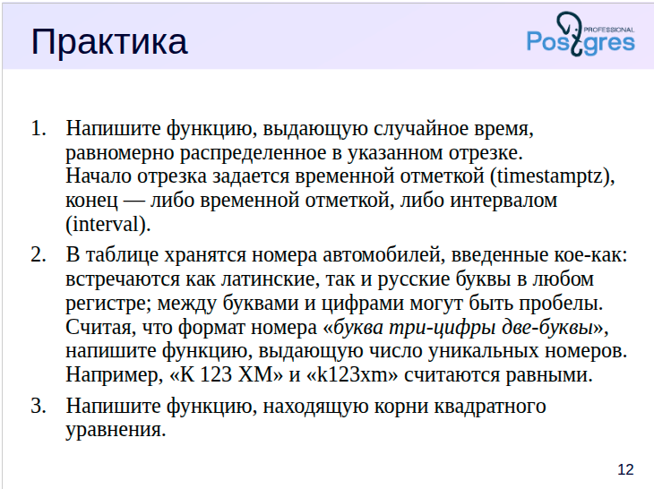

## Модуль 1. Пользовательские функции и процедуры
- Языки, используемые для создания пользовательских функций и процедур в PostgreSQL.
- Функции и процедуры на SQL.
- Язык PlPgSQL.
- Разработка функций на ненативных языках.







### 📘 **О функциях в программировании и в PostgreSQL**

#### 🎯 **Назначение функций**

Основная цель использования функций в программировании — **упростить решение задачи** путём её **декомпозиции** на более мелкие, изолированные подзадачи. Это позволяет:

* Работать с каждой функцией **абстрактно**, не погружаясь в детали её реализации.
* Скрыть реализацию функции за **чётко определённым интерфейсом** (входные параметры и возвращаемое значение).
* Изменять внутреннюю реализацию функции **без влияния** на вызывающий код.

> Однако это преимущество может быть нарушено при наличии **глобального состояния**, которое функции могут читать или модифицировать.
> В контексте СУБД таким глобальным состоянием является **вся база данных**.

---

#### 📦 **Модули и организация кода**

В традиционных языках программирования функции, как правило, группируются в **модули** (пакеты, классы и т. д.), что позволяет:

* Структурировать код,
* Ограничивать область видимости,
* Выделять интерфейс и реализацию модуля.

> В PostgreSQL такой модульной системы **нет**.
> Вместо этого используется система **пространств имён** (schemas), а граница между кодом чётко разделена:

* **Серверный код** (функции, процедуры) работает с базой данных;
* **Клиентский код** управляет транзакциями и вызывает SQL-запросы.

---

#### ⚙️ **Производительность и планирование**

В обычных языках программирования основным недостатком широкого применения функций могут быть **накладные расходы на вызов**.
Обычно это решается через **подстановку кода** функции (inlining).

> В системах управления базами данных, таких как PostgreSQL, последствия могут быть серьёзнее:

* При выносе части запроса в функцию **оптимизатор теряет "контекст"** и не может построить эффективный план выполнения.
* Это может привести к **ухудшению производительности**.

🔄 Однако PostgreSQL умеет в некоторых случаях выполнять **inlining функций**, особенно **SQL-функций**, что позволяет избежать потерь.

Альтернативные подходы:

* Использование **подзапросов** (inline),
* Создание **представлений** (views),
* Продуманная декомпозиция бизнес-логики между серверной и клиентской частью.

---

#### 📌 **Вывод**

Функции — ключевой инструмент для организации кода как в программировании, так и в базах данных.
Однако при использовании функций в PostgreSQL необходимо учитывать:

* Жёсткое разделение клиентской и серверной логики;
* Отсутствие полноценной модульной системы;
* Возможные потери производительности из-за изоляции планировщика;
* Способы минимизации этих потерь — подстановка, подзапросы, представления.

---





## 📌 **Функции как объекты базы данных в PostgreSQL**

### 📦 **Функции — полноправные объекты БД**

* Функции в PostgreSQL являются такими же объектами базы данных, как **таблицы**, **индексы**, **представления** и др.
* Их **определения хранятся в системном каталоге**, поэтому функции называют **хранимыми** (stored functions).
* Это позволяет использовать их многократно, независимо от клиентского приложения.

---

### 📚 **Стандартные и пользовательские функции**

* В PostgreSQL встроено **множество стандартных функций** для работы с:

  * Числами, строками, датами,
  * JSON, массивами и др.

* Список можно найти в документации:
  [Основные типы данных и функции](https://postgrespro.ru/docs/postgresql/16/functions)

* Также пользователь может **создавать собственные функции**:

  * На **разных языках** (SQL, PL/pgSQL, PL/Python и др.).
  * В рамках данного курса примеры даются на **языке SQL**.

---

### 🧱 **Структура определения функции**

Определение функции включает:

1. **Имя функции**;
2. **Список параметров** (необязательный);
3. **Тип возвращаемого значения**;
4. **Тело функции** — код, реализующий логику.

Пример на SQL:

```sql
CREATE FUNCTION add(a INT, b INT)
RETURNS INT
AS $$
  SELECT a + b;
$$ LANGUAGE sql;
```

---

### 🔤 **Тело как строка**

* Код тела функции всегда передаётся как **строковая константа**.
* Это позволяет PostgreSQL хранить код **унифицировано** — независимо от языка программирования.
* При вызове функция **интерпретируется** заново (за исключением некоторых оптимизаций).

---

### ⚙️ **Оптимизация: предварительный разбор SQL-функций**

* Начиная с версии **PostgreSQL 14**, появилась возможность **разбирать SQL-функции заранее**:

  * В системный каталог сохраняется **дерево разбора**, а не исходный текст.
  * Это повышает **производительность**, устраняя необходимость повторной интерпретации при каждом вызове.

> Функции на других языках (например, PL/pgSQL) по-прежнему интерпретируются при каждом вызове.

---

### 🧠 **Функции на языке C**

* Ещё один способ избежать интерпретации — написать функцию на языке **C** и подключить её как расширение.
* Такие функции выполняются **напрямую в нативном коде** и работают быстрее всего.
* Однако это выходит за рамки данного курса.

---

### 📍 **Контекст вызова функций**

Функции в PostgreSQL могут быть вызваны:

* В команде `SELECT` — в списке выбираемых выражений:

  ```sql
  SELECT add(2, 3);
  ```
* В условиях `WHERE`, `HAVING`:

  ```sql
  SELECT * FROM orders WHERE total_with_tax(price) > 1000;
  ```
* В ограничениях (`CHECK`):

  ```sql
  CREATE TABLE t (
    x INT CHECK (is_valid_x(x))
  );
  ```

Функция — это **выражение**, и она может быть использована в любом месте, где допустимы выражения SQL.

---

### 📖 **Ссылки на документацию**

* [SQL: CREATE FUNCTION](https://postgrespro.ru/docs/postgresql/16/sql-createfunction)
* [Вызов функций](https://postgrespro.ru/docs/postgresql/16/sql-syntax-calling-funcs)

---


Вот ваш материал, полностью **сохранённый без изменений**, оформленный в формате **Markdown** и **SQL** с соответствующей разметкой.

---


# Функции без параметров

Вот простой пример функции без параметров, содержащей один оператор:

```sql
=> CREATE FUNCTION hello_world() -- имя и пустой список параметров
RETURNS text                     -- тип возвращаемого значения
AS $$ SELECT 'Hello, world!'; $$ -- тело
LANGUAGE sql;                    -- указание языка
CREATE FUNCTION
````

Тело удобно записывать в строке, заключенной в кавычки-доллары, как в приведенном примере. Иначе придется заботиться об экранировании кавычек, которые наверняка встретятся в теле функции. Сравните:

```sql
=> SELECT ' SELECT ''Hello, world!''; ';
         ?column?          
---------------------------
  SELECT 'Hello, world!'; 
(1 row)
```

```sql
=> SELECT $$ SELECT 'Hello, world!'; $$;
         ?column?          
---------------------------
  SELECT 'Hello, world!'; 
(1 row)
```

При необходимости кавычки-доллары могут быть вложенными. Для этого в каждой паре кавычек надо использовать разный текст между долларами:

```sql
=> SELECT $func$ SELECT $$Hello, world!$$; $func$;
          ?column?           
-----------------------------
  SELECT $$Hello, world!$$; 
(1 row)
```

Функция вызывается в контексте выражения, например:

```sql
=> SELECT hello_world(); -- пустые скобки обязательны
  hello_world  
---------------
 Hello, world!
(1 row)
```

Давайте взглянем на то, как тело функции хранится в системном каталоге.

```sql
=> \pset xheader_width 60
Expanded header width is 60.

=> SELECT proname, prosrc, prosqlbody FROM pg_proc
WHERE proname = 'hello_world' \gx
-[ RECORD 1 ]-------------------------
proname    | hello_world
prosrc     |  SELECT 'Hello, world!'; 
prosqlbody | 
```

Мы видим сохраненную в исходном виде тело-строку.

А теперь реализуем современную возможность пересоздать нашу функцию в другом виде — в стиле стандарта SQL. В нашем случае телом функции может быть один оператор вида RETURN <выражение>:

```sql
=> CREATE OR REPLACE FUNCTION hello_world() RETURNS text
LANGUAGE sql
RETURN 'Hello, world!';
CREATE FUNCTION
```

Снова заглянем в системный каталог — тело функции сохранено по-другому:

```sql
=> SELECT proname, prosrc, left(prosqlbody, 100) AS body FROM pg_proc WHERE proname = 'hello_world' \gx
-[ RECORD 1 ]-----------------------------------------------
proname | hello_world
prosrc  | 
body    | {QUERY :commandType 1 :querySource 0 :canSetTag true :utilityStmt <> 
:resultRelation 0 :hasAggs fals
```

Исходный код в этом случае не хранится, получить его можно командой `\sf`:

```sql
=> \sf hello_world
CREATE OR REPLACE FUNCTION public.hello_world()
 RETURNS text
 LANGUAGE sql
RETURN 'Hello, world!'::text
```

В случае, если тело функции состоит из нескольких операторов SQL, в качестве результата возвращается значение из первой строки, которую вернул последний оператор. Если код такой функции написан в стиле стандарта SQL, потребуется использовать конструкцию `BEGIN ATOMIC ... END`, которая охватывает выполняемый блок операторов:

```sql
=> CREATE OR REPLACE FUNCTION hello_world() RETURNS text
LANGUAGE sql
BEGIN ATOMIC
  SELECT 'First Line';
  SELECT 'Second Line';
END;
CREATE FUNCTION
```

Пробуем вызов:

```sql
=> SELECT hello_world();
 hello_world 
-------------
 Second Line
(1 row)
```

Обратите внимание на особенности синтаксиса стиля стандарта SQL — в отличие от традиционного «строчного»:

* нет конструкции `AS`, содержащей код функции в виде строки;
* может использоваться новое ключевое слово `RETURN` для возврата значения;
* указание `LANGUAGE sql` не является обязательным;
* при создании функции ее код **разбирается**, а результат разбора сохраняется в `pg_proc.prosqlbody` (в традиционной нотации текст функции сохраняется в `pg_proc.prosrc`).

Это лучше соответствует стандарту и в большей мере совместимо с другими реализациями SQL. Теперь при вызове функции ее команды заново не интерпретируются, а используется заранее разобранный вариант.

---

Не все операторы SQL можно использовать в функции. Запрещены:

* команды управления транзакциями (`BEGIN`, `COMMIT`, `ROLLBACK` и т. п.);
* служебные команды (такие, как `VACUUM` или `CREATE INDEX`).

Вот пример неправильной функции. Здесь мы использовали псевдотип `void`, который говорит о том, что функция не возвращает ничего.

```sql
=> CREATE FUNCTION do_commit() RETURNS void
LANGUAGE sql
BEGIN ATOMIC COMMIT; END;
ERROR:  COMMIT is not yet supported in unquoted SQL function body
```

Управлять транзакциями можно в процедурах, о чем мы будет говорить в следующей теме.

---

# Функции с входными параметрами

Пример функции с одним параметром:

```sql
=> CREATE FUNCTION hello(name text) -- формальный параметр
RETURNS text
LANGUAGE sql
RETURN 'Hello, ' || name || '!';
CREATE FUNCTION
```

При вызове функции мы указываем фактический параметр, соответствующий формальному:

```sql
=> SELECT hello('Alice');
     hello     
---------------
 Hello, Alice!
(1 row)
```

При указании типа параметра можно указать и модификатор (например, `varchar(10)`), но он игнорируется.

Можно определить параметр функции без имени; тогда внутри тела функции на параметры придется ссылаться по номеру. Удалим функцию и создадим новую:

```sql
=> DROP FUNCTION hello(text); -- достаточно указать тип параметра
DROP FUNCTION

=> CREATE FUNCTION hello(text)
RETURNS text
LANGUAGE sql
RETURN 'Hello, ' || $1 || '!'; -- номер вместо имени
CREATE FUNCTION

=> SELECT hello('Alice');
     hello     
---------------
 Hello, Alice!
(1 row)
```

Но так лучше не делать, это неудобно.

Удалим функцию и создадим заново, добавив еще два параметра — приветствие и обращение.

```sql
=> DROP FUNCTION hello(text);
DROP FUNCTION
```

Здесь мы используем необязательное ключевое слово `IN`, обозначающее входной параметр. Предложение `DEFAULT` позволяет определить значение по умолчанию для параметра:

```sql
=> CREATE FUNCTION hello(IN name text, IN greet text DEFAULT 'Dear', IN title text DEFAULT 'Mr')
RETURNS text
LANGUAGE sql
RETURN 'Hello, ' || greet || ' ' || title || ' ' || name || '!';
CREATE FUNCTION
```

```sql
=> SELECT hello('Alice', 'Charming', 'Mrs'); -- указаны второй и третий параметры
           hello            
----------------------------
 Hello, Charming Mrs Alice!
(1 row)
```

Обратите внимание, что параметры со значениями по умолчанию должны идти в конце всего списка. При вызове функции значения фактических параметров, определенных как `DEFAULT`, можно опускать, тогда остальные `DEFAULT`-параметры, идущие в списке после, также получат значения по умолчанию.

```sql
=> SELECT hello('Bob', 'Excellent'); -- указан только первый default-параметр
          hello           
--------------------------
 Hello, Excellent Mr Bob!
(1 row)

=> SELECT hello('Bob'); -- опущены оба параметра, имеющие значение по умолчанию
        hello        
---------------------
 Hello, Dear Mr Bob!
(1 row)
```

До сих пор мы вызывали функцию, указывая фактические параметры **позиционным способом** — в том порядке, в котором они определены при создании функции. Во многих стандартных функциях имена параметров не заданы, так что этот способ оказывается единственным.

Но если формальным параметрам даны имена, можно использовать их при указании фактических параметров. В этом случае параметры могут указываться в **произвольном порядке**:

```sql
=> SELECT hello(title => 'Mrs', name => 'Alice');
         hello          
------------------------
 Hello, Dear Mrs Alice!
(1 row)
```

Такой способ удобен, когда порядок параметров неочевиден, особенно если их много; также можно явно указать значение одного из параметров по умолчанию.

Можно совмещать оба способа: часть параметров (начиная с первого) указать **позиционно**, а оставшиеся — **по имени**:

```sql
=> SELECT hello('Alice', title => 'Mrs');
         hello          
------------------------
 Hello, Dear Mrs Alice!
(1 row)
```

Если функция должна возвращать **неопределенное значение**, когда хотя бы один из входных параметров **не определен**, ее можно объявить как **строгую** (`STRICT`). Тело функции при этом вообще не будет выполняться.

```sql
=> DROP FUNCTION hello(text, text, text);
DROP FUNCTION

=> CREATE FUNCTION hello(IN name text, IN title text DEFAULT 'Mr')
RETURNS text
LANGUAGE sql STRICT
RETURN 'Hello, ' || title || ' ' || name || '!';
CREATE FUNCTION

=> SELECT hello('Alice', NULL);
 hello 
-------
 
(1 row)
```





Формальные параметры с режимом `IN` и `INOUT` считаются входными.  
Значения соответствующих фактических параметров должны быть указаны при вызове функции  
(либо должны быть определены значения по умолчанию).

Возвращаемое значение можно определить двумя способами:  
● использовать предложение `RETURNS` для указания типа;  
● определить выходные параметры с режимом `INOUT` или `OUT`.

Две эти формы записи эквивалентны.  
Например, функция с указанием `RETURNS integer` и функция с параметром `OUT integer` возвращают целое число.

Можно использовать и оба способа одновременно.  
В этом случае функция также будет возвращать одно целое число.  
Но при этом типы `RETURNS` и выходных параметров должны быть согласованы друг с другом.

Таким образом, нельзя написать функцию, которая будет возвращать одно значение,  
и при этом передавать другое значение в `OUT`-параметре —  
что позволяет большинство традиционных языков программирования.


# ПРАКТИКА


# Функции с выходными параметрами

Альтернативный способ вернуть значение — использовать выходной параметр.

```sql
=> DROP FUNCTION hello(text, text);
DROP FUNCTION

=> CREATE FUNCTION hello(
    IN name text,
    OUT text -- имя можно не указывать, если оно не нужно
)
LANGUAGE sql
RETURN 'Hello, ' || name || '!';
CREATE FUNCTION

=> SELECT hello('Alice');
     hello     
---------------
 Hello, Alice!
(1 row)
````

Результат тот же самый.

Можно использовать и `RETURNS`, и `OUT`-параметр вместе — результат снова будет тем же:

```sql
=> DROP FUNCTION hello(text); -- OUT-параметры не указываем
DROP FUNCTION

=> CREATE FUNCTION hello(IN name text, OUT text)
RETURNS text
LANGUAGE sql
RETURN 'Hello, ' || name || '!';
CREATE FUNCTION

=> SELECT hello('Alice');
     hello     
---------------
 Hello, Alice!
(1 row)
```

Или даже так, использовав `INOUT`-параметр:

```sql
=> DROP FUNCTION hello(text);
DROP FUNCTION

=> CREATE FUNCTION hello(INOUT name text)
LANGUAGE sql
RETURN 'Hello, ' || name || '!';
CREATE FUNCTION

=> SELECT hello('Alice');
     hello     
---------------
 Hello, Alice!
(1 row)
```

Обратите внимание, что, в отличие от многих языков программирования, фактическое значение, переданное SQL-функции в `INOUT`-параметре, никак не изменяется: мы передаем входное значение, а выходное возвращается функцией в качестве результата. Поэтому мы можем указать константу, хотя другие языки требовали бы переменную.

В то время как в `RETURNS` можно указать только одно значение, выходных параметров может быть несколько. Например:

```sql
=> DROP FUNCTION hello(text);
DROP FUNCTION

=> CREATE FUNCTION hello(
    IN name text,
    OUT greeting text,
    OUT clock timetz)
LANGUAGE sql
RETURN ('Hello, ' || name || '!', current_time);
CREATE FUNCTION
```

Здесь возвращаемое `RETURN` выражение пришлось взять в скобки.

```sql
=> SELECT hello('Alice');
                hello                 
--------------------------------------
 ("Hello, Alice!",10:30:32.568396+03)
(1 row)
```




Каждой функции сопоставлена категория изменчивости, которая определяет свойства возвращаемого значения при одинаковых значениях входных параметров.

Категория `volatile` говорит о том, что возвращаемое значение может произвольно меняться. Такие функции будут выполняться каждый раз при каждом вызове. Если при создании функции категория не указана, назначается именно эта категория.

Категория `stable` используется для функций, возвращаемое значение которых не меняется в пределах одного SQL-оператора. В частности, такие функции не могут менять состояние БД. Такая функция может быть выполнена один раз во время выполнения запроса, а затем будет использоваться вычисленное значение.

Категория `immutable` еще более строгая: возвращаемое значение не меняется никогда. Такую функцию можно выполнить на этапе планирования запроса, а не во время выполнения.

Можно — не означает, что всегда происходит именно так, но планировщик вправе выполнить такие оптимизации. В некоторых (простых) случаях планировщик делает собственные выводы об изменчивости функции, невзирая на указанную явно категорию.

https://postgrespro.ru/docs/postgresql/16/xfunc-volatility





# Практика

## Категории изменчивости и изоляция

В целом использование функций внутри запросов не нарушает установленный уровень изоляции транзакции, но есть два момента, о которых полезно знать.

Во-первых, функции с изменчивостью volatile на уровне изоляции Read Committed приводят к рассогласованию данных внутри одного запроса.

Сделаем функцию, возвращающую число строк в таблице:

```sql
=> CREATE TABLE t(n integer);
CREATE TABLE
=> CREATE FUNCTION cnt() RETURNS bigint
LANGUAGE sql VOLATILE 
RETURN (SELECT count(*) FROM t);
CREATE FUNCTION
````

Теперь вызовем ее несколько раз с задержкой, а в параллельном сеансе вставим в таблицу строку.

```sql
=> BEGIN ISOLATION LEVEL READ COMMITTED;
BEGIN
=> SELECT (SELECT count(*) FROM t), cnt(), pg_sleep(1)
FROM generate_series(1,4);
=> INSERT INTO t VALUES (1);
INSERT 0 1

 count | cnt | pg_sleep 
-------+-----+----------
     0 |   0 | 
     0 |   0 | 
     0 |   1 | 
     0 |   1 | 
(4 rows)

=> END;
COMMIT
```

При изменчивости stable или immutable, либо при использовании более строгих уровней изоляции такого не происходит потому, что в этих случаях всегда используется снимок основного запроса. В предыдущем же примере (volatile, Read Committed) основной запрос и запросы в функции используют разные снимки данных.

```sql
=> ALTER FUNCTION cnt() STABLE;
ALTER FUNCTION
=> TRUNCATE t;
TRUNCATE TABLE
=> BEGIN ISOLATION LEVEL READ COMMITTED;
BEGIN
=> SELECT (SELECT count(*) FROM t), cnt(), pg_sleep(1)
FROM generate_series(1,4);
=> INSERT INTO t VALUES (1);
INSERT 0 1

 count | cnt | pg_sleep 
-------+-----+----------
     0 |   0 | 
     0 |   0 | 
     0 |   0 | 
     0 |   0 | 
(4 rows)

=> END;
COMMIT
```

Второй момент связан с видимостью изменений, сделанных собственной транзакцией.

Функции с изменчивостью volatile видят все изменения, в том числе сделанные текущим, еще не завершенным оператором SQL.

```sql
=> ALTER FUNCTION cnt() VOLATILE;
ALTER FUNCTION
=> TRUNCATE t;
TRUNCATE TABLE
=> INSERT INTO t SELECT cnt() FROM generate_series(1,5);
INSERT 0 5
=> SELECT * FROM t;
 n 
---
 0
 1
 2
 3
 4
(5 rows)
```

Это верно для любых уровней изоляции.

Функции с изменчивостью stable или immutable видят изменения только уже завершенных операторов.

```sql
=> ALTER FUNCTION cnt() STABLE;
ALTER FUNCTION
=> TRUNCATE t;
TRUNCATE TABLE
=> INSERT INTO t SELECT cnt() FROM generate_series(1,5);
INSERT 0 5
=> SELECT * FROM t;
 n 
---
 0
 0
 0
 0
 0
(5 rows)
```

## Категории изменчивости и оптимизация

Благодаря дополнительной информации о поведении функции, которую дает указание категории изменчивости, оптимизатор может сэкономить на вызовах функции.

Для экспериментов создадим функцию, возвращающую случайное число:

```sql
=> CREATE FUNCTION rnd() RETURNS float
LANGUAGE sql VOLATILE 
RETURN random();
CREATE FUNCTION
```

Проверим план выполнения следующего запроса:

```sql
=> EXPLAIN (costs off)
SELECT * FROM generate_series(1,10) WHERE rnd() > 0.5;
                   QUERY PLAN                   
------------------------------------------------
 Function Scan on generate_series
   Filter: (random() > '0.5'::double precision)
(2 rows)
```

В плане мы видим «честное» обращение к функции generate\_series; каждая строка результата сравнивается со случайным числом и при необходимости отбрасывается фильтром.

В этом можно убедиться и воочию:

```sql
=> SELECT * FROM generate_series(1,10) WHERE rnd() > 0.5;
 generate_series 
-----------------
               1
               4
(2 rows)

=> \g
 generate_series 
-----------------
               1
               4
               5
               7
               8
              10
(6 rows)

=> \g
 generate_series 
-----------------
               1
               2
               3
               4
               5
(5 rows)

=> \g
 generate_series 
-----------------
               5
               8
              10
(3 rows)

=> \g
 generate_series 
-----------------
               1
               4
               5
               6
               7
               9
(6 rows)
```

Здесь с разной вероятностью получаем от 0 до 10 строк.

Функция с изменчивостью stable будет вызвана всего один раз — поскольку мы фактически указали, что ее значение не может измениться в пределах оператора:

```sql
=> ALTER FUNCTION rnd() STABLE;
ALTER FUNCTION
=> EXPLAIN (costs off)
SELECT * FROM generate_series(1,10) WHERE rnd() > 0.5;
                      QUERY PLAN                      
------------------------------------------------------
 Result
   One-Time Filter: (rnd() > '0.5'::double precision)
   ->  Function Scan on generate_series
(3 rows)
```

Результатом запроса будет либо 0, либо 10 строк.

```sql
=> SELECT * FROM generate_series(1,10) WHERE rnd() > 0.5;
 generate_series 
-----------------
               1
               2
               3
               4
               5
               6
               7
               8
               9
              10
(10 rows)

=> \g
 generate_series 
-----------------
               1
               2
               3
               4
               5
               6
               7
               8
               9
              10
(10 rows)

=> \g
 generate_series 
-----------------
(0 rows)

=> \g
 generate_series 
-----------------
               1
               2
               3
               4
               5
               6
               7
               8
               9
              10
(10 rows)
```

Наконец, изменчивость immutable позволяет вычислить значение функции еще на этапе планирования, поэтому во время выполнения вычисление фильтра уже не требуется:

```sql
=> ALTER FUNCTION rnd() IMMUTABLE;
ALTER FUNCTION
=> EXPLAIN (costs off)
SELECT * FROM generate_series(1,10) WHERE rnd() > 0.5;
        QUERY PLAN        
--------------------------
 Result
   One-Time Filter: false
(2 rows)

=> \g
            QUERY PLAN            
----------------------------------
 Function Scan on generate_series
(1 row)

=> \g
        QUERY PLAN        
--------------------------
 Result
   One-Time Filter: false
(2 rows)
```

Для immutable получаем случайный план!

Ответственность «за дачу заведомо ложных показаний» лежит на разработчике.

## Подстановка тела функции в SQL-запрос

В некоторых (очень простых) случаях тело функции на языке SQL может быть подставлено прямо в основной SQL-оператор на этапе разбора запроса. В этом случае время на вызов функции не тратится.

Упрощенно — требуется выполнение следующих условий:

* Тело функции состоит из одного оператора SELECT;
* Нет обращений к таблицам, отсутствуют подзапросы, группировки и т. п.;
* Возвращаемое значение должно быть одно;
* Вызываемые функции не должны противоречить указанной категории изменчивости.

Пример мы уже видели: наша функция rnd(), объявленная volatile.

Посмотрим еще раз.

```sql
=> ALTER FUNCTION rnd() VOLATILE;
ALTER FUNCTION
=> EXPLAIN (costs off)
SELECT * FROM generate_series(1,10) WHERE rnd() > 0.5;
                   QUERY PLAN                   
------------------------------------------------
 Function Scan on generate_series
   Filter: (random() > '0.5'::double precision)
(2 rows)
```

В фильтре упоминается функция `random()`, но не `rnd()`. Она будет вызываться напрямую, минуя «обертку» в виде функции `rnd()`.


